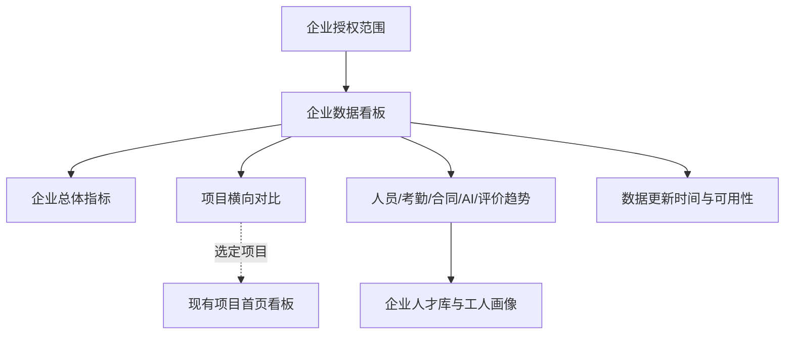

# 企业级数据看板前端页面开发设计方案 V1

## 文档属性

| 项目 | 内容 |
| --- | --- |
| 文档目的 | 在现有“项目首页看板”之上，设计企业授权范围内的多项目数据汇总看板 |
| 适用工程 | `D:\chen\codex\gongrenhuaxiang` |
| 当前阶段 | 方案待确认，尚未执行代码实现 |
| 页面定位 | 企业/公司管理人员使用的只读数据总览与项目横向对比页面 |
| 现有首页 | `src/pages/HomeDashboard.jsx`，项目维度、单屏、只读统计 |
| 当前数据状态 | `src/mock/dashboard.js` 为项目级浏览器内存 Mock；尚无企业级聚合接口 |
| 技术约束 | React 19 + Vite + Tailwind CSS 4 + `lucide-react`，沿用现有 `activeMenu` 菜单模式 |

本阶段只生成前端页面设计方案，不修改 `src/` 代码，不新增真实接口，不宣称已经完成企业级数据汇总、权限接入或外部系统联调。

## 1. 设计依据与原型范围

### 1.1 设计依据

本方案依据以下内容形成：

1. 当前首页看板的实际代码与 Mock：
   - `src/pages/HomeDashboard.jsx`
   - `src/mock/dashboard.js`
2. 当前应用入口与菜单：
   - `src/main.jsx` → `src/AppFixed.jsx`
   - 当前没有 URL 路由，使用 `activeMenu` 切换页面。
3. 已确认的项目首页边界：
   - 首页是项目维度的单屏只读统计；
   - 当前首页只允许选择项目；
   - 不展示待办、处置、审批、人员明细和业务跳转；
   - AI 统计只展示已匹配和陌生人，不把陌生人直接解释为风险人员；
   - 评价统计读取正式评价结果，数据不足时不得用 0 分或 D 级替代。
4. 平台需求中关于企业、项目、工人、企业人才库和公司/企业/项目数据范围的定义。

### 1.2 本版核心定位

现有首页回答的是：

> 某一个项目现在有多少人、考勤和合同情况如何、AI 识别和评价结果怎样？

企业级数据看板回答的是：

> 企业授权范围内有多少项目和工人，各项目的数据表现是否均衡，企业沉淀的人才和评价数据是否可用？

因此企业看板不是把项目首页的卡片简单相加，而是增加一层“企业授权范围内的多项目汇总与对比”。

### 1.3 一期纳入范围

| 范围 | 说明 |
| --- | --- |
| 企业范围 | 在当前用户权限内选择一个企业，默认展示该企业授权项目汇总 |
| 项目范围 | 全部授权项目；可切换到单个项目作为对比筛选条件，但不替换现有项目首页 |
| 人员数据 | 企业去重后的工人总量、当前在场人数、历史合作/可复用人才摘要 |
| 考勤数据 | 企业范围今日到场率、近 7/30 日到场趋势、项目横向对比 |
| 合同数据 | 合同签署完成率、签署状态分布、项目对比 |
| AI 数据 | 识别记录量、匹配率、陌生人记录、设备在线摘要；不推导风险结论 |
| 评价数据 | 最新正式评价批次的覆盖率、平均分、A-D 等级分布、五维平均分 |
| 项目对比 | 以表格展示授权项目的核心指标，不展示项目经营、产值、进度等未形成可信数据源的指标 |
| 数据可信度 | 展示各数据源更新时间和“正常/延迟/暂无数据”状态，避免企业汇总被误读为实时结果 |

### 1.4 一期不纳入范围

- 企业待办、审批、消息处理、风险处置和任务工作台；
- 合同详情、工人姓名、身份证号、人脸照片、抓拍图片和合同文件；
- 项目经营收入、产值、成本、施工进度、履约排名等当前工程没有稳定数据契约的指标；
- 将 AI 陌生人数量直接定义为风险人员数量；
- 前端直接读取实名制、闸机、摄像头、海康超脑、电子签署或评价计算服务；
- 前端根据各项目数字自行计算企业平均值、去重工人数、到场率或评价结果；
- 企业级工人调配、用工审批或不可逆的人员限制。

### 1.5 页面层级关系



“项目横向对比”仅作为企业看板中的只读信息，不在本阶段把企业看板改造成项目管理工作台。若后续需要项目详情，优先复用现有项目首页的项目选择能力。

## 2. 现有前端工程分析

### 2.1 当前页面与数据结构

| 项目 | 当前实际情况 | 对本方案的影响 |
| --- | --- | --- |
| 入口 | `src/main.jsx` 加载 `src/AppFixed.jsx` | 新页面建议沿用现有 `activeMenu`，不引入新路由库 |
| 菜单 | 当前包含首页看板、数据采集中心、工人评价模型、工人画像与工人库 | 建议新增“企业数据看板”菜单，保留现有首页不变 |
| 首页 | `HomeDashboard.jsx` 通过项目选择展示单项目统计 | 企业看板需要独立页面和企业级聚合 Mock，不直接修改首页逻辑 |
| Mock | `mock/dashboard.js` 只有 P001、P002 项目快照 | 不能把两个项目快照直接在浏览器端相加作为正式企业统计 |
| 组件 | 首页内部包含指标卡、柱状趋势、环形图、评价等级图和合同状态条 | 可复用视觉语言和图表表达，建议后续抽取通用组件 |
| 样式 | `index.css` 为首页固定单屏提供了 `dashboard-layout` 和低高度规则 | 新页面应使用独立的 `enterprise-dashboard-layout`，避免影响首页单屏布局 |
| API | 当前工程没有真实 API 封装，页面使用浏览器内存 Mock | 首版默认 Mock，真实接口只定义替换边界，不视为已联调 |
| 权限 | 当前页面没有真实登录和数据权限验证 | 原型只表现权限范围和无权限状态，正式权限由后端和统一认证提供 |

### 2.2 复用与隔离原则

建议复用：

- 现有页面的白底卡片、浅灰背景、蓝/青/紫色状态色；
- 现有 `MetricCard`、`DataStat`、`ValueTrend`、环形图和进度条的表达方式；
- 现有五维评价名称：职业资质、履约能力、安全行为、工作效率、信用记录；
- 现有 A、B、C、D 等级颜色和合同状态名称：签署完成、签署中、初始、临近到期；
- 现有“陌生人不等于风险”的文案边界。

建议隔离：

- 不将企业汇总逻辑放入 `HomeDashboard.jsx`；
- 不把项目 Mock 直接当作企业级数据源；
- 不为了复用而修改首页的固定行高和低高度规则；
- 不在企业看板中恢复首页已删除的“统计周期/刷新/数据范围”旧内容；企业看板的筛选项只服务于多项目范围和趋势查看。

## 3. 菜单、页面与页面结构

### 3.1 菜单建议

| 菜单项 | 建议 key | 页面 | 角色范围 | 说明 |
| --- | --- | --- | --- | --- |
| 企业数据看板 | `enterprise-dashboard` | `EnterpriseDashboard` | 公司/企业管理人员 | 企业授权范围内的多项目数据汇总与对比 |
| 首页看板 | `dashboard` | `HomeDashboard` | 项目管理人员及有项目查看权限的用户 | 保持现有项目维度统计，不改为企业汇总 |

当前工程没有 URL 路由，因此第一版原型建议只在 `AppFixed.jsx` 的菜单映射中新增页面，不引入 `react-router`。后续如果接入正式路由，概念路径可命名为 `/enterprise-dashboard`，但这不是当前已有路径。

### 3.2 页面入口与顶部筛选

页面标题：`企业数据看板`

顶部工具栏建议包含：

| 控件 | 默认值 | 作用 | 备注 |
| --- | --- | --- | --- |
| 企业选择 | 当前用户的默认企业 | 切换企业授权范围 | 多企业用户才显示下拉；单企业用户显示只读名称 |
| 项目范围 | 全部授权项目 | 选择全部项目或某一个项目进行对比筛选 | 选择单项目后不跳转，只改变当前页面汇总范围 |
| 趋势周期 | 近 30 日 | 选择近 7 日/近 30 日趋势 | 不改变“今日”指标和最新评价批次口径 |
| 评价周期 | 最新正式评价批次 | 显示评价结果来源周期 | 只读，不在看板执行模型 |
| 更新时间 | 例如“数据更新至 2026-08-17 10:30” | 说明汇总时间 | 不增加手动刷新按钮，避免把 Mock 刷新误认为实时同步 |

### 3.3 推荐单屏布局

目标分辨率：`1440 × 900` 和 `1280 × 760`。桌面端保持单屏；项目全部列表较多时，仅“查看全部项目”抽屉内部滚动。

```text
┌──────────────────────────────────────────────────────────────────────────┐
│ 企业数据看板        [企业] [项目范围：全部] [近30日] 评价周期  更新时间    │
├────────┬────────┬────────┬────────┬────────┬────────┤
│在管项目│企业工人│当前在场│今日到场│合同签署│评价覆盖│
│数量    │总量    │人数    │率      │完成率  │率      │
├──────────────────────────────────────────┬───────────────────────────────┤
│ 项目核心指标对比（约 2/3）                │ 企业工人结构（约 1/3）          │
│ 项目表格：人员/到场/合同/评价/数据状态     │ 在场/可复用/证书 + A-D 等级分布  │
├───────────────────────────────┬──────────────────────────────────────────┤
│ 企业近30日到场趋势（约 1/2）    │ 合同、AI 与评价摘要（约 1/2）              │
│ 到场人数/到场率趋势              │ 合同状态 + AI匹配 + 五维评价             │
├──────────────────────────────────────────────────────────────────────────┤
│ 数据源更新时间与可用性：实名制/考勤 · 合同 · AI识别 · 评价                   │
└──────────────────────────────────────────────────────────────────────────┘
```

## 4. 页面与组件设计

### 4.1 `EnterpriseDashboard` 页面容器

#### 页面目标

为企业/公司管理人员提供授权范围内的多项目只读总览，重点支持“看整体、比项目、判断数据是否可用”，不直接处理业务事项。

#### 页面区域

1. `EnterpriseScopeToolbar`：企业、项目范围、趋势周期、评价周期和更新时间；
2. `EnterpriseSummaryCards`：六项企业级 KPI；
3. `ProjectComparisonPanel`：项目横向指标表；
4. `WorkforceStructurePanel`：企业工人规模、人才结构和等级分布；
5. `EnterpriseAttendanceTrendPanel`：企业近 7/30 日到场趋势；
6. `ContractAiEvaluationPanel`：合同、AI 和评价结果的摘要组合；
7. `DataFreshnessPanel`：数据源更新时间、延迟和数据完整性提示；
8. `ProjectListDrawer`：授权项目较多时查看完整项目列表，抽屉内部支持分页。

### 4.2 企业级 KPI 卡片

建议使用六张卡片，避免与项目首页完全重复：

| KPI | 主值 | 辅助信息 | 汇总口径 |
| --- | --- | --- | --- |
| 在管项目 | `activeProjectCount` | 授权项目总数 | 由后端按当前权限和项目状态返回；项目状态定义待确认 |
| 企业工人总量 | `uniqueWorkerCount` | 当前在场 `onSiteWorkerCount` 人 | 按企业范围内唯一工人身份去重，不能前端累加项目人数 |
| 当前在场人数 | `onSiteWorkerCount` | 占企业工人总量比例 | 以企业统一人员/考勤汇总为准 |
| 今日到场率 | `attendanceRate` | 实到/应到人数 | 建议由后端按企业范围加权计算，不平均各项目百分比 |
| 合同签署完成率 | `contractCompletionRate` | 完成、签署中、初始 | 分母和合同范围由后端统一口径返回 |
| 评价覆盖率 | `evaluationCoverageRate` | 已评价/应评价人数 | 读取最新正式评价批次；缺少正式批次时显示不可用 |

平均评价分、A级占比、AI匹配率不放入第一行 KPI，放入下方专题卡片，给项目比较留出空间。

### 4.3 `ProjectComparisonPanel` 项目核心指标对比

#### 页面目标

帮助企业管理人员快速发现不同项目在人员规模、到场、合同和评价覆盖方面的差异。

#### 主表字段

| 列 | 展示形式 | 说明 |
| --- | --- | --- |
| 项目名称 | 文本，长名称省略并支持完整内容悬浮提示 | 只展示用户有权限的项目 |
| 当前在场 | 数值 + 人 | 企业统一在场汇总结果 |
| 今日到场率 | 百分比 | 用颜色和文字双重表达，不只依赖颜色 |
| 合同签署完成率 | 百分比 | 使用“签署完成”业务名称 |
| 评价覆盖率 | 百分比 | 来自最新正式评价批次 |
| 平均评价分 | 数值 + 分 | 没有正式批次时显示“暂无正式评价” |
| AI匹配率 | 百分比 | 分母由后端返回；陌生人不等同于风险 |
| 数据状态 | 正常/延迟/不完整 | 表示数据可用性，不表示项目经营状态 |
| 更新时间 | 时间 | 展示该项目汇总更新时间 |

#### 表格行为

- 默认按项目名称或企业预设顺序展示前 5 个项目；
- 支持按今日到场率、合同完成率、评价覆盖率和平均评价分排序；
- 项目数量超过 5 个时显示“查看全部项目”，打开只读 `ProjectListDrawer`；
- 抽屉支持项目名称搜索、指标排序和分页；
- 点击项目行只设置当前企业看板的项目范围，不直接进入敏感数据详情；
- 不提供编辑、审批、处置、批量操作或导出按钮；
- 如果后续确认需要跳转项目首页，再通过 `onNavigate('dashboard', projectId)` 传递项目范围，当前不实现。

### 4.4 `WorkforceStructurePanel` 企业工人结构

#### 展示内容

左侧为企业人才规模摘要，右侧为等级/人才结构图：

| 区域 | 指标 |
| --- | --- |
| 规模摘要 | 企业工人总量、当前在场、历史合作工人、可复用人才 |
| 资质摘要 | 有效证书人数、证书覆盖率；没有稳定证书汇总时显示“暂无数据” |
| 评价等级 | A、B、C、D 人数及占比；没有正式批次时显示“暂无正式评价” |
| 评价分布 | 最新评价批次的平均分和五维平均分入口性摘要 |

#### 口径要求

- “企业工人总量”按唯一工人数字身份去重；跨项目重复参与的工人只能计一次；
- “可复用人才”只是人才库业务分类，不等同于企业已完成用工审批；
- 评价等级和人才结构必须标注评价周期或数据截止时间；
- 负面记录、身份证号、照片和具体工人名单不在企业看板展示。

### 4.5 `EnterpriseAttendanceTrendPanel` 企业到场趋势

#### 默认展示

- 默认近 30 日企业每日实际到场人数；
- 可切换近 7 日；
- 鼠标悬停显示日期、实际到场人数和到场率；
- 在图表顶部显示当前选定范围的平均到场率，仅作为后端返回的聚合指标；
- 当数据仅覆盖部分项目时显示“部分项目数据已更新”；
- 无数据时显示“当前统计范围暂无考勤趋势数据”，不绘制空柱体。

#### 不展示

- 不在企业看板中拼接项目原始考勤明细；
- 不用项目百分比的简单平均值冒充企业到场率；
- 不把缺少进场、缺少出场直接升级为风险结论。

### 4.6 `ContractAiEvaluationPanel` 合同、AI 与评价摘要

该区域采用三块紧凑的摘要，不再复制项目首页的完整卡片。

#### 电子合同摘要

- 合同签署完成率；
- 签署完成、签署中、初始、临近到期四类数量；
- 近 6 个月企业完成签署趋势；
- 没有合同数据时显示“暂无合同统计数据”。

#### AI 识别摘要

- 企业范围识别记录总量；
- 已匹配数量、陌生人数量、匹配率；
- 在线设备数/设备总数；
- 文案明确“AI 为辅助核验，陌生人不代表风险人员”；
- AI 数据延迟时展示数据更新时间，不使用其他项目数据替代。

#### 工人评价摘要

- 最新正式评价批次名称、数据截止时间；
- 平均评价分、A级占比、评价覆盖率；
- 五维平均分横向进度条；
- 没有成功或部分成功的正式批次时展示“暂无可展示的正式评价统计”，不显示 0 分或 D 级。

### 4.7 `DataFreshnessPanel` 数据源更新时间与可用性

本区域用于说明企业汇总的可信边界，不是后台运维台账。

| 数据源 | 展示项 | 状态 |
| --- | --- | --- |
| 实名制/人员 | 最近同步时间、覆盖项目数 | 正常/延迟/暂无数据 |
| 闸机考勤 | 最近汇总时间、数据截止日期 | 正常/延迟/部分项目未更新 |
| 电子合同 | 最近统计时间、合同统计范围 | 正常/延迟/暂无数据 |
| AI 识别 | 最近回传时间、设备覆盖范围 | 正常/延迟/部分设备未更新 |
| 评价批次 | 批次名称、完成时间、数据截止时间 | 成功/部分成功/暂无正式批次 |

状态同时显示文字和图标，不只使用红黄绿颜色。数据状态不提供“立即修复”按钮，后续如果需要运维处理，应另设数据同步或系统管理页面。

### 4.8 项目列表抽屉

| 项目 | 方案 |
| --- | --- |
| 入口 | 项目对比区的“查看全部项目” |
| 内容 | 授权项目全量列表及核心指标 |
| 查询 | 项目名称关键词、数据状态、评价数据是否可用 |
| 排序 | 今日到场率、合同完成率、评价覆盖率、平均评价分、更新时间 |
| 分页 | 默认每页 10 条，页码和总数由 UI 数据契约返回 |
| 详情 | 仅保留项目范围选择；不在抽屉展示工人明细和敏感资料 |
| 状态 | 加载、空列表、接口失败、无权限、数据延迟均在抽屉内独立展示 |

## 5. 交互、状态与权限表现

### 5.1 允许的交互

- 切换企业；
- 切换项目范围；
- 切换近 7 日/近 30 日趋势；
- 表格排序；
- 打开和关闭项目全量抽屉；
- 抽屉内搜索和分页；
- 图表悬浮查看具体数值；
- 点击项目行将其设置为当前看板筛选范围。

### 5.2 不提供的交互

- 不在企业看板执行评价模型、确认 AI 结果、发起合同、处理风险或修改人员资料；
- 不提供首页已有项目选择以外的跨模块业务入口；
- 不直接展示身份证号、手机号、银行卡号、人脸照片、抓拍图片或合同文件；
- 不提供未经确认的下载、导出和批量处置动作；
- 不以企业看板中的单项指标自动生成“优秀项目”“风险项目”结论。

### 5.3 页面状态

| 场景 | 页面表现 |
| --- | --- |
| 首次加载 | 页面保持固定网格，卡片使用与正式内容等高的骨架屏 |
| 企业切换 | 保留筛选栏，所有卡片进入局部加载；旧企业数据不与新企业数据混合 |
| 项目范围切换 | 仅刷新企业看板当前范围；显示当前范围名称和更新时间 |
| 部分数据失败 | 只在对应模块显示“暂无法获取”，其他模块继续展示 |
| 企业无授权项目 | 页面显示“当前企业暂无授权项目”，不展示其他企业或默认项目数据 |
| 无企业权限 | 页面显示“暂无企业级看板查看权限”，不降级显示任意项目汇总 |
| 无评价批次 | 评价区域显示“暂无正式评价”，不补 0 分、D 级或空图 |
| 数据延迟 | 显示数据截止日期和“部分项目未更新”，不伪装成实时数据 |
| 项目名称过长 | 单元格省略，悬浮提示完整名称，不能撑高固定单屏 |
| 项目较多 | 主屏显示前 5 个项目，完整列表放入可滚动分页抽屉 |
| 低高度窗口 | 复用首页的紧凑布局思想，减少面板内间距；抽屉和表格内部允许滚动，主页面不出现纵向滚动 |

### 5.4 权限表现

- 企业下拉只展示当前用户有权限的企业；
- 项目范围只展示当前企业下的授权项目；
- 后端返回的数据范围必须带有企业/项目权限过滤结果，前端不自行过滤敏感数据来代替权限控制；
- 无权限、权限变化或企业已失效时，清空旧数据并显示明确状态；
- 企业级统计不展示跨企业的工人重复信息，也不因无权访问某项目而用其他项目数据填补。

## 6. Mock 数据与 UI 数据契约

### 6.1 Mock 策略

建议新增 `src/mock/enterpriseDashboard.js`，与现有 `src/mock/dashboard.js` 分离。Mock 的默认结构直接模拟企业聚合接口的返回，不在页面组件中把 P001、P002 快照相加。

建议提供以下场景：

1. `standard`：两个以上授权项目，企业汇总数据完整；
2. `partial`：某个项目考勤或 AI 数据延迟，企业看板显示部分更新；
3. `no-evaluation`：企业存在人员和考勤数据，但暂无正式评价批次；
4. `empty-projects`：企业有权限但暂时没有授权项目；
5. `forbidden`：没有企业级看板权限；
6. `error`：企业汇总接口失败，仅展示筛选栏和局部错误状态。

### 6.2 建议的前端 Mock 函数

```js
getEnterpriseDashboardOverview({
  enterpriseId,
  projectId: 'all',
  trendPeriod: '30d',
  scenario: 'standard'
})
```

上述函数是前端 Mock 适配器建议，不代表当前工程已经存在，也不代表真实接口已接通。

### 6.3 UI 数据契约建议

```js
{
  scope: {
    enterpriseId: 'E001',
    enterpriseName: '示例总包企业',
    projectId: 'all',
    projectScopeLabel: '全部授权项目',
    trendPeriod: '30d',
    evaluationPeriod: '2026年7月正式评价批次',
    updatedAt: '2026-08-17 10:30'
  },
  summary: {
    activeProjectCount: 6,
    authorizedProjectCount: 8,
    uniqueWorkerCount: 1280,
    onSiteWorkerCount: 936,
    attendanceRate: 91.6,
    contractCompletionRate: 88.4,
    evaluationCoverageRate: 84.2
  },
  projects: {
    items: [
      {
        projectId: 'P001',
        projectName: '项目名称',
        onSiteWorkerCount: 128,
        attendanceRate: 93.3,
        contractCompletionRate: 90.6,
        evaluationCoverageRate: 93.8,
        averageScore: 86.8,
        aiMatchRate: 95.3,
        dataStatus: '正常',
        updatedAt: '2026-08-17 10:28'
      }
    ],
    total: 6,
    page: 1,
    pageSize: 5
  },
  workforce: {
    uniqueWorkerCount: 1280,
    onSiteWorkerCount: 936,
    historicalWorkerCount: 344,
    reusableWorkerCount: 520,
    validCertificateWorkerCount: 804,
    grades: [
      { label: 'A', value: 240, color: '#52C41A' },
      { label: 'B', value: 520, color: '#1890FF' },
      { label: 'C', value: 300, color: '#FAAD14' },
      { label: 'D', value: 60, color: '#FF4D4F' }
    ]
  },
  attendanceTrend: [
    { date: '08-01', present: 904, rate: 89.7 },
    { date: '08-17', present: 936, rate: 91.6 }
  ],
  contracts: {
    total: 1280,
    completed: 1132,
    signing: 96,
    initial: 52,
    expiring: 34,
    trend: [{ month: '2026-08', value: 126 }]
  },
  ai: {
    matched: 3420,
    stranger: 126,
    matchRate: 96.4,
    onlineDevices: 42,
    totalDevices: 46,
    todayCount: 486
  },
  evaluation: {
    available: true,
    batchName: '2026年7月正式评价批次',
    dataCutoff: '2026-07-31',
    averageScore: 84.6,
    coverageRate: 84.2,
    aRate: 18.8,
    dimensions: [
      { label: '职业资质', value: 85 },
      { label: '履约能力', value: 86 },
      { label: '安全行为', value: 88 },
      { label: '工作效率', value: 82 },
      { label: '信用记录', value: 87 }
    ]
  },
  freshness: [
    { source: '实名制/人员', status: '正常', updatedAt: '2026-08-17 10:20', dataCutoff: '2026-08-17' },
    { source: '闸机考勤', status: '正常', updatedAt: '2026-08-17 10:25', dataCutoff: '2026-08-17' },
    { source: '电子合同', status: '部分项目未更新', updatedAt: '2026-08-17 09:50', dataCutoff: '2026-08-16' },
    { source: 'AI识别', status: '正常', updatedAt: '2026-08-17 10:28', dataCutoff: '2026-08-17' },
    { source: '评价批次', status: '成功', updatedAt: '2026-08-03 23:10', dataCutoff: '2026-07-31' }
  ]
}
```

示例中的数值仅用于说明 UI 结构，执行原型时应根据确认后的演示口径调整，不作为真实业务数据。

### 6.4 聚合口径与后端边界

以下结果应由后端或统一聚合层提供：

- 企业范围内的唯一工人去重；
- 企业到场率、合同完成率和评价覆盖率的分母、分子及加权方式；
- 跨项目工人、合同、设备和 AI 记录的归属关系；
- 最新正式评价批次及其数据截止时间；
- 数据源延迟、部分项目未更新和接口失败状态；
- 当前用户的企业/项目权限过滤。

前端只负责展示契约结果、格式化百分比、图表和状态，不直接查询数据库或外部系统，不在浏览器中重算企业级业务指标。

### 6.5 真实接口替换边界

建议新增 `src/api/enterpriseDashboard.js` 作为页面数据适配层。真实接口名称和地址待后端联调时确认，当前统一标记为“建议接口”，不得写成已存在的接口。

建议的替换方式：

```text
EnterpriseDashboard
        ↓
enterpriseDashboardService
        ├─ Mock：getEnterpriseDashboardOverview
        └─ Real：企业看板聚合查询接口（建议）
```

Mock 和真实接口必须返回同一 UI 数据结构；切换真实接口时不改动页面组件的业务展示逻辑。

## 7. 文件影响与实现顺序

### 7.1 文件影响清单

| 文件 | 状态 | 建议处理 |
| --- | --- | --- |
| `src/pages/EnterpriseDashboard.jsx` | 建议新增 | 企业看板页面容器及页面组件编排 |
| `src/mock/enterpriseDashboard.js` | 建议新增 | 企业级聚合 Mock 和标准/异常场景 |
| `src/api/enterpriseDashboard.js` | 建议新增 | Mock/真实聚合查询适配层；真实接口待确认 |
| `src/AppFixed.jsx` | 建议修改 | 新增企业数据看板菜单和 `activeMenu` 映射 |
| `src/index.css` | 建议修改 | 新增企业看板独立布局、表格和低高度规则；不覆盖现有 `.dashboard-layout` |
| `src/pages/mvpShared.jsx` | 可选修改 | 若抽取通用卡片、状态、表格组件，再补充导出；不强行迁移现有首页内部组件 |
| `src/pages/HomeDashboard.jsx` | 本阶段不修改 | 保持项目首页的项目维度和已确认边界 |
| `src/mock/dashboard.js` | 本阶段不修改 | 保持当前项目级 Mock，不承担企业级聚合 |
| `README.md`、`PROJECT_CONTEXT.md` | 代码确认后更新 | 只有实现并验证后，才记录企业看板的实际完成状态和 Mock 边界 |

### 7.2 确认后的实现顺序

1. 确认企业/公司层级名称、默认权限范围和指标口径；
2. 建立企业级 Mock 适配器和异常场景；
3. 新增企业看板页面与独立布局；
4. 在 `AppFixed.jsx` 中加入菜单入口，保持首页入口不变；
5. 完成项目列表抽屉、筛选、排序、分页和局部状态；
6. 完成 1440 × 900、1280 × 760 的单屏检查；
7. 执行 `npm.cmd run build` 和 `npm.cmd run lint`；
8. 验证 Mock/真实接口替换边界后，再更新项目文档。

本方案确认前不执行以上代码步骤。

## 8. 原型验收标准

### 8.1 页面与导航

1. 新增“企业数据看板”入口后，现有“首页看板”仍保持项目维度，不被替换或改成企业聚合。
2. 企业看板默认展示当前用户授权企业的全部项目汇总。
3. 单企业用户不出现无意义的企业选择；多企业用户只能看到有权限的企业。
4. 当前工程继续使用 `activeMenu`，不因本次原型新增不必要的路由依赖。

### 8.2 数据与展示

1. 首屏包含企业项目数、唯一工人总量、当前在场、今日到场率、合同完成率、评价覆盖率六项 KPI。
2. 项目对比区至少展示项目名称、当前在场、今日到场率、合同完成率、评价覆盖率、平均评价分、AI 匹配率和数据状态。
3. 跨项目工人不在前端重复计数；企业级百分比不由前端简单平均。
4. 最新评价批次缺失时显示“暂无正式评价”，不显示 0 分、D 级或伪造图表。
5. AI 区域同时展示已匹配/陌生人和业务边界文案，陌生人不被表述为风险人员。
6. 每个数据源都有更新时间或数据截止日期，延迟和部分更新有文字状态。

### 8.3 交互与异常

1. 企业、项目范围和趋势周期切换后，数据不会混用；筛选期间显示局部加载。
2. 项目超过首屏容量时，完整列表通过抽屉分页查看，主页面不被撑高。
3. 模拟无权限、无项目、无评价、部分延迟和接口失败场景均能独立演示。
4. 页面没有审批、处置、批量修改、敏感信息查看和未经确认的导出动作。

### 8.4 视觉与可用性

1. 沿用当前 React/Tailwind 项目的浅色管理台视觉语言，不另起一套大屏风格。
2. 1440 × 900 和 1280 × 760 下主页面无纵向滚动条；项目抽屉内部可滚动。
3. 长项目名称、较大数值、无数据提示和错误提示不破坏固定网格。
4. 状态不只依赖颜色，至少同时显示状态文字；图表有文本数值和悬浮提示。
5. 下拉框、表格排序、抽屉关闭和图表信息具备可访问的文本标签或键盘焦点表现。

## 9. 待确认事项

以下事项确认后，才进入代码实现：

1. **层级命名**：本页面使用“企业数据看板”还是“公司数据看板”？“公司、企业、项目”三层在当前业务中分别指什么？
2. **菜单形态**：采用独立的“企业数据看板”菜单，还是在现有首页顶部增加“企业/项目”视角切换？本方案推荐独立菜单，以保护现有项目首页边界。
3. **默认权限范围**：企业管理人员默认查看全部授权项目，还是默认查看最近访问项目？本方案推荐全部授权项目。
4. **项目状态口径**：`在管项目数` 的分母和“在管”定义由谁提供？若暂时没有稳定项目状态，原型可改为“授权项目数”。
5. **工人去重口径**：企业工人总量是否按统一工人数字身份去重？跨项目同时存在的工人如何计入在场人数？本方案推荐由后端按唯一工人身份处理。
6. **趋势默认周期**：默认使用近 7 日还是近 30 日？本方案推荐企业看板默认近 30 日，项目首页保持现有单屏口径。
7. **评价口径**：企业平均评价分和等级分布是否读取最新正式批次？是否允许部分成功批次参与企业汇总？
8. **合同口径**：合同签署完成率的分母采用有效用工关系、应签工人还是合同总量？
9. **AI 口径**：企业 AI 匹配率的分母是否固定为“已匹配 + 陌生人”？异常技术状态如何返回并展示？
10. **项目对比交互**：项目行点击后只筛选当前企业看板，还是需要跳转现有项目首页？本方案一期推荐只筛选，跳转留待确认。
11. **数据状态**：是否需要把“部分项目未更新”作为企业级数据状态？如果需要，后端需返回项目覆盖数量和更新时间。
12. **视觉方向**：继续沿用当前白底管理台风格，还是需要企业领导驾驶舱式的深色大屏风格？本方案按当前管理台风格设计。

## 10. 当前交付结论

本方案已经把企业级看板与现有项目首页区分为两个层级：

- 项目首页：单项目、单屏、只读统计；
- 企业数据看板：企业授权范围、多项目汇总、项目对比、人才结构和数据可用性。

当前只完成设计文档，未修改任何前端代码，未新增企业 Mock，未接通真实接口。待上述关键事项确认后，再按第 7 章顺序执行原型实现。
