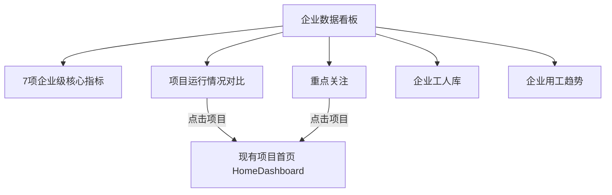

# 企业级数据看板前端页面开发设计方案 V1

## 文档属性

| 项目 | 内容 |
| --- | --- |
| 设计对象 | 企业授权范围内的多项目数据看板 |
| 适用工程 | `D:\chen\codex\gongrenhuaxiang` |
| 页面名称 | 企业数据看板 |
| 菜单 key | `enterprise-dashboard` |
| 现有项目首页 | `src/pages/HomeDashboard.jsx`，继续承担项目级统计职责 |
| 当前阶段 | 最终确认方案，进入前端原型实现 |
| 数据状态 | 当前使用企业级 Mock，正式数据由后端统一聚合 |
| 技术栈 | React 19 + Vite + Tailwind CSS 4 + `lucide-react` |

本方案用于指导企业级前端原型实现。企业看板保持只读、统计和多项目对比定位，不承担审批、数据维护、风险处置、人员明细查看或敏感数据展示。

## 1. 页面定位与层级关系

### 1.1 项目级首页

现有 `HomeDashboard.jsx` 回答：

> 当前这个项目的人员、出勤、合同、AI 和工人评价情况怎么样？

项目首页保持单项目、固定单屏、只读统计，不改造成企业汇总页面。

### 1.2 企业级首页

新增 `EnterpriseDashboard.jsx` 回答：

> 公司整体管理了多少项目和工人，各项目表现怎么样，哪些项目需要重点关注，公司工人库沉淀情况怎么样？

核心逻辑：

```text
看整体 → 比项目 → 找重点 → 看企业工人库 → 穿透项目
```

企业看板必须满足：

- 只读；
- 以企业/组织范围汇总数据；
- 允许项目横向对比；
- 允许点击项目进入现有项目首页；
- 不做审批、维护、确认、处置或编辑；
- 不展示身份证号、人脸照片、抓拍图片、合同文件和敏感人员明细；
- 不把 AI 未匹配记录直接定义为风险人员。

### 1.3 页面层级关系



## 2. 现有工程分析与复用约束

| 项目 | 当前情况 | 实现约束 |
| --- | --- | --- |
| 应用入口 | `src/main.jsx` → `src/AppFixed.jsx` | 沿用现有 `activeMenu`，不引入新路由框架 |
| 当前菜单 | 首页看板、数据采集中心、工人评价模型、工人画像与工人库 | 新增独立“企业数据看板”，不删除现有菜单 |
| 项目首页 | `src/pages/HomeDashboard.jsx` | 只做项目穿透所需的最小 `projectId` 外部传入调整 |
| 项目 Mock | `src/mock/dashboard.js` | 继续作为项目首页数据源，不在前端累加生成企业数据 |
| 工人标签 | `MvpTagCenter.jsx` 及共享数据中存在标签规则 | 企业看板支持后端动态返回 3~4 个标签，不把 4 个标签永久写死在组件结构中 |
| 工人评价 | `MvpPortraitCenter.jsx`、`MvpIndexCenter.jsx` 等页面使用 A/B/C/D 等级和正式评价结果 | 无正式评价时显示“暂无正式评价”，不能用 0 分或 D 级代替 |
| 样式 | `index.css` 已维护项目首页的固定单屏布局和卡片风格 | 新增企业看板独立 CSS 类，避免破坏 `.dashboard-layout` |
| 数据状态 | 当前以浏览器内存 Mock 为主，无真实后端、文件存储或 AI 服务 | 页面和文档明确区分 Mock、建议 adapter 和未来接口 |

视觉上复用现有首页的白色卡片、浅灰背景、蓝色主色、边框、阴影、字号、间距、进度条、柱形图、饼图和状态色。企业看板不设计为深色驾驶舱。

## 3. 菜单、顶部范围栏与布局

### 3.1 新增菜单

| 菜单项 | key | 页面 |
| --- | --- | --- |
| 企业数据看板 | `enterprise-dashboard` | `EnterpriseDashboard` |
| 首页看板 | `dashboard` | `HomeDashboard` |

当前工程没有正式 URL 路由，第一版只在 `AppFixed.jsx` 中增加菜单和页面映射。

### 3.2 顶部范围栏

页面标题固定为 `企业数据看板`。顶部提供组织选择，不提供项目选择；企业首页负责比较项目，而不是切换成单项目统计。

| 展示项 | 默认值 | 交互 |
| --- | --- | --- |
| 选择组织 | 全公司 | 下拉选择；一级为全公司，二级列举南京分公司、苏南分公司等分公司 |
| 数据更新时间 | 2026-08-17 14:30 | 文本展示，不增加手动刷新 |

### 3.3 固定单屏布局

目标分辨率：`1920 × 1080`、`1440 × 900`、`1280 × 760`。项目表主屏最多展示 5 项，完整项目列表在 `ProjectListDrawer` 内滚动和分页。

```text
┌──────────────────────────────────────────────────────────────┐
│ 企业数据看板          选择组织：[全公司]       数据更新时间   │
├────────┬────────┬────────┬────────┬────────┬────────┬────────┤
│在管项目│当前在场│今日出勤│合同签署│工人库  │AI摄像头│AI数据  │
│        │        │率      │率      │人数    │识别    │采集    │
├────────────────────────────────────┬─────────────────────────┤
│ 项目运行情况对比                    │ 重点关注                 │
│ 项目名称/分公司/在场/出勤/合同/评价  │ 出勤率最低 3 个项目      │
│ 覆盖/A级占比                         │ 合同签署率最低 3 个项目  │
├───────────────────────┬──────────────────────────────────────┤
│ 企业工人库             │ 企业用工趋势                         │
│ 标签人数 + A/B/C/D     │ 近 7 日/近 15 日出勤人数 + 出勤率     │
└──────────────────────────────────────────────────────────────┘
```

## 4. 第一排：7 个核心指标

第一排固定为 7 张 KPI 卡片，不增加其他 KPI。

| KPI | 主指标 | 辅助指标/口径 |
| --- | --- | --- |
| 在管项目 | `36 个` | 当前组织权限范围内的在管项目数量，无复杂辅助数据 |
| 当前在场 | `3,258 人` | 所有在管项目当前在场工人数量 |
| 今日出勤率 | `92.6%` | `今日出勤 3,018 人`；后端按企业实际出勤总人数 ÷ 应出勤总人数计算 |
| 合同签署率 | `94.3%` | `完成签署 3,856 人`；后端按完成签署人数 ÷ 应签署人数计算 |
| 工人库人数 | `8,260 人` | 正式评价可用时显示 `平均分 85.6`，否则显示 `暂无评价`；点击进入工人库默认视图 |
| AI 摄像头识别 | `6,852 条` | `已匹配 6,597 条`；不展示陌生人数量或风险结论 |
| AI 数据采集 | `1,268 条` | `已确认 1,083 条`；只展示数据采集中心 AI 台账统计，不提供确认操作 |

企业出勤率、合同签署率、工人库去重人数、AI 数量和评价平均分由后端统一聚合，前端禁止简单平均项目百分比或执行 `P001 + P002`。

## 5. 第二排左侧：项目运行情况对比

区域约占第二排宽度的 3/4，是企业看板的核心区域；右侧重点关注收窄为约 1/4。

### 5.1 主表字段

| 字段 | 展示形式 |
| --- | --- |
| 项目名称 | 可点击，单行省略，悬浮显示完整名称 |
| 所属分公司 | 文本 |
| 当前在场 | 人数 |
| 今日出勤率 | 百分比 |
| 合同签署率 | 百分比 |
| 评价覆盖率 | 百分比 |
| A 级占比 | 百分比 |

主页面默认展示 5 个项目，提供 `查看全部项目` 打开完整项目列表抽屉。

“查看全部项目”弹窗展示当前组织范围内全部项目，字段与主表保持一致，不展示数据状态字段；弹窗内部支持搜索、分页和项目首页穿透。

### 5.2 不增加字段

- 综合项目评分；
- 项目排名；
- 经营指标；
- 项目产值；
- 项目进度；
- AI 摄像头匹配率。

### 5.3 项目穿透

项目名称可点击进入现有 `HomeDashboard` 并自动选中对应项目。当前工程没有正式路由，采用共享状态：

```text
EnterpriseDashboard
    ↓ onOpenProject(projectId)
AppFixed.jsx 保存 dashboardProjectId
    ↓ 设置 activeMenu = dashboard
HomeDashboard 接收 projectId
```

`HomeDashboard.jsx` 只做最小修改：支持外部默认 `projectId`，保留现有项目下拉和布局逻辑。

## 6. 第二排右侧：重点关注

区域约占第二排宽度的 1/4，只保留两个分组，并采用红/橙色提醒卡、警示图标和高对比度项目行，形成明确的待关注视觉层级。不额外显示总提醒数、分组提醒数量或说明性提示文字。

### 6.1 出勤率偏低

按当前组织范围内项目的今日出勤率从低到高排序，展示最低 3 个项目。每行先展示放大的出勤率数字，再展示右对齐的蓝色可点击项目名称；移除序号和“查看”入口，点击整行可穿透到项目首页，不设置前端人工阈值。

### 6.2 合同签署率低

按当前组织范围内项目的合同签署率从低到高排序，展示最低 3 个项目。分组使用橙色提醒样式，每项先展示放大的合同签署率数字，再展示右对齐的蓝色可点击项目名称，同样支持项目首页穿透。

重点关注不增加 AI 设备离线、AI 陌生人、评价缺失、风险项目、数据异常或项目综合排名。项目不足 3 个时按实际数量展示。

## 7. 第三排左侧：企业工人库

区域名称固定为 `企业工人库`，不展示当前在场、历史工人、累计合作工人和其他与第一排重复的数量。布局调整为左侧等级分布环形图，右侧 4 个标签人数卡片，采用 2×2 网格，卡片容器高度与右侧用工趋势面板对齐。右上角不展示“标签与等级分布”文字，改为“进入工人库”按钮；每张标签人数卡片可进入工人库，并自动应用对应标签筛选条件。

### 7.1 标签人数

展示后端动态返回的 3~4 个标签人数。首版 Mock 使用：履约稳定、安全之星、健康合格、重点关注。组件使用数组渲染，不能永久写死只能有这 4 个标签。

示例：

```text
履约稳定       安全之星       健康合格       重点关注
2,386 人       612 人         4,826 人       128 人
```

### 7.2 A/B/C/D 等级分布

继续使用项目首页的等级配色表达：A 绿色、B 蓝色、C 橙色、D 红色，并在环形色块中直接标注等级，同时展示各等级人数及占比。等级统计只使用正式评价结果，没有正式评价批次时显示 `暂无正式评价`，不绘制全 0 环形图，也不将未评价人员归为 D 级。

## 8. 第三排右侧：企业用工趋势

区域名称固定为 `企业用工趋势`，支持近 7 日和近 15 日切换，默认展示近 7 日：

- 柱状图：每日实际出勤人数；
- 折线图：每日出勤率；
- 左轴：人数；
- 右轴：百分比。

当前工程不引入重量级图表库，使用 React + CSS/SVG 轻量实现参考 ECharts 的企业数据图表视觉：独立浅灰画布、左右双 Y 轴、实线弱网格、刻度、X 轴日期、渐变蓝色柱、紫色折线、悬浮十字辅助线和 Tooltip。柱体按分类中心点布局，首尾柱体与左右坐标轴保留间距；近 7 日和近 15 日均在 X 轴完整展示全部日期，不常驻展示柱内人数或节点出勤率，所有具体指标统一通过悬浮查看；左右轴名称分别对齐到各自刻度数字上方，指标图例置于画布底部居中。悬浮建议显示：

图表上方提供两个可点击指标图例，默认“实际出勤人数”和“出勤率”同时展示；关闭任一图例后可单独查看另一类图形，至少保留一类指标处于展示状态。

```text
2026-08-17
实际出勤：3,018 人
出勤率：92.6%
```

## 9. 已删除区域

页面底部数据更新时间摘要直接删除，不再保留数据源更新时间行。本版同时删除上一版的 `ContractAiEvaluationPanel` 以及大块 `DataFreshnessPanel`，不再单独展示合同状态、AI 设备在线、AI 匹配率、五维评价、评价平均分或合同趋势。

## 10. Mock 与 API adapter

新增：

- `src/mock/enterpriseDashboard.js`：企业后端聚合结果 Mock；
- `src/api/enterpriseDashboard.js`：页面数据 adapter。

页面调用 `getEnterpriseDashboardOverview()`，adapter 现阶段返回 Mock，后续接正式 Spring Boot 接口时只替换 adapter。

### 10.1 建议数据结构

```js
{
  scope: {
    orgId: 'ORG001',
    orgName: '全公司',
    updatedAt: '2026-08-17 14:30'
  },
  summary: {
    activeProjectCount: 36,
    onSiteWorkerCount: 3258,
    attendance: { rate: 92.6, presentCount: 3018, expectedCount: 3260 },
    contracts: { signRate: 94.3, signedWorkerCount: 3856, requiredWorkerCount: 4088 },
    workerPool: { totalWorkerCount: 8260, averageScore: 85.6, scoreAvailable: true },
    cameraAi: { totalRecordCount: 6852, matchedCount: 6597 },
    aiCollection: { totalCount: 1268, confirmedCount: 1083 }
  },
  projects: { items: [], total: 36, page: 1, pageSize: 5 },
  attention: { lowAttendanceProjects: [], lowContractProjects: [] },
  workerPool: { tags: [], grades: [] },
  attendanceTrend: []
}
```

Mock 至少补充 6 个项目和 15 日趋势，支持前 5 项展示、最低 3 项重点关注、项目穿透和图表演示。

建议项目结构：

```js
projects.items: [{
  projectId,
  projectName,
  branchName,
  onSiteWorkerCount,
  attendanceRate,
  contractSignRate,
  evaluationCoverageRate,
  aRate
}]

attention.lowAttendanceProjects: [{ projectId, projectName, value }]
attention.lowContractProjects: [{ projectId, projectName, value }]

workerPool.tags: [{ tagId, name, value, property }]
workerPool.grades: [{ label, value, color }]
attendanceTrend: [{ date, present, rate }]
```

### 10.2 数据计算边界

后端统一聚合：在管项目数、当前在场、企业出勤人数/应出勤人数/出勤率、完成签署人数/应签人数/合同签署率、工人库去重人数/平均分、AI 总记录/已匹配、AI 采集总数/已确认、项目比较指标、最低 3 个项目、标签人数、A/B/C/D 分布和趋势数据。

前端只负责展示、排序、页面交互、项目穿透、空状态和加载状态，禁止简单平均项目百分比。

## 11. 页面组件建议

```text
EnterpriseDashboard
├── EnterpriseScopeToolbar
├── EnterpriseSummaryCards
├── ProjectComparisonPanel
├── KeyAttentionPanel
├── EnterpriseWorkerPoolPanel
├── EnterpriseAttendanceTrendPanel
└── ProjectListDrawer
```

不为了组件化过度拆分，优先保持页面逻辑清晰和 Mock/adapter 边界稳定。

## 12. 空状态、异常和权限

| 场景 | 展示 |
| --- | --- |
| 无项目 | `当前组织范围暂无在管项目` |
| 无评价数据 | KPI 平均分显示 `暂无评价`；等级区显示 `暂无正式评价` |
| 数据加载失败 | 对应区域显示 `暂无法获取`，不影响其他区域 |
| 项目不足 3 个 | 重点关注按实际项目数量展示 |
| 长项目名称 | 单行省略，悬浮显示完整名称 |
| 无企业权限 | 显示无权限状态，不降级展示其他企业数据 |
| 项目数量较多 | 主页面最多 5 项，完整列表抽屉内部滚动分页 |

加载状态使用与正式内容等高的局部骨架屏；局部错误只影响对应区域；不使用 0、D 级或其他默认项目替代真实缺失数据。

## 13. 文件影响与实施顺序

| 文件 | 操作 | 目的 |
| --- | --- | --- |
| `企业级数据看板_前端页面开发设计方案_V1.md` | 更新 | 固化本次最终确认方案 |
| `src/pages/EnterpriseDashboard.jsx` | 新增 | 企业级看板页面和组件编排 |
| `src/mock/enterpriseDashboard.js` | 新增 | 企业后端聚合结果 Mock |
| `src/api/enterpriseDashboard.js` | 新增 | Mock/真实接口 adapter 边界 |
| `src/AppFixed.jsx` | 修改 | 新增企业菜单、共享项目穿透状态 |
| `src/pages/HomeDashboard.jsx` | 最小修改 | 支持外部默认 `projectId`，保留原有页面逻辑 |
| `src/index.css` | 修改 | 企业看板独立布局、7 卡、提醒效果、趋势切换和抽屉样式 |
| `PROJECT_CONTEXT.md` | 验证后更新 | 记录真实已实现范围和 Mock 边界 |

严格实施顺序：更新文档 → 建立 Mock/adapter → 新增页面 → 实现 7 KPI → 项目对比和全部项目弹窗 → 重点关注提醒效果 → 企业工人库 2×2 布局 → 7/15 日趋势切换 → 项目穿透 → 响应式检查 → build/lint → 更新项目上下文。

除以上文件外，不修改无关页面和历史功能。

## 14. 原型验收标准

- 有独立的“企业数据看板”菜单，原有项目首页保持正常；
- 第一排恰好 7 张 KPI；
- 今日出勤率同时展示今日出勤人数；
- 合同签署率同时展示完成签署人数；
- 工人库人数同时展示平均分或 `暂无评价`；
- AI 摄像头识别同时展示总记录和已匹配数量；
- AI 数据采集同时展示总数量和已确认数量；
- 项目运行情况表保持项目名称、所属分公司、当前在场、今日出勤率、合同签署率、评价覆盖率、A级占比字段，不展示数据状态；主屏仅 5 行，适当放大表格字号和行高，避免底部空白；
- 组织下拉包含一级“全公司”和二级分公司选项；
- 顶部显示“数据更新时间”，不显示“组织范围/项目范围”静态标签；
- 全部项目弹窗展示当前组织范围内全部项目，并保持与主表一致的字段；
- 项目名称和重点关注项目均可穿透到现有项目首页；
- 重点关注只包含出勤率最低 3 项和合同签署率最低 3 项；
- 重点关注有明显提醒效果，使用红/橙颜色层级和警示图标，不显示总提醒数、分组提醒数量或提示文字；项目名称使用蓝色可点击样式，整行点击可穿透；
- 企业工人库不展示当前在场、历史工人和累计合作工人；
- 工人库人数 KPI 和企业工人库右上角“进入工人库”按钮均进入工人库默认视图；企业工人库左侧展示 A/B/C/D 环形图，色块内标注对应等级，右侧用 2×2 卡片展示动态 3~4 个标签人数，标签卡携带对应标签筛选条件进入工人库，卡片高度与用工趋势面板对齐；
- 企业用工趋势支持近 7 日/近 15 日切换，不常驻标注人数或出勤率，具体指标通过悬浮 Tooltip 查看；
- 不展示合同、评价、AI 运行摘要区域，底部不保留更新时间行；
- 无评价时不显示假 0 分或 D 级；
- 企业百分比不由项目百分比简单平均；
- 1920×1080、1440×900、1280×760 下桌面端尽量无纵向滚动；
- `npm.cmd run build` 成功；
- `npm.cmd run lint` 不新增本次代码导致的错误或警告。

## 15. 当前交付边界

本次实现完成后，企业汇总数字、项目比较、重点关注、标签、等级和趋势仍属于前端 Mock；真实组织权限、统一工人身份去重、企业聚合计算、正式评价、AI 摄像头、AI 数据采集和合同数据仍需后端接口。页面不提供确认、审批、处置、维护和敏感信息访问，正式接口接入时只替换 `src/api/enterpriseDashboard.js` adapter，保持 UI 契约不变。
