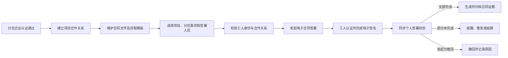
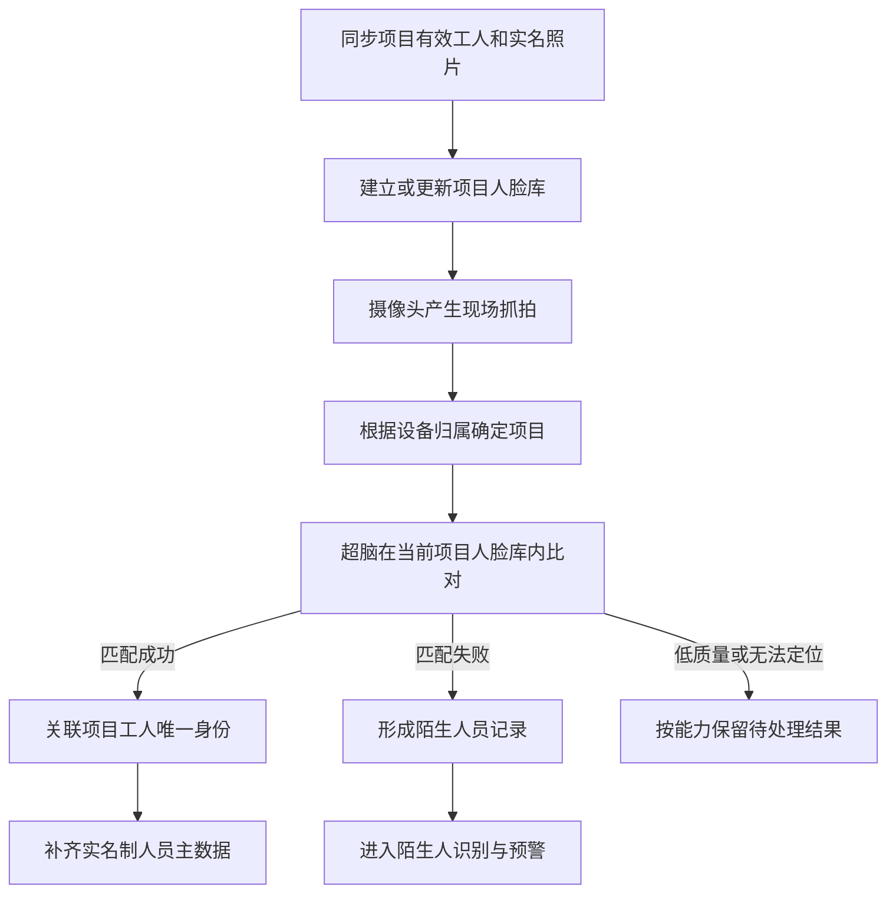
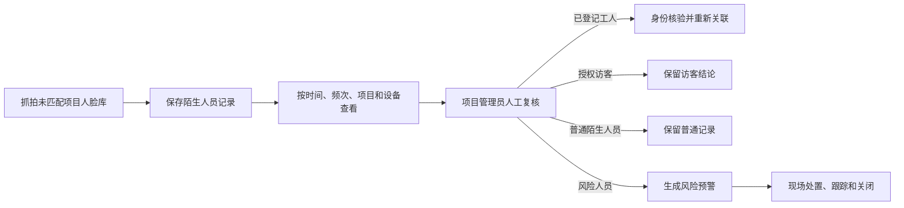
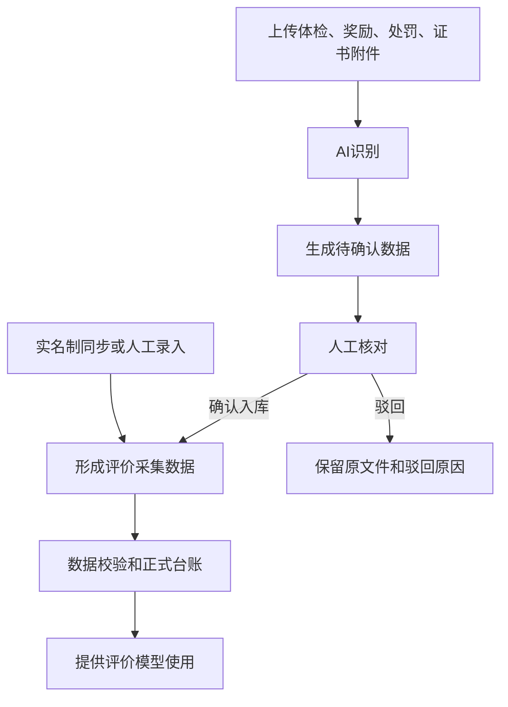

# 基于电子认证体系和 AI 识别的建筑产业工人服务平台
## 第 5—7 章功能需求说明

> 本文件为需求规格说明书第 5—7 章的独立功能需求稿，按照新的功能目录编制。每个功能点统一包含：功能说明、使用角色、操作流程、处理逻辑、页面原型。“材料明确”表示专项需求材料已有明确描述；“推荐设计”或“待确认”表示需课题组或试点项目确认。

---

## 5. 基于电子认证体系的电子合同签订

### 5.1 分包企业注册认证

#### 5.1.1 功能说明

分包企业注册认证用于建立参与项目用工和电子合同签署的企业主体。分包企业可包括承包企业、劳务企业等实际参与项目合作的企业类型。企业提交注册资料后，由平台管理员审核；审核通过后，企业才可以建立项目合作关系、维护项目人员并发起电子合同签署。

主要功能包括：企业注册资料提交、营业执照上传、企业信息审核、审核结果通知、资料补正、企业信息修改、企业认证状态查询，以及认证信息同步至外部电子签署平台。

#### 5.1.2 使用角色

| 角色 | 使用职责 |
| --- | --- |
| 分包企业经办人 | 填写企业资料、上传证照、查看审核结果和补充资料 |
| 系统管理员 | 查看待审核企业、审核通过或驳回、维护企业主体 |
| 承包企业管理员 | 查看与本企业项目相关的已认证分包企业 |
| 电子签署平台 | 接收认证通过的企业主体，返回外部主体标识和同步结果 |

#### 5.1.3 操作流程

1. 分包企业经办人进入注册页面，选择企业类型。
2. 填写企业名称、统一社会信用代码、经办人姓名、手机号等信息，上传营业执照。
3. 系统校验必填资料和统一社会信用代码后提交，企业状态置为“未审核”。
4. 系统管理员查看资料和附件，选择“审核通过”或“审核不通过”。
5. 审核通过后创建或启用企业主体，并同步外部电子签署平台。
6. 同步成功后企业可以参与项目合作和合同签署；同步失败进入异常处理。
7. 审核不通过时记录原因，企业补正后重新提交。

#### 5.1.4 处理逻辑

| 处理项 | 处理要求 |
| --- | --- |
| 企业唯一性 | 统一社会信用代码不得重复；企业名称重复时提示人工核验 |
| 资料校验 | 企业类型、企业名称、统一社会信用代码、经办人信息和营业执照应完整 |
| 认证状态 | 未审核、审核通过、审核不通过、同步中、同步失败、已停用 |
| 审核留痕 | 保存提交人、提交时间、审核人、审核时间、结果和不通过原因 |
| 外部同步 | 审核通过后同步企业主体；失败可重试，不得重复创建外部主体 |
| 修改处理 | 关键信息修改后，按影响范围重新审核或同步 |
| 删除处理 | 已有关联项目、合作关系、合同或历史数据的企业不得物理删除 |
| 权限处理 | 企业只能维护本企业资料；后端必须再次校验数据范围 |
| 异常处理 | 附件上传失败、验证码错误、外部平台不可用时保留已填写内容并允许重试 |

#### 5.1.5 页面原型

页面原型由课题组补充，建议包括：企业注册页面、企业审核页面、附件预览、认证状态页面、外部同步状态、失败原因和企业关联项目/合同信息。

---

### 5.2 项目管理

#### 5.2.1 功能说明

项目管理用于维护电子合同签署和项目用工关系的业务载体。承包企业建立项目后，可维护项目基本信息、关联劳务企业和分包事项；项目作为企业合作、人员范围、合同签署、考勤和评价数据的共同业务范围。

主要功能包括：项目新增、编辑、查询、工期维护、劳务企业关联、分包事项维护、项目状态维护、项目详情查看、历史信息查询和导出。

#### 5.2.2 使用角色

| 角色 | 使用职责 |
| --- | --- |
| 承包企业管理员 | 新增和维护本企业项目 |
| 项目管理员 | 查看和维护授权项目业务信息 |
| 劳务企业管理员 | 查看与本企业建立合作的项目 |
| 系统管理员 | 查看全部项目，处理基础信息和异常关联 |
| 实名制平台 | 提供或接收项目、企业、班组和用工关系数据 |

#### 5.2.3 操作流程

1. 承包企业管理员填写项目所属企业、项目名称、合同开工日期和合同竣工日期。
2. 系统校验项目和工期后保存项目。
3. 承包企业在项目下建立劳务企业合作关系，维护分包事项和合作期限。
4. 合作关系建立后，项目可用于工人用工关系、电子合同和项目人脸库。
5. 用户查看项目下的合作企业、工人、合同和履约信息。
6. 项目工期或合作关系发生变化时，系统保留变更记录并提示相关影响。

#### 5.2.4 处理逻辑

| 处理项 | 处理要求 |
| --- | --- |
| 基础信息 | 项目名称、承包企业、合同开工日期和合同竣工日期应完整 |
| 工期校验 | 开工日期不得晚于竣工日期；修改时提示对已有合同和人员的影响 |
| 数据范围 | 承包企业管理员维护本企业项目；系统管理员查看全部项目 |
| 合作关联 | 同一承包企业、劳务企业、项目和分包事项原则上只能存在一条有效合作记录 |
| 删除规则 | 已关联劳务企业、工人、合同、考勤或评价数据的项目不得物理删除 |
| 项目状态 | 建议包括筹备中、在建、已完工、已停用；停用不删除历史业务记录 |
| 同步规则 | 外部实名制项目与平台项目建立唯一映射，映射失败时不得错误关联人员和考勤 |
| 异常处理 | 项目重复、工期冲突、外部项目不存在或合作失效时阻止相关业务提交 |

#### 5.2.5 页面原型

页面原型由课题组补充，建议包括：项目列表、项目新增/编辑、项目详情、关联劳务企业、分包事项、合作期限、人员数量和项目状态。

---

### 5.3 电子合同管理

#### 5.3.1 功能说明

电子合同管理用于完成合同文件模板和流程模板维护、签署任务发起、工人签署、签署进度跟踪、合同查看、撤回、归档以及合同与项目履约数据的关联。电子认证、电子签名、电子印章和签署证据由外部电子签署平台提供，本平台负责业务编排、状态展示、数据关联和归档索引。

#### 5.3.2 使用角色

| 角色 | 使用职责 |
| --- | --- |
| 系统管理员 | 维护合同文件模板和合同流程模板 |
| 劳务企业管理员 | 发起合同、选择人员、跟踪签署进度 |
| 承包企业/项目管理员 | 按授权查看项目合同和履约状态 |
| 建筑产业工人 | 接收签署任务、完成认证和电子签名 |
| 外部电子签署平台 | 执行认证、签名/签章、合同生成并返回状态 |

#### 5.3.3 操作流程

1. 系统管理员维护合同文件模板和签署流程模板。
2. 劳务企业管理员选择有效项目、分包事项、签署主题和流程模板。
3. 系统带出合作关系中的默认签署人员，校验人员身份、在职和在场状态。
4. 发起人确认人员范围和截止时间后提交签署任务。
5. 系统向外部平台发起签署，保存外部合同标识和个人任务标识。
6. 工人完成身份认证、阅读合同和电子签名。
7. 平台同步个人签署结果并更新整体进度。
8. 全部完成后获取最终合同文件和签署证据并归档。

#### 5.3.4 处理逻辑

| 处理项 | 处理要求 |
| --- | --- |
| 模板类型 | 文件模板定义合同正文和待填充内容；流程模板定义参与方、顺序和认证方式 |
| 发起前提 | 企业认证、项目和合作关系有效，分包事项明确，签署人员属于有效合作人员 |
| 人员范围 | 原材料规定默认包含建立合作关系时的全部人员，是否允许减少需确认 |
| 个人状态 | 待签署、已签署、拒绝签署、认证失败、签署失败、已取消 |
| 整体状态 | 草稿、发起中、进行中、部分失败、签约完成、已撤回、已终止、已解除 |
| 进度计算 | 已完成签署人数/签署总人数，全部完成后整体状态才为签约完成 |
| 外部同步 | 外部结果幂等处理；部分成功时支持失败人员重发或人工处理 |
| 撤回处理 | 进行中的任务可按权限撤回，记录人员、时间和原因并同步外部平台 |
| 删除处理 | 未发起草稿可删除；已发起和已完成合同采用逻辑归档，不得物理删除 |
| 归档内容 | 最终文件、认证记录、签署证据、过程日志、外部合同标识及人员范围快照 |
| 履约关联 | 关联数字身份、项目、分包事项、合作关系、进退场、考勤、AI识别和评价数据 |
| 生命周期 | 变更、续签和解除应基于原合同建立关联合同，保留原合同和时间链 |
| 异常处理 | 外部平台不可用可重试；外部已成功而本平台同步失败时按外部标识补偿同步 |

#### 5.3.5 页面原型

页面原型由课题组补充，建议包括：合同文件模板、合同流程模板、电子合同台账、合同发起、人员选择、签署进度、合同详情、文件下载和签署证据归档。

---

## 6. 基于 AI 识别的考勤辅助与陌生人预警

### 6.1 AI 摄像头和超脑

#### 6.1.1 功能说明

AI 摄像头和超脑功能用于接收项目现场抓拍事件，调用或接收海康超脑的人脸比对结果，并在当前项目有效人脸库内识别人员。识别结果用于形成 AI 识别记录，为智能考勤和陌生人预警提供证据。

本功能不替代实名制平台的人员主数据和原始考勤，也不允许跨项目进行人脸匹配。

#### 6.1.2 使用角色

| 角色 | 使用职责 |
| --- | --- |
| 项目管理员 | 查看项目识别记录、核查人员和处理识别异常 |
| 承包企业管理员 | 查看授权项目的 AI 识别和现场人员情况 |
| 系统管理员 | 配置项目、设备、人脸库同步和连接状态 |
| 实名制平台 | 提供当前项目工人、用工关系和实名照片 |
| 摄像头/海康超脑 | 产生抓拍并完成人脸比对 |

#### 6.1.3 操作流程

1. 从实名制平台同步项目、企业、班组、工人、用工关系和实名照片。
2. 根据项目有效人员建立人脸库并记录同步结果。
3. 摄像头上传抓拍时间、照片、设备和项目归属。
4. 超脑在抓拍所属项目的人脸库内比对。
5. 匹配成功返回项目工人唯一标识；匹配失败标记为陌生人员。
6. 平台保存抓拍和识别结果，已匹配记录补齐实名制人员信息。

#### 6.1.4 处理逻辑

| 处理项 | 处理要求 |
| --- | --- |
| 人脸库范围 | 只能使用当前项目有效人脸库，不允许跨项目匹配 |
| 人脸库来源 | 优先使用实名制平台实名照片；自动同步、人工上传或平台直传方式待确认 |
| 有效人员 | 身份核验通过、项目用工关系有效且未离场的人员才进入当前人脸库 |
| 匹配成功 | 必须关联项目工人唯一身份，不能只保存算法姓名 |
| 匹配失败 | 保存照片、时间、项目和设备信息，工人身份为空 |
| 低质量结果 | 低置信度、质量不足、多脸或项目无法定位时，是否形成待复核记录需结合超脑能力确认 |
| 重复处理 | 对同一事件和重复推送幂等处理 |
| 同步时效 | 识别结果优先实时传输；不支持实时则定时抓取 |
| 设备异常 | 设备离线、项目归属缺失、上传失败或超脑不可用时形成设备/接口异常 |
| 数据保留 | 抓拍照片保存期限和定期清理策略需结合隐私要求确认 |

#### 6.1.5 页面原型

页面原型由课题组补充，建议包括：设备及超脑连接状态、项目人脸库同步状态、AI识别记录、识别详情、照片缩略图和大图预览。

---

### 6.2 智能考勤

#### 6.2.1 功能说明

智能考勤用于按项目、工人和日期形成每日考勤台账，汇总实名制或闸机进出场记录，并关联 AI 摄像头识别记录，帮助管理人员判断工人是否到场、进出场是否完整、工作时长以及是否存在考勤核验异常。

#### 6.2.2 使用角色

| 角色 | 使用职责 |
| --- | --- |
| 项目管理员 | 查询每日考勤、查看进出场和 AI 明细、核查异常 |
| 承包企业管理员 | 查看授权项目考勤和现场数据 |
| 劳务企业管理员 | 查看本企业工人的项目考勤 |
| 实名制/闸机平台 | 提供进场、出场、考勤照片和原始记录 |
| AI 识别服务 | 提供同项目、同工人、同日期的识别记录 |

#### 6.2.3 操作流程

1. 系统定时同步实名制或闸机进出场记录及考勤照片。
2. 系统按“项目 + 工人 + 考勤日期”形成日考勤汇总。
3. 系统关联同项目、同工人、同日期的 AI 识别记录。
4. 管理人员按日期、工人、企业、项目和考勤状态查询台账。
5. 点击考勤记录数查看全部进出场明细，点击 AI 记录数查看摄像头明细。
6. 对缺少记录或多源数据不一致的情况进行核查或人工处理。

#### 6.2.4 处理逻辑

| 处理项 | 处理要求 |
| --- | --- |
| 汇总范围 | 按项目、工人和考勤日期形成一条日考勤记录 |
| 首次进场 | 当日有效进场记录中的最早时间 |
| 最后出场 | 当日有效出场记录中的最晚时间 |
| 工作时长 | 正常状态下为最后出场减首次进场，单位小时，保留两位小数 |
| 考勤状态 | 正常：有有效进场和出场；缺少记录：缺少进场或出场 |
| 空值规则 | 缺少记录时工作时长显示空值或“-”，不按零小时处理 |
| AI 关联 | 通过工人唯一标识和日期关联；AI记录数为零时仍可查看空状态 |
| 明细展示 | 进出场明细按时间升序，照片支持缩略图和大图预览 |
| 数据来源 | 实名制/闸机为原始考勤来源，AI为现场辅助验证来源 |
| 扩展异常 | 有考勤无 AI、有 AI 无考勤、单边记录、连续缺勤、跨项目出现和超长工时 |
| 人工修正 | 如允许补卡或修改，应保留原始值、修正值、原因、操作人和时间；规则待确认 |

#### 6.2.5 页面原型

页面原型由课题组补充，建议包括：工人考勤台账、日期和人员查询、考勤汇总列表、进出场记录弹窗、AI记录弹窗、缺少记录提示和多源不一致核查入口。

---

### 6.3 陌生人识别

#### 6.3.1 功能说明

陌生人识别用于管理未匹配到当前项目有效工人身份的现场抓拍记录，支持陌生人员沉淀、重复出现追踪、项目管理员人工复核以及风险预警。

陌生人员只表示“当前未匹配到项目有效工人”，不自动等同于异常人员或高风险人员。只有明确规则和人工复核后的风险结论，才可进入风险台账、负面标签或评价模型。

#### 6.3.2 使用角色

| 角色 | 使用职责 |
| --- | --- |
| 项目管理员 | 查看陌生人员、核实现场情况、完成复核和处置 |
| 承包企业管理员 | 查看授权项目陌生人员和风险预警 |
| 劳务企业管理员 | 查看与本企业相关的核查结果 |
| 系统管理员 | 维护规则、处理数据异常和身份关联问题 |
| AI 摄像头/超脑 | 产生未匹配结果及抓拍证据 |

#### 6.3.3 操作流程

1. 保存未匹配抓拍的照片、时间、项目和设备信息。
2. 按项目展示首次出现时间、最近出现时间和出现次数。
3. 项目管理员查看照片和现场情况，选择复核结果。
4. 复核为已登记工人时完成身份核验后重新关联。
5. 复核为授权访客或普通陌生人员时保留结论，不生成负面评价。
6. 复核为风险人员时创建风险预警，通知相关人员并记录处置过程。
7. 已确认风险人员再次出现时按规则主动提醒。

#### 6.3.4 处理逻辑

| 处理项 | 处理要求 |
| --- | --- |
| 记录内容 | 抓拍照片、首次出现时间、最近出现时间、项目、设备、出现次数和复核状态 |
| 人员聚合 | 多次抓拍是否属于同一陌生人员，应基于可验证结果或人工确认，不得仅凭相似照片自动合并 |
| 复核结果 | 已登记工人、授权访客、普通陌生人员、风险人员 |
| 重新关联 | 必须校验当前项目用工关系，不得直接修改原始识别结果 |
| 风险判断 | 结合时间、频次、区域、项目名单、人工标记和历史风险结论 |
| 再次出现 | 已确认风险人员再次出现时生成主动提醒并关联历史事件 |
| 黑名单边界 | 未经明确授权不得形成跨项目共享人脸黑名单 |
| 风险评价 | 仅人工复核确认的风险结论可进入负面标签或信用评价 |
| 处置闭环 | 预警至少保存来源记录、风险类型、项目、发现时间、通知对象、处置人、过程、结论和关闭时间 |

#### 6.3.5 页面原型

页面原型由课题组补充，建议包括：陌生人员库、陌生人员详情、出现记录、人工复核弹窗、风险预警列表、风险事件详情和处置关闭页面。

---

## 7. 基于实名制数据建立工人评价模型

### 7.1 工人数据采集

#### 7.1.1 功能说明

工人数据采集用于形成评价模型可使用的标准数据。来源包括实名制系统同步、AI 附件识别、人工数据维护、电子合同履约数据、智能考勤数据和系统计算数据。

采集对象包括工人基础信息、体检记录、奖励记录、处罚记录、证书记录和劳资纠纷记录。AI 识别结果必须经过人工确认后才能进入正式评价数据集。

#### 7.1.2 使用角色

| 角色 | 使用职责 |
| --- | --- |
| 评价管理员 | 维护评价数据、确认 AI 识别数据、检查数据质量 |
| 劳务企业管理员 | 维护本企业工人资料和业务记录 |
| 项目管理员 | 核验项目发生的奖励、处罚、考勤和履约信息 |
| 系统管理员 | 维护字典、导入异常和数据权限 |
| 实名制平台 | 提供人员、组织、项目、用工关系、进退场和考勤 |
| AI 识别服务 | 识别附件字段并生成待确认数据 |

#### 7.1.3 操作流程

1. 系统同步实名制人员、组织、项目、班组、用工关系和考勤。
2. 管理人员新增体检、奖励、处罚、证书或劳资纠纷记录。
3. 上传附件并选择业务类型，系统 AI 识别生成待确认数据。
4. 管理人员核对识别字段，确认入库或驳回。
5. 系统校验工人、身份证号、项目、日期和业务字段后形成正式台账。
6. 评价模型按评价周期读取正式台账和系统计算数据。

#### 7.1.4 处理逻辑

| 处理项 | 处理要求 |
| --- | --- |
| 实名制数据 | 同步成功并完成数字身份关联后方可使用 |
| 体检记录 | 工人、项目、体检日期、体检结果和是否合格应完整 |
| 奖励记录 | 使用安全之星、质量之星、公司技能大赛等有效字典 |
| 处罚记录 | 使用安全整改、质量整改等有效字典 |
| 证书记录 | 包含证书类别、名称、有效期及工人身份关联 |
| 劳资纠纷 | 包含工人、项目、发生日期和纠纷事项；有效记录即可参与信用扣分 |
| AI 待确认 | 确认前不得写入正式台账或参与评分 |
| 数据状态 | 建议包括草稿、待确认、已确认、已驳回、已作废 |
| 保存校验 | 工人和身份证号匹配；日期、数值、比例和字典值符合规则 |
| 历史处理 | 被批次引用的数据允许更正，但历史批次保留原始快照 |
| 删除处理 | 正式数据和 AI 原件原则上逻辑删除，不能物理删除历史证据 |
| 数据待补充 | 数据不足或分母为零时标记“数据待补充”，不得直接按零分处理 |

#### 7.1.5 页面原型

页面原型由课题组补充，建议包括：数据采集中心、五类业务台账、人工新增/编辑、附件上传、AI待确认、确认入库、驳回、原附件预览和数据质量提示。

---

### 7.2 工人评价模型

#### 7.2.1 功能说明

工人评价模型用于配置评价维度、指标、计分依据来源、算分规则、权重、等级区间和标签规则，并按评价周期执行模型，形成五维得分、综合评分和评价等级。

五个评价维度为：职业资质、履约能力、安全行为、工作效率、信用记录。

#### 7.2.2 使用角色

| 角色 | 使用职责 |
| --- | --- |
| 评价模型管理员 | 配置指标、权重、等级、适用范围和模型状态 |
| 评价执行人员 | 选择评价周期和范围，创建和跟踪批次 |
| 系统管理员 | 维护计分依据来源、字段字典和权限 |
| 企业/项目管理员 | 查看授权范围内的评价结果 |
| 工人 | 按授权查看本人评价结果和依据 |

#### 7.2.3 操作流程

1. 创建或编辑评价模型，配置五个维度及权重。
2. 在维度下配置指标，选择计分依据来源和算分规则。
3. 配置 A、B、C、D 等级区间及适用范围。
4. 配置随模型执行的标签规则。
5. 保存并校验模型，校验通过后启用。
6. 选择评价周期、项目或工人范围，创建执行批次。
7. 系统计算指标、维度、综合评分、等级并执行标签规则。
8. 执行完成后更新画像和工人库；失败工人保留原因。

#### 7.2.4 处理逻辑

| 处理项 | 处理要求 |
| --- | --- |
| 默认权重 | 职业资质25%、履约能力30%、安全行为20%、工作效率10%、信用记录15% |
| 评分类型 | 基准分、加分项、扣分项、权重计分 |
| 权重计分 | 完成比例=计分依据来源值÷标准值；指标得分=完成比例×最大权重分值 |
| 得分范围 | 维度得分和综合评分0—100分；完成比例原则上0%—100% |
| 等级区间 | A：90—100，B：80—89.99，C：60—79.99，D：0—59.99；必须完整且不重叠 |
| 指标方向 | 有效证书、项目经历、体检、工时占比、出勤完成率、连续缺勤、公司变更、奖励整改、劳资纠纷等 |
| 配置校验 | 指标编号和名称不重复；来源字段有效；加扣分和权重参数完整 |
| 执行前校验 | 权重100%、等级完整、存在启用指标、周期有效、范围有有效工人 |
| 批次状态 | 待执行、执行中、成功、部分成功、失败 |
| 批次快照 | 保存指标、权重、等级、标签规则、原始数据引用、人员范围和计算明细 |
| 历史结果 | 配置修改不得影响历史批次；快照和评分明细不得物理删除 |
| 重复执行 | 相同工人、周期和模型重复执行时提示并进行幂等控制 |
| 数据不足 | 分母为零或数据不足时标记数据待补充，不按零分处理 |

#### 7.2.5 页面原型

页面原型由课题组补充，建议包括：模型列表、模型编辑、五维权重、等级区间、指标配置、计分依据来源、算分规则、标签规则、评价执行和批次详情。

---

### 7.3 工人画像及评价

#### 7.3.1 功能说明

工人画像及评价用于汇总工人的实名基础信息、项目履历、五维得分、综合评分、评价等级、智能标签和评价依据，形成可理解、可追溯的综合评价结果。

画像读取最近一次成功的正式评价批次，不在页面打开时重新计算。五维得分、综合评分、等级和自动标签必须来自同一批次。

#### 7.3.2 使用角色

| 角色 | 使用职责 |
| --- | --- |
| 承包企业管理员 | 查看授权项目和本企业工人画像 |
| 项目管理员 | 查看本项目工人评价、履约和风险摘要 |
| 劳务企业管理员 | 查看本企业工人画像和评价依据 |
| 评价管理员 | 查看批次结果、评分明细和标签结果 |
| 建筑产业工人 | 按授权查看本人评价结果 |

#### 7.3.3 操作流程

1. 评价批次成功后生成或更新工人画像。
2. 画像读取同一成功批次中的五维得分、综合评分、等级和自动标签。
3. 系统汇总当前及历史项目、企业、班组、合同、考勤、风险和评价数据。
4. 根据综合评分、等级、最高/最低维度和标签生成综合评价说明。
5. 用户查看画像、评价周期、数据截止时间和评分依据。
6. 新的成功批次完成后切换当前结果；失败批次不得替换正式画像。

#### 7.3.4 处理逻辑

| 处理项 | 处理要求 |
| --- | --- |
| 基础信息 | 姓名、脱敏身份证号、所属企业、当前项目、班组和状态 |
| 项目履历 | 展示实际参与项目，并按用户数据权限过滤 |
| 评价结果 | 五维得分、综合评分、等级、评价周期、执行批次和更新时间 |
| 标签 | 区分正向/警示、自动/人工标签；自动更新保留人工标签 |
| 评价依据 | 追溯指标、计分依据来源、算分规则和正式业务记录 |
| 业务摘要 | 体检、奖励、处罚、证书、劳资纠纷、考勤和现场风险摘要 |
| 综合说明 | 使用轻量化模板生成，不依赖外部大模型 |
| 数据时效 | 展示数据截止时间；过期或不完整时明确提示 |
| 历史结果 | 可查看历史批次及当时配置快照和计算结果 |
| 权限保护 | 身份证号、合同、风险事件、纠纷和负面依据按权限展示 |
| 人工调整 | 人工标签或说明应记录来源、操作人、时间和理由，不修改模型分数 |

#### 7.3.5 页面原型

页面原型由课题组补充，建议包括：画像首页、基础信息、五维得分、综合评分、等级、标签、项目履历、评价依据、历史批次和数据不足提示。

---

### 7.4 工人库

#### 7.4.1 功能说明

工人库用于沉淀企业当前在场工人、历史合作工人和可复用人才，将工人画像、评价结果、证书、项目经历、标签和风险信息转化为企业用工和风险管理的参考依据。

工人库不是自动用工审批工具，不应仅凭评分或单个负面记录形成不可逆的用工限制。

#### 7.4.2 使用角色

| 角色 | 使用职责 |
| --- | --- |
| 承包企业管理员 | 按项目、工种、等级和风险筛选工人 |
| 项目管理员 | 为新项目组织班组和人员时查询工人库 |
| 劳务企业管理员 | 查看本企业当前及历史合作工人 |
| 评价管理员 | 查看人才库结果来源和评价批次 |
| 系统管理员 | 维护数据权限、字典和异常处理 |

#### 7.4.3 操作流程

1. 评价批次成功后，将画像结果同步到相应企业工人库。
2. 用户按工种、证书、项目经历、等级、标签、在场状态和风险筛选。
3. 用户查看画像及评价依据，确认评价周期和数据时效。
4. 用户将工人作为新项目选人、班组组织或风险审查的参考对象。
5. 新项目形成用工关系后，合同、考勤、履约和评价数据继续反馈到工人库。
6. 工人离场或合作解除后保留历史记录，更新当前状态和可用性。

#### 7.4.4 处理逻辑

| 处理项 | 处理要求 |
| --- | --- |
| 人才范围 | 当前在场、历史合作和可复用人才均可沉淀，但应区分状态 |
| 筛选条件 | 工种、证书、项目经历、等级、标签、当前状态和风险信息 |
| 数据来源 | 读取工人画像和评价批次结果，不重复维护评分数据 |
| 数据时效 | 展示最近评价周期、截止时间和更新时间 |
| 评价依据 | 可查看指标、项目履历、证书、合同履约、考勤和已复核风险 |
| 决策留痕 | 重要用工决策记录参考画像版本、评价批次、操作人和时间 |
| 风险限制 | 自动评分和标签仅作辅助，不替代企业审批或生成永久禁用 |
| 状态更新 | 入场、离场、解约、合作解除和新项目合作更新当前状态并保留历史 |
| 权限范围 | 承包企业按授权项目查看；劳务企业查看本企业工人；项目用户看授权范围 |
| 反馈闭环 | 新项目履约结果继续进入采集、模型、画像和工人库 |

#### 7.4.5 页面原型

页面原型由课题组补充，建议包括：企业工人库列表、工人库筛选、工人详情、画像摘要、评价依据、新项目选人参考和用工决策留痕。
