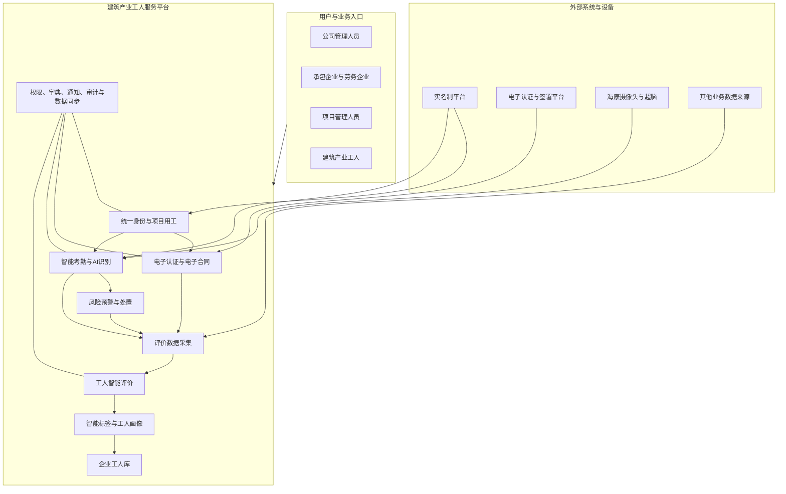
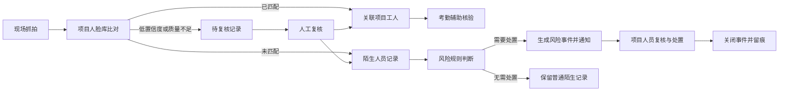
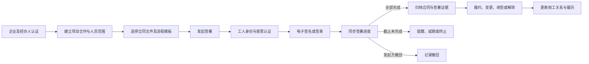
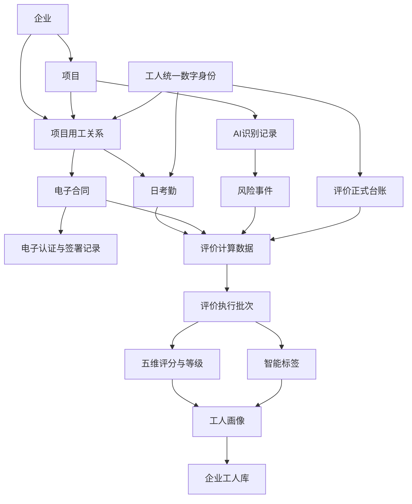

# 基于电子认证体系和 AI 识别的建筑产业工人服务平台需求规格说明书

## 文档属性

| 属性 | 内容 |
| --- | --- |
| 文档名称 | 基于电子认证体系和 AI 识别的建筑产业工人服务平台需求规格说明书 |
| 课题名称 | 基于电子认证体系和 AI 识别的建筑产业工人服务的应用研究 |
| 文档版本 | V0.1 |
| 文档状态 | 开题阶段初稿 |
| 编制日期 | 2026 年 7 月 28 日 |
| 适用阶段 | 课题开题、总体方案确认、原型设计与后续详细设计输入 |
| 设计层级 | 项目级、模块级、流程级 |
| 主要读者 | 课题负责人、业务负责人、产品人员、研发人员、测试人员、试点项目管理人员 |

### 需求状态说明

本文档使用以下状态标识：

- **已确认**：来源于课题任务书、专项需求材料或用户明确确认的业务流程。
- **推荐方案**：根据三项研究方向和完整业务闭环形成的总体产品方案，需在评审时确认。
- **待确认**：材料中尚未给出唯一结论，或依赖外部系统、设备及试点条件。
- **本期不实现**：不属于当前课题成果平台的核心闭环，保留后续扩展空间。

---

## 1. 文档概述

### 1.1 编制目的

本说明书用于明确课题成果平台的总体产品需求，统一课题任务书、三个专项研究方向和现有工人评价原型之间的建设边界，为后续前端原型、产品需求详细设计、系统研发、集成联调、试点验证和课题验收提供共同依据。

本文档重点说明：

- 平台要解决的业务问题和总体建设目标；
- 本期建设范围、非本期范围和现有能力复用范围；
- 参与角色及其职责；
- 总体业务闭环、功能架构和模块关系；
- 电子认证与电子合同、AI 考勤与风险预警、工人智能评价三个方向的产品需求；
- 核心业务对象、关键状态和关键业务规则；
- 课题研究内容与平台功能、验证场景之间的对应关系；
- 后续原型设计和详细设计需要继续细化的事项。

本文档不展开接口地址、数据库表结构、类与方法、算法代码、页面逐字段规则和按钮级交互。

### 1.2 编制依据

1. 《基于电子认证体系和 AI 识别的建筑产业工人服务的应用研究-先进技术储备类任务书61改》。
2. 《电子认证与电子合同》专项需求文档，仅采用其中与企业及工人身份、项目用工关系、电子合同、电子签章和合同履约有关的内容。
3. 《AI考勤与风险预警》专项需求文档。
4. 《工人智能评价》专项需求文档。
5. 当前工人智能评价平台前端 MVP 及项目说明材料。
6. 已确认的总体业务闭环：工人进场 → 实名制登记 → 电子合同认证 → 智能考勤与风险预警 → 智能评价与工人画像 → 企业工人库 → 反哺公司用工与风险管理。

### 1.3 适用范围

本说明书面向以总承包单位为核心、覆盖项目、劳务企业、班组和建筑产业工人的公司级建筑产业工人服务平台。平台以工人统一数字身份为主线，关联其项目用工关系、电子合同、考勤与现场识别、评价结果、标签、画像和企业工人库记录。

### 1.4 术语说明

| 术语 | 说明 |
| --- | --- |
| 实名制平台 | 提供项目、企业、班组、工人、用工关系、考勤记录和实名制照片等基础数据的外部或现有系统 |
| 统一数字身份 | 平台为同一工人建立的唯一身份关联，用于连接实名信息、项目履历、合同、考勤、风险事件和评价结果 |
| 电子认证 | 对企业主体、经办人、工人身份及签署意愿进行核验，并形成可追溯认证记录 |
| 电子合同 | 建筑产业工人与用工主体在线签署，并支持查询、变更、续签、解除和留痕的劳动或劳务合同 |
| AI 识别记录 | 由现场摄像头和识别设备产生，经项目人脸库比对后形成的已匹配、陌生人或待复核记录 |
| 计分依据来源 | 按工人、项目和评价周期形成的可用于指标取值的业务计算口径，不等同于原始数据库字段 |
| 算分规则 | 指标如何根据计分依据来源计算得分，包括基准分、加分、扣分和权重计分 |
| 规则依据 | 智能标签规则选择的业务数据、系统计算结果或评分结果 |
| 工人画像 | 工人的基础资料、项目履历、五维得分、综合评分、等级、标签、台账摘要和风险信息的综合呈现 |
| 企业工人库 | 企业沉淀的可查询、可筛选、可复用的建筑产业工人人才资源库 |

---

## 2. 需求背景与建设目标

### 2.1 业务背景

建筑产业工人管理已逐步形成实名制登记、门禁考勤、劳务合同和项目用工管理等数字化基础，但实际应用中仍存在系统相互独立、数据难以共享、劳动关系缺乏可信证据链、工人评价依赖经验、现场风险识别不及时等问题。

课题拟依托现有建筑产业工人管理基础，融合电子认证、电子签名、多源业务数据、AI 视觉识别和动态评价模型，形成覆盖工人“进场—履约—评价—再用工”的数字化服务闭环。

### 2.2 当前问题

| 问题领域 | 主要问题 |
| --- | --- |
| 身份与用工关系 | 工人、企业、项目、班组和用工关系分散，缺少统一数字身份和跨环节关联 |
| 电子合同 | 线下签署和纸质归档效率低，签署真实性、履约过程和争议取证缺乏统一可信支撑 |
| 考勤管理 | 单一门禁或实名制考勤难以充分证明真实在场和完整工时，异常数据依赖人工排查 |
| 现场风险 | 陌生人员和异常人员缺少主动发现、复核、处置和留痕闭环 |
| 工人评价 | 评价标准不统一，职业资质、履约、安全、效率和信用数据没有形成可配置、可追溯的量化模型 |
| 人才沉淀 | 工人数据停留在单项目管理，评价和画像无法有效反哺后续选人、用人和风险管理 |

### 2.3 建设价值

平台形成四项核心价值：

- **身份可信**：统一关联企业、工人、项目、用工关系和电子合同。
- **过程可溯**：留存签署、履约、考勤、识别、风险处置和评价执行证据。
- **评价可用**：以多源客观数据形成五维评价、智能标签和工人画像。
- **风险可控**：通过身份核验、合同状态、考勤核验、陌生人员识别和评价警示辅助管理决策。

### 2.4 总体建设目标

**已确认目标：**

构建以总承包单位为核心，覆盖工人进场、实名登记、电子合同认证、智能考勤、现场风险预警、智能评价、工人画像和企业工人库的建筑产业工人数字化服务平台，为迈向工人全生命周期数字化赋能奠定基础。

**推荐的产品目标：**

1. 建立工人统一数字身份和项目人员主数据，实现跨系统、跨项目、跨业务环节的一致关联。
2. 建立电子合同认证和全流程留痕能力，使劳动关系可核验、可查询、可追溯。
3. 建立实名制考勤与 AI 识别协同核验机制，提高现场人员和考勤数据的真实性。
4. 建立陌生人员发现、风险复核、预警通知、处置反馈和闭环归档能力。
5. 建立可配置的五维评价模型，以客观数据形成评分、等级、标签和画像。
6. 建立企业工人库，用评价结果和风险信息反哺人员筛选、项目用工和公司风险管理。

---

## 3. 建设范围与阶段边界

### 3.1 本期建设范围

| 建设域 | 本期范围 |
| --- | --- |
| 基础主数据 | 企业、项目、班组、工人、项目用工关系、进退场关系和统一身份关联 |
| 电子认证 | 企业主体认证、经办人关联、工人实名身份核验、签署身份与意愿认证记录 |
| 电子合同 | 合同模板与流程模板引用、签署发起、签署进度、签署完成、撤回、合同查询下载、变更/续签/解除及履约留痕 |
| 智能考勤 | 实名制考勤同步、按工人/项目/日期汇总、进出场明细、工作时长、缺少记录识别 |
| AI 识别 | 项目人脸库、现场抓拍、项目内比对、已匹配人员、陌生人员、识别记录查询 |
| 风险预警 | 陌生或异常人员复核、风险事件生成、通知、处置、关闭和留痕 |
| 评价数据采集 | 实名制数据同步、AI 附件识别待确认、体检/奖励/处罚/证书/劳资纠纷人工台账 |
| 工人评价 | 五维指标、维度权重、算分规则、等级、模型执行、执行记录和历史快照 |
| 智能标签 | 基于业务数据和评分结果的 AND/OR 规则、正向标签、警示标签 |
| 工人画像 | 基础信息、项目履历、五维评价、综合评分、等级、标签及台账摘要 |
| 企业工人库 | 工人查询筛选、画像查看、人才沉淀、用工参考和风险提示 |
| 共性支撑 | 权限与数据范围、字典、消息通知、审计留痕、数据同步状态和异常处理 |

### 3.2 非本期范围

以下内容不作为本期核心交付：

- 工资核算、工资代发、薪税和财务结算；
- 面向全行业的公开工人交易或跨企业人才市场；
- 完整培训学习平台、考试平台和证书发证系统；
- 通用视频监控平台、设备运维平台和全类型物联网管理；
- 自动对工人作出辞退、封禁、处罚等不可逆决定；
- 未经人工核验，直接使用低置信度 AI 结果对工人评分或形成负面结论；
- 大模型自动生成工人评价结论，当前画像摘要采用可解释的规则模板；
- 与本课题三项研究方向无关的通用企业管理和行政办公功能。

### 3.3 后续扩展范围

- 面向工人的移动端合同签署、个人画像和权益查询；
- 评价结果驱动的培训推荐、岗位推荐和班组优化；
- 更多现场行为识别，如异常聚集、越界、未佩戴防护用品等；
- 跨项目的人才调配和项目用工计划；
- 与工资支付、劳务纠纷处理和信用管理平台的深度协同；
- 模型版本治理、自动调参、数据质量评估和算法效果监控。

### 3.4 现有能力复用范围

| 能力 | 当前基础 | 本期处理 |
| --- | --- | --- |
| 工人智能评价 | 已有 React + Vite 前端 MVP，覆盖数据采集、评价模型、标签、画像和工人库演示闭环 | 复用业务规则、页面流程、字典和模型结构；真实后端、数据持久化和外部接口仍需建设 |
| 电子合同 | 现有材料表明已设计与外部电子签署平台的协同流程 | 以服务恢复后的全流程复验和优化为重点，实际接口能力需重新确认 |
| AI 识别 | 已形成实名制数据与海康设备抓拍结果协同的专项需求 | 在项目现场完成设备接入、项目人脸库、识别结果回传和场景适配验证 |
| 实名制数据 | 作为人员、企业、班组、项目、用工和考勤的权威来源 | 明确数据口径、同步方式、唯一标识和异常补偿机制 |

---

## 4. 参与角色与职责

| 角色 | 主要职责 | 主要参与环节 |
| --- | --- | --- |
| 系统管理员 | 维护基础配置、企业审核、权限、字典、外部系统配置和审计 | 全局管理 |
| 公司劳务/工人管理人员 | 查看公司范围项目和工人，管理评价模型，使用企业工人库辅助用工 | 评价、画像、工人库、风险管理 |
| 承包企业管理员 | 维护本企业项目，确认劳务合作和人员范围，查看合同、考勤和风险 | 项目、用工、合同、考勤、预警 |
| 劳务企业管理员 | 维护工人基础信息，建立项目合作关系，发起电子合同，维护部分评价台账 | 实名登记、合作、合同、数据采集 |
| 项目管理人员 | 管理项目人员范围，核对考勤和 AI 识别记录，处置风险事件 | 进场、考勤、风险预警 |
| 评价管理人员 | 维护评价指标、维度权重、等级和标签，执行评价并查看结果 | 评价模型、标签、画像 |
| 建筑产业工人 | 完成实名登记、身份认证和合同签署，形成履约、考勤和评价数据 | 入场、签约、履约 |
| 风险事件处置人员 | 接收预警，复核身份和风险，记录处置结果并关闭事件 | 风险预警闭环 |
| 外部电子认证/签署平台 | 提供企业与个人认证、电子签名、电子签章、合同文件和签署状态 | 电子认证与合同 |
| 实名制平台 | 提供企业、项目、班组、工人、用工关系、考勤和实名照片 | 主数据与考勤 |
| AI 设备及识别服务 | 产生现场抓拍并在项目人脸库范围内进行识别比对 | AI 识别与预警 |

角色只定义总体职责和数据责任。菜单、页面、操作和字段权限在详细设计阶段进一步明确。

---

## 5. 总体产品实现方案

### 5.1 总体实现思路

平台以“一个统一数字身份、三项研究能力、一个企业工人库”为总体思路：

1. 以实名制数据建立工人、企业、项目、班组和用工关系的统一主数据。
2. 以统一数字身份贯穿电子认证、合同签署、履约、考勤、AI 识别、评价和画像。
3. 以电子合同固化劳动或劳务关系，形成可信签署和履约证据。
4. 以实名制考勤和 AI 识别共同描述工人在场及现场活动，发现数据缺失和人员风险。
5. 以多源业务数据执行五维评价，形成可解释的评分、等级和标签。
6. 以工人画像和企业工人库沉淀人才资源，反哺后续选人、用工和风险管理。
7. 新一轮项目用工结果继续产生履约数据，推动画像和工人库动态更新。

### 5.2 总体业务闭环


### 5.3 闭环产出

| 环节 | 主要产出 | 下游用途 |
| --- | --- | --- |
| 实名登记 | 工人统一身份、项目人员主数据 | 合同签署、考勤匹配、评价关联 |
| 电子合同 | 合同文件、签署记录、合同状态 | 劳动关系证明、履约追溯 |
| 智能考勤 | 日考勤汇总、进出场明细、工时、缺失状态 | 履约分析、评价取数 |
| AI 识别 | 已匹配人员、陌生人员、识别证据 | 考勤辅助、风险发现 |
| 风险处置 | 风险事件、复核结论、处置记录 | 项目风险管理、评价数据 |
| 智能评价 | 五维得分、综合评分、等级、标签 | 工人画像、人才筛选 |
| 企业工人库 | 可查询的工人画像与履历 | 选人、调配、风险提示 |

---

## 6. 功能架构与模块关系

### 6.1 总体功能架构



### 6.2 统一身份与项目用工

该模块负责形成其他模块共同使用的业务基础：

- 企业主体及经办人信息；
- 项目、班组和企业合作关系；
- 工人实名信息及统一数字身份；
- 工人与劳务企业、承包企业、项目、班组之间的用工关系；
- 工人入场、在场、离场、解约和项目履历；
- 实名照片及项目人脸库关联。

统一数字身份应作为跨系统关联的主线，但不得仅依赖姓名或身份证号明文进行松散匹配。具体唯一标识生成和外部标识映射方式在详细设计中确定。

### 6.3 电子认证与电子合同

#### 6.3.1 电子认证

平台应支持：

- 对承包企业、劳务企业的主体信息进行审核；
- 关联企业名称、统一社会信用代码、营业执照、经办人及联系方式；
- 将审核通过的企业同步至外部电子认证与签署平台；
- 对工人实名身份、签署人身份和签署意愿进行核验；
- 记录认证结果、认证时间、认证渠道和外部认证标识；
- 认证失败或信息不一致时阻止进入正式签署，并保留失败原因。

#### 6.3.2 电子合同

平台应支持：

- 维护或引用合同文件模板和签署流程模板；
- 按项目、分包事项和有效合作人员确定签署范围；
- 由劳务企业或授权主体发起合同签署；
- 查看签署人员、已签署/未签署状态、整体进度和截止时间；
- 同步外部签署平台的签署状态和最终合同文件；
- 对进行中的签署流程执行撤回；
- 查询、查看、下载和归档已完成合同；
- 关联合同变更、续签和解除记录；
- 将合同状态反馈到工人项目用工关系；
- 保留发起、认证、签署、撤回、完成、变更和解除的全过程留痕。

合同印章管理由外部电子签署平台承载时，本平台提供安全跳转或状态协同，不重复建设电子印章底层能力。

### 6.4 智能考勤与 AI 风险预警

#### 6.4.1 智能考勤

平台应按“项目 + 工人 + 考勤日期”形成日考勤汇总，并支持查看：

- 工人及其所属企业、班组和项目；
- 当日首次进场、最后出场；
- 当日有效进出场记录数量；
- 工作时长；
- 正常或缺少记录状态；
- 实名制进出场明细及照片；
- 同一工人、同一日期的 AI 识别记录。

当前确认的考勤状态为：

- **正常**：至少存在有效进场和有效出场；
- **缺少记录**：缺少进场或出场。

工作时长原则上仅在考勤正常时计算，按最后出场时间减首次进场时间形成。跨日、夜班、重复打卡、无方向记录等复杂场景需在详细设计中明确。

#### 6.4.2 AI 识别

平台应支持：

- 按项目同步有效工人及实名照片，建立项目人脸库；
- 接收摄像头抓拍时间、照片、设备和项目归属；
- 仅在抓拍所属项目的有效人脸库内进行匹配，不允许跨项目匹配；
- 匹配成功后关联项目工人唯一身份，并补充企业、班组和项目信息；
- 匹配失败时形成陌生人员记录，保留抓拍证据；
- 支持按时间、项目、设备和识别结果查询；
- 支持照片缩略图和大图查看；
- AI 识别记录可与实名制考勤进行关联核验，但不能替代原始实名制记录。

#### 6.4.3 风险预警

任务书要求平台形成现场风险主动预警能力。推荐建立以下闭环：



“陌生人员”只表示未匹配到当前项目工人，不能自动等同于“异常人员”或“高风险人员”。是否产生预警，应由风险规则、名单信息、出现频次、时间和项目场景共同判断。

低置信度、图片质量不足、多脸和项目归属不明记录，专项材料当前方案为不传入管理后台。为避免风险数据静默丢失，本文推荐后续增加“待复核”机制；是否纳入本期由项目组确认。

### 6.5 评价数据采集

评价数据来源包括：

1. **实名制系统同步**：工人、企业、项目、班组、用工关系和考勤。
2. **AI 附件识别**：从业务附件提取评价数据，进入待确认队列。
3. **人工数据维护**：体检、奖励、处罚、证书和劳资纠纷。
4. **系统计算数据**：由原始业务数据按统一口径形成的计分依据来源。

AI 附件识别数据必须经过“附件上传 → AI 识别 → 待确认 → 人工核对 → 确认入库或驳回”流程。未经确认的数据不得直接参与评价。

### 6.6 工人智能评价

平台应支持以下评价能力：

- 配置职业资质、履约能力、安全行为、工作效率、信用记录五个评价维度；
- 配置维度权重，默认权重分别为 25%、30%、20%、10%、15%；
- 配置评价指标、计分依据来源和算分规则；
- 支持基准分、加分项、扣分项和权重计分四种评分类型；
- 配置 A、B、C、D 等级区间；
- 按公司、项目、评价周期等范围创建评价执行批次；
- 计算指标得分、维度得分、综合评分和等级；
- 保留执行批次、结果明细、模型配置快照和失败信息；
- 评价完成后执行智能标签规则并更新工人画像；
- 单个工人失败不影响其他工人完成评价，批次应体现部分成功状态。

### 6.7 智能标签、工人画像与企业工人库

#### 6.7.1 智能标签

标签规则可使用实名制数据、评价采集数据、系统计算数据和评分结果作为规则依据。标签条件支持 AND 和 OR。

标签分类采用静态字典：

- 职业资质；
- 履约能力；
- 安全行为；
- 工作效率；
- 信用记录；
- 综合评价。

标签属性分为正向标签和警示标签。自动标签与人工标签应区分来源；重新执行模型时更新自动标签，不应覆盖人工标签。

#### 6.7.2 工人画像

工人画像读取最近一次成功评价批次的完整结果，不在打开页面时临时重新计算。五维得分、综合评分、等级和自动标签必须来自同一执行批次。

画像至少包含：

- 工人实名基础信息；
- 当前及历史项目履历；
- 五维得分、综合评分和等级；
- 正向标签和警示标签；
- 体检、奖励、处罚、证书和劳资纠纷摘要；
- 考勤与现场风险摘要；
- 基于规则模板形成的智能综合评价说明。

#### 6.7.3 企业工人库

企业工人库应支持：

- 按工种、技能证书、项目经历、评价等级、标签和风险信息筛选工人；
- 查看工人画像和评价依据；
- 区分当前在场工人、历史合作工人和可复用人才；
- 为新项目选人、班组组织和风险审查提供参考；
- 保留评价时间和数据时效提示，避免使用过期结果；
- 记录重要用工决策所依据的画像版本和评价批次。

工人库提供辅助决策，不直接替代企业用工审批和人工判断。

---

## 7. 整体业务流程

### 7.1 主业务流程

| 阶段 | 业务活动 | 主要参与者 | 关键产出 |
| --- | --- | --- | --- |
| 1. 工人进场 | 劳务企业选择拟进场工人，关联承包企业、项目、班组和分包事项 | 劳务企业、承包企业、项目管理人员 | 进场申请、待建立用工关系 |
| 2. 实名登记 | 核验工人实名信息和照片，建立统一数字身份及项目人员主数据 | 劳务企业、项目管理人员、实名制平台 | 已核验身份、项目人员关系 |
| 3. 电子合同认证 | 选择模板和签署人员，完成身份与意愿认证、合同签署 | 劳务企业、工人、电子签署平台 | 已签署合同、签署证据 |
| 4. 履约与考勤 | 同步实名制进出场记录，接收 AI 抓拍并按日形成考勤 | 项目管理人员、实名制平台、AI 设备 | 日考勤、进出场明细、AI 记录 |
| 5. 风险预警 | 识别陌生或异常人员，复核并处置风险事件 | 项目管理人员、风险处置人员 | 风险事件、处置结果 |
| 6. 智能评价 | 汇聚实名制和人工台账，按模型生成评分、等级和标签 | 评价管理人员 | 评价批次、五维得分、标签 |
| 7. 工人画像 | 汇总身份、履历、考勤、风险和评价结果 | 公司管理人员 | 工人画像 |
| 8. 企业工人库 | 沉淀人才，支持新项目选人和风险审查 | 公司劳务/工人管理人员 | 人才筛选和用工参考 |
| 9. 反馈再用工 | 用工结果形成新的项目履历和评价数据 | 公司、项目、劳务企业 | 动态更新的画像与工人库 |

### 7.2 电子合同流程



### 7.3 评价执行流程


### 7.4 重要分支流程

#### 身份核验失败

身份信息不一致、认证失败或实名照片不可用时，系统应暂停签约和正式入场流程，记录失败原因，并由业务人员补充或修正资料后重新核验。

#### 合同未完成

签署截止前应支持查看未签人员和进度。截止后由业务规则决定延期、重新发起或终止，不得将未完成合同标记为有效合同。

#### 考勤缺少记录

缺少进场或出场时标记“缺少记录”，不直接计算正常工作时长。后续可通过业务补录、设备记录或人工核验形成修正记录，原始记录和修正过程均应保留。

#### 陌生人员复核

陌生人员不能因未匹配而直接形成负面评价。复核后可归类为已登记工人、授权访客、普通陌生人员或需要处置的风险人员。

#### 评价数据不足

计分依据来源缺失或分母为零时，指标应标记“数据待补充”，不能简单按零分处理。评价结果应能区分“真实低分”和“数据不足”。

### 7.5 关键业务状态

| 对象 | 建议核心状态 |
| --- | --- |
| 工人身份 | 待核验、核验通过、核验失败、信息失效 |
| 项目用工关系 | 待入场、在场、离场、已解约 |
| 电子合同 | 草稿、签署中、签署完成、已撤回、已变更、已续签、已解除 |
| 日考勤 | 正常、缺少记录 |
| AI 识别 | 已匹配、陌生人；待复核为推荐扩展状态 |
| 风险事件 | 待复核、已确认、处置中、已关闭、已排除 |
| 评价批次 | 待执行、执行中、成功、部分成功、失败 |
| 画像 | 待生成、已生成、待更新 |

完整状态转换条件在详细设计阶段定义。

---

## 8. 核心业务对象及关系

### 8.1 核心业务对象

| 对象 | 业务含义 | 主要来源 | 关键关系 |
| --- | --- | --- | --- |
| 企业 | 承包企业或劳务企业主体 | 企业注册、审核、外部认证 | 拥有项目、工人或合作关系 |
| 项目 | 工人进场、合同、考勤和风险识别的业务边界 | 项目管理或实名制平台 | 关联企业、班组、工人和设备 |
| 班组 | 项目内组织工人的业务单元 | 实名制平台 | 隶属项目，包含工人 |
| 工人统一数字身份 | 同一工人的跨系统唯一关联 | 实名核验及标识映射 | 关联合同、考勤、识别、评价和画像 |
| 项目用工关系 | 工人与劳务企业、承包企业、项目和班组的履约关系 | 实名制或合作管理 | 决定签约、考勤、画像中的项目范围 |
| 电子认证记录 | 企业或工人的身份、意愿核验结果 | 外部认证平台 | 支撑电子合同签署 |
| 电子合同 | 项目用工关系的电子化协议及生命周期记录 | 本平台与外部签署平台 | 关联签署任务、工人和项目 |
| 日考勤 | 工人某项目某日期的考勤汇总 | 实名制考勤 | 关联进出场明细和 AI 识别 |
| AI 识别记录 | 现场抓拍及项目人脸库比对结果 | AI 设备与识别服务 | 关联项目、设备、工人或陌生人 |
| 风险事件 | 需要复核和处置的现场人员风险 | 风险规则或人工标记 | 关联识别证据、处置人和结果 |
| 评价正式台账 | 体检、奖励、处罚、证书和劳资纠纷等评价输入 | 人工维护或 AI 确认入库 | 参与计分依据来源计算 |
| 评价指标 | 某一评价维度下的计分项 | 评价配置 | 关联计分依据来源和算分规则 |
| 评价模型 | 维度权重、指标、等级和标签的组合 | 评价配置 | 产生评价执行批次 |
| 评价批次 | 某次按范围、周期和模型执行的任务 | 模型执行 | 产生评分、等级、标签和快照 |
| 智能标签 | 对工人特征或风险的规则化描述 | 标签规则 | 关联画像和企业工人库 |
| 工人画像 | 工人某一时点的综合业务快照 | 最近成功评价及业务台账 | 进入企业工人库 |
| 企业工人库记录 | 企业可持续复用的工人人才记录 | 工人画像与项目履历 | 支撑后续用工 |

### 8.2 对象关系图



---

## 9. 关键业务规则

### 9.1 身份与项目边界规则

1. 同一工人应使用统一数字身份关联不同项目履历，不得仅用姓名进行跨系统匹配。
2. 工人进入项目人脸库前，应已经形成有效项目用工关系，并具备可用实名照片。
3. AI 人脸比对必须限定在抓拍所属项目的当前有效人脸库内，不允许跨项目匹配。
4. 身份证号、手机号、人脸照片等敏感信息应按角色和数据范围控制，页面默认脱敏。
5. 身份信息变更不能覆盖历史合同、考勤和评价证据中的原始快照。

### 9.2 项目用工与电子合同规则

1. 企业主体信息审核通过后，方可参与项目合作和正式电子合同签署。
2. 已存在有效合作关系或用工关系的企业和人员，不应被直接物理删除。
3. 合同签署人员原则上来自有效合作关系中的项目人员。
4. 合同签署完成后，方可作为有效电子合同进入履约和归档环节。
5. 签署中的合同可按权限撤回；已完成合同不得通过删除方式消除，应通过变更、续签、解除或作废流程处理。
6. 合同文件、签署状态、认证信息、时间戳、操作记录和外部平台标识应能够关联查询。
7. 解约或合同解除应同步影响项目用工关系；工人在场时解除关系，应同时进入离场处理。
8. 合同模板和流程模板由外部签署平台维护时，本平台保存引用关系和同步状态。

### 9.3 考勤与 AI 识别规则

1. 日考勤以“项目 + 工人 + 考勤日期”为唯一业务汇总口径。
2. 首次进场取当日有效进场记录最早时间，最后出场取当日有效出场记录最晚时间。
3. 缺少有效进场或出场时，考勤状态为“缺少记录”，正常工作时长不直接计算。
4. AI 已匹配结果必须关联到当前项目的工人唯一身份，不能只保存算法返回姓名。
5. AI 匹配失败统一记录为陌生人员；陌生人员不等同于风险人员。
6. AI 识别结果用于考勤辅助核验时，应保留原始抓拍、设备、时间、项目和比对结果。
7. 识别阈值、图片质量、多脸处理、重复抓拍合并和陌生人员聚类规则由 AI 详细设计确定。
8. AI 识别数据如用于负面标签、信用扣分或风险结论，必须经过明确规则和人工复核。

### 9.4 评价数据规则

1. AI 附件识别结果未经人工确认，不得进入正式评价台账。
2. 正式台账应保留原文件、识别结果、确认人和确认时间。
3. 历史评价批次应保留所使用的数据或数据引用快照，后续修改不得影响历史结果。
4. 劳资纠纷在当前规则中，只要评价周期内存在有效记录即可参与信用记录扣分；其成立口径和撤销机制需进一步确认。
5. 计分依据来源应使用业务口径名称和计算说明，不在评价配置中直接暴露原始技术字段。

### 9.5 评价模型规则

#### 9.5.1 五维评价

默认维度权重如下：

| 维度 | 默认权重 |
| --- | ---: |
| 职业资质 | 25% |
| 履约能力 | 30% |
| 安全行为 | 20% |
| 工作效率 | 10% |
| 信用记录 | 15% |

综合评分计算原则：

```text
综合评分
= 职业资质得分 × 职业资质权重
+ 履约能力得分 × 履约能力权重
+ 安全行为得分 × 安全行为权重
+ 工作效率得分 × 工作效率权重
+ 信用记录得分 × 信用记录权重
```

维度得分和综合评分统一限制在 0—100 分。维度权重修改后必须显式保存，五个维度合计必须等于 100%；存在未保存修改时不得执行模型。

#### 9.5.2 评分类型

| 评分类型 | 业务规则 |
| --- | --- |
| 基准分 | 进入评价周期后获得默认分值，不选择计分依据来源 |
| 加分项 | 计分依据来源满足条件后按单次分值累计，并受最高加分上限约束 |
| 扣分项 | 计分依据来源满足条件后按单次分值累计扣减，并受最大扣分上限约束 |
| 权重计分 | 将计分依据来源值与标准值换算为完成比例，再乘以最大权重分值 |

权重计分统一口径：

```text
完成比例 = 计分依据来源值 ÷ 标准值
指标得分 = 完成比例 × 最大权重分值
```

完成比例原则上限制在 0%—100%，指标得分不超过最大权重分值。材料中出现的“维度内权重”在本说明书中统一按“最大权重分值”表达，最终字段口径需在详细设计时确认。

#### 9.5.3 初始指标方向

| 维度 | 初始指标方向 |
| --- | --- |
| 职业资质 | 基础分、有效证书、公司技能大赛奖励、有效项目经历、体检不合格 |
| 履约能力 | 有效工时占比、出勤完成率、连续缺勤、近三个月劳务公司变更 |
| 安全行为 | 基础分、安全之星、安全整改 |
| 工作效率 | 基础分、质量之星、质量整改 |
| 信用记录 | 基础分、劳资纠纷；考勤诚信异常作为三方向联动待验证指标 |

具体阈值、分值、上限和统计周期均应配置化，并以业务评审确认版本为准。

#### 9.5.4 模型执行

1. 模型执行前必须校验维度权重合计、等级区间、启用指标、执行日期和执行范围。
2. 等级区间应完整覆盖 0—100，且不能重叠。
3. 默认等级为 A：90—100、B：80—89.99、C：60—79.99、D：0—59.99，可在评审后调整。
4. 每次执行创建独立批次，并保留指标、权重、等级、标签规则和数据快照。
5. 同一工人、同一评价周期、同一模型重复执行时，应明确覆盖、重算或保留多版本的规则。
6. 计分数据不足或分母为零时标记“数据待补充”，不得直接按零分处理。

### 9.6 标签、画像和企业工人库规则

1. 标签规则至少包含一个条件，规则依据、运算符和值必须完整。
2. AND 表示全部条件成立，OR 表示任意条件成立。
3. 修改标签规则不自动修改历史画像，需重新执行模型后更新自动标签。
4. 自动标签更新时保留人工标签。
5. 画像中的评分、等级和自动标签必须来自同一评价批次。
6. 项目履历只能展示工人真实参与过的项目，并按企业和数据权限过滤。
7. 企业工人库的评价结果应显示评价周期和更新时间，过期数据需提示。
8. 工人库中的警示信息仅作为辅助决策，不能自动形成不可逆的用工限制。

### 9.7 审计与数据安全规则

1. 合同、身份、人脸、考勤、评价和风险数据属于敏感业务数据，应按最小必要原则授权。
2. 合同文件、签署证据、评价批次和风险处置记录原则上不得物理删除。
3. 关键配置修改、模型执行、人工确认、风险处置和合同操作必须记录操作人、时间和结果。
4. 外部系统同步应记录同步时间、数据范围、成功/失败数量和失败原因。
5. 人脸照片和抓拍图片的保存期限、清理方式和授权范围必须形成专项制度并在详细设计中落实。

---

## 10. 课题研究内容与平台功能对应关系

| 研究方向 | 研究问题 | 平台功能 | 关键验证场景 | 预期形成的课题证据 |
| --- | --- | --- | --- | --- |
| 电子认证与电子合同 | 劳动关系缺少可信认证、合同全过程难追溯 | 企业与工人认证、合同模板、签署发起、进度、归档、变更/续签/解除、履约关联 | 企业认证后发起合同，工人完成认证和签署，平台同步状态并可追溯 | 电子合同流程、认证记录、签署证据、合同履约关联 |
| 工人智能评价 | 评价依赖经验，多源数据未形成量化模型 | 数据采集、五维指标、模型、等级、标签、画像、企业工人库 | 选定项目和评价周期执行模型，形成可解释评分、标签和画像 | 指标体系、模型规则、评价批次、画像和人才库 |
| AI 考勤与风险预警 | 考勤真实性不足，陌生和异常人员缺少主动发现 | 日考勤、进出场明细、项目人脸库、抓拍识别、陌生人员、风险事件和处置 | 同步实名制考勤，接入项目摄像头，识别项目工人和陌生人员并完成风险闭环 | 考勤核验结果、AI 识别记录、风险预警和处置记录 |
| 三方向融合 | 三类系统数据分散，无法形成工人全周期服务 | 统一数字身份、多源数据关联、企业工人库反馈 | 同一工人的合同、考勤、风险和评价结果在画像中贯通 | “进场—履约—评价—用工服务”业务闭环 |

---

## 11. 平台实施与验证要求

### 11.1 实施阶段建议

#### 第一阶段：需求基线与数据准备

- 确认三项研究方向的范围、角色、流程和数据口径；
- 确认实名制、电子签署平台和海康设备的实际接口能力；
- 建立企业、项目、班组、工人和用工关系主数据；
- 确定试点项目、设备、人员范围和评价周期。

#### 第二阶段：专项能力实现与联调

- 恢复并复验电子认证与电子合同全流程；
- 完成实名制考勤同步、项目人脸库和 AI 识别结果接入；
- 完成评价数据采集、指标模型、标签和画像后端能力；
- 实现权限、审计、消息和同步异常处理。

#### 第三阶段：三方向集成

- 使用统一数字身份关联合同、考勤、AI、风险和评价；
- 打通 AI 风险结果与评价数据的受控联动；
- 将画像同步到企业工人库；
- 验证工人库对新项目用工和风险审查的支持作用。

#### 第四阶段：试点验证与优化

- 在实际工程项目开展试点；
- 采集合同签署、考勤核验、识别准确性、风险处置和评价可用性数据；
- 记录问题、优化规则和形成课题研究结论；
- 整理系统、研究报告、专利和软件著作权等成果材料。

### 11.2 核心验收场景

| 编号 | 验收场景 | 验收要点 |
| --- | --- | --- |
| V-01 | 工人实名进场 | 同一工人形成唯一身份，正确关联企业、项目和班组 |
| V-02 | 电子合同签署 | 可发起、认证、签署、查询进度、归档并关联项目用工关系 |
| V-03 | 合同异常处理 | 身份失败、未签、撤回、变更或解除均有明确状态和留痕 |
| V-04 | 日考勤形成 | 按项目、工人、日期形成汇总，并可追溯进出场明细 |
| V-05 | AI 项目内匹配 | 仅使用当前项目人脸库，已匹配记录关联工人唯一身份 |
| V-06 | 陌生人员识别 | 未匹配人员保留抓拍证据，不误关联正式工人 |
| V-07 | 风险闭环 | 风险事件可通知、复核、处置、关闭和追溯 |
| V-08 | 评价数据确认 | AI 附件识别数据经人工确认后进入正式台账 |
| V-09 | 模型执行 | 按评价周期生成批次、五维得分、综合评分和等级 |
| V-10 | 标签与画像 | 标签命中依据可解释，画像中的评分与标签来自同一批次 |
| V-11 | 企业工人库反馈 | 可按资质、履历、等级、标签和风险条件筛选工人 |
| V-12 | 全链路追溯 | 可从工人画像追溯到项目、合同、考勤、风险和评价依据 |

### 11.3 非功能要求

#### 安全与隐私

- 身份证号、手机号、银行卡号、人脸照片、合同文件等敏感信息应加密传输和受控访问；
- 根据公司、企业和项目范围隔离数据；
- 导出、下载和查看敏感文件应记录审计日志；
- 外部电子签署和 AI 设备接入应使用可信身份和安全通信机制。

#### 可追溯性

- 关键业务对象应保留来源系统、外部标识、生成时间和更新时间；
- 合同、评价和风险结论必须能够追溯到原始数据或证据；
- 历史模型配置和执行结果不得因当前配置修改而变化。

#### 可用性与异常处理

- 外部系统暂时不可用时，平台应记录失败任务并支持重试或人工补偿；
- 同步延迟、设备离线和数据缺失应可识别、可查询；
- 批量评价中单个工人失败不得导致整个批次结果丢失。

#### 性能与容量

合同并发签署、日考勤汇总、AI 抓拍量、评价批次人数和图片保存容量的具体指标，需结合试点项目规模和设备数据量后确认。

### 11.4 课题验证原则

1. 以真实试点项目和可核验数据验证，不以静态演示页面替代系统验证。
2. 区分“前端原型完成”“系统功能完成”“外部系统联调完成”和“项目现场验证完成”。
3. AI 效果需记录识别样本、阈值、误识别、漏识别和施工环境适配情况。
4. 评价模型需验证数据来源、计算口径、结果可解释性和业务人员认可度。
5. 电子合同需验证身份认证、签署意愿、签署证据、文件完整性和履约关联。

---

## 12. 后续详细设计输入

### 12.1 前端原型设计重点

- 以工人全周期为主线组织总体导航，避免三个研究方向完全割裂；
- 首页突出待签合同、缺少考勤、待复核识别、风险事件、待执行评价等业务事项；
- 工人详情作为身份、合同、考勤、风险、评价和履历的统一入口；
- 风险信息与普通陌生人员信息应在视觉和业务含义上明确区分；
- 评价配置统一使用“计分依据来源”“算分规则”“规则依据”等业务名称；
- 企业工人库突出筛选、比较、画像可信时间和评价依据。

### 12.2 产品需求详细设计待细化内容

- 每个角色的菜单、页面、操作、数据和字段权限；
- 企业、工人身份认证的具体方式和失败处理；
- 合同签署、撤回、变更、续签、解除的完整状态转换；
- 进场、离场、解约和合同状态之间的联动；
- 日考勤跨日、夜班、补卡、重复记录和异常修正规则；
- AI 识别阈值、低质量数据、重复抓拍、陌生人员归并和人工复核；
- 风险规则、通知对象、升级机制、处置时限和关闭条件；
- 评价周期、模型版本、重算、数据补充和结果失效；
- 企业工人库人才筛选、收藏、推荐、风险提示和使用留痕；
- 数据同步频率、失败重试、数据对账和人工补偿。

### 12.3 技术设计待细化内容

以下内容进入后续前后端开发设计，不在本文档展开：

- 系统部署架构和技术组件；
- 接口地址、请求响应字段和错误码；
- 数据库表、索引、分区和归档策略；
- 外部电子签署平台、实名制平台、海康设备的接口协议；
- 人脸算法、阈值、模型训练和推理部署；
- 批处理、消息队列、任务调度和并发控制；
- 文件、合同、人脸和抓拍图片的存储方案。

---

## 13. 待确认事项

| 编号 | 待确认事项 | 影响范围 | 优先级 |
| --- | --- | --- | --- |
| Q-01 | 外部电子认证与签署平台是否继续使用“大家签”，服务和接口当前是否可用 | 电子合同整体方案 | 高 |
| Q-02 | 企业认证、经办人认证和工人签署认证分别采用何种方式 | 电子认证流程 | 高 |
| Q-03 | 合同签署人员是否必须覆盖合作关系中的全部人员，是否允许按实际进场人员调整 | 合同发起 | 高 |
| Q-04 | 合同变更、续签、解除和争议取证的正式业务流程 | 合同全生命周期 | 高 |
| Q-05 | 实名制平台可提供的项目、工人、用工、照片和考勤接口及唯一标识 | 全平台主数据 | 高 |
| Q-06 | 实名制数据每日同步还是准实时同步，失败后如何补偿 | 考勤与评价 | 高 |
| Q-07 | 海康摄像头能否远程接入超脑并回传抓拍和识别结果 | AI 识别 | 高 |
| Q-08 | 项目人脸库由实名制自动同步、超脑人工维护还是平台统一管理 | AI 识别 | 高 |
| Q-09 | AI 识别结果是否实时传输；低置信度和低质量记录是否建设待复核队列 | AI 与风险 | 高 |
| Q-10 | 抓拍照片、人脸特征和合同文件的保存周期与清理制度 | 安全与合规 | 高 |
| Q-11 | 哪些陌生或异常场景触发风险预警，通知谁、由谁关闭 | 风险预警闭环 | 高 |
| Q-12 | 评价周期采用月度、季度、项目阶段还是多种模式 | 评价模型 | 高 |
| Q-13 | 五维默认权重、等级区间、指标分值和阈值是否作为课题试点基线 | 评价结果 | 高 |
| Q-14 | “考勤诚信异常”何时由 AI 考勤方向输出并纳入信用记录 | 三方向融合 | 中 |
| Q-15 | 劳资纠纷进入扣分的成立、撤销和申诉口径 | 信用评价 | 高 |
| Q-16 | 企业工人库的可见范围、人才筛选规则和风险提示使用边界 | 用工服务 | 高 |
| Q-17 | 试点项目、工人人数、设备数量和验收量化指标 | 课题验证 | 高 |
| Q-18 | 当前 React 前端 MVP 是继续作为验证原型，还是迁移到正式项目技术体系 | 实施路径 | 中 |

---

## 附录 A：本期建议产品模块清单

1. 统一身份与项目用工
2. 电子认证与电子合同
3. 工人考勤
4. AI 识别记录
5. 风险预警与处置
6. 评价数据采集
7. 工人评价模型
8. 智能标签
9. 工人画像
10. 企业工人库
11. 消息通知与待办
12. 权限、字典、审计与数据同步管理

## 附录 B：材料采用与排除说明

《电子认证与电子合同》材料为综合平台历史需求。本文档仅采用以下内容：

- 企业主体审核及向电子签署平台同步；
- 项目、工人、企业合作和项目用工关系；
- 工人实名信息及项目履历；
- 电子合同发起、签署人员、进度、撤回、完成和下载；
- 合同文件模板、流程模板和电子印章平台协同；
- 离场、解约与合同/用工关系联动。

该材料中的首页统计、通用角色管理、无感考勤、陌生人员库、异常人员库和月度考勤等非电子认证/电子合同内容，未作为该专项方向的需求来源。AI 考勤与风险预警以《AI考勤与风险预警》专项材料和课题任务书为准，工人智能评价以《工人智能评价》专项材料和当前评价 MVP 业务规则为准。
