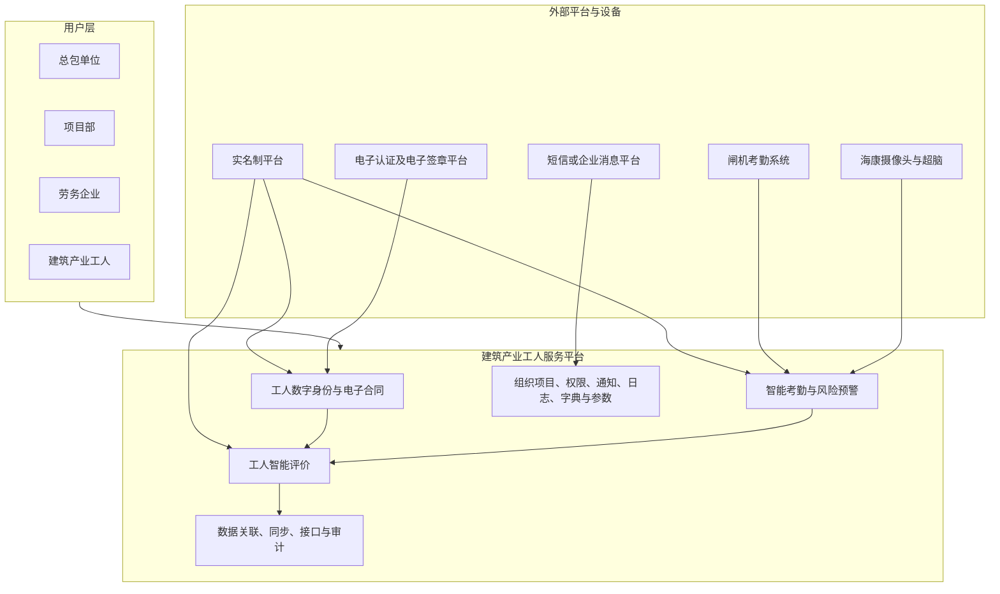
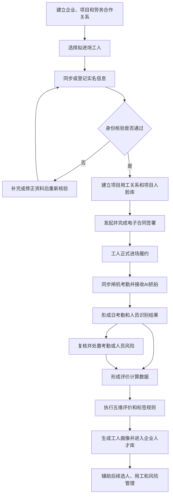
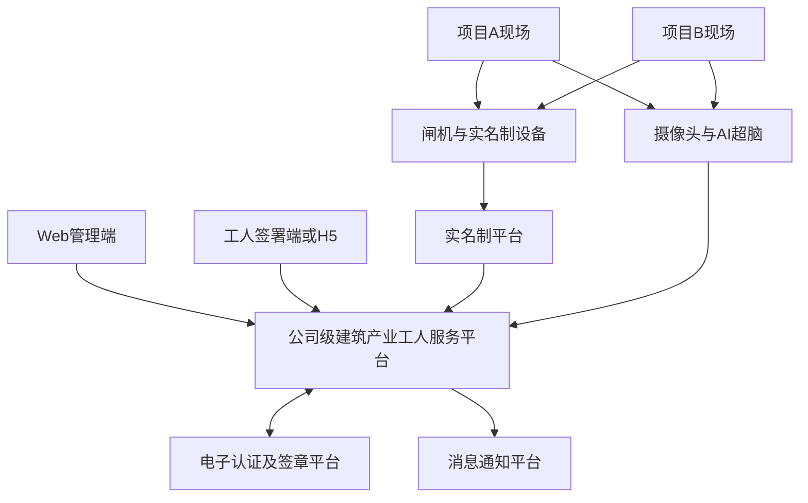
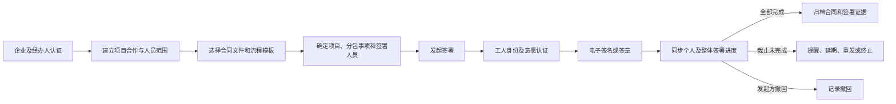
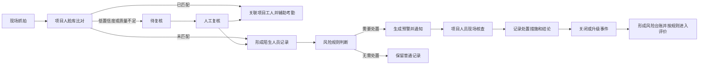
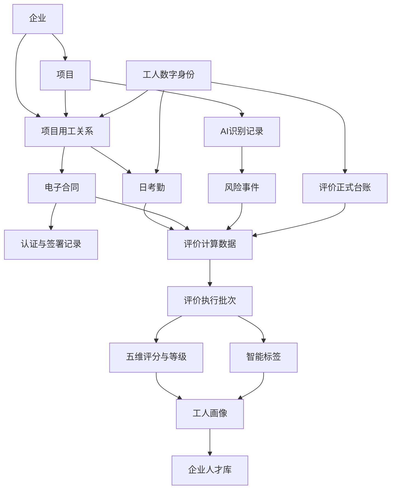

# 基于电子认证体系和 AI 识别的建筑产业工人服务平台需求规格说明书

## 文档属性

| 属性 | 内容 |
| --- | --- |
| 课题名称 | 基于电子认证体系和 AI 识别的建筑产业工人服务的应用研究 |
| 文档名称 | 基于电子认证体系和 AI 识别的建筑产业工人服务平台需求规格说明书 |
| 文档版本 | V0.2（第 5—7 章详细扩充版） |
| 文档状态 | 开题阶段需求基线修订稿 |
| 编制日期 | 2026 年 7 月 29 日 |
| 适用阶段 | 开题评审、总体方案确认、原型设计、详细设计、研发与试点验收 |
| 设计层级 | 项目级、模块级、流程级和系统协同级 |
| 主要读者 | 课题负责人、业务负责人、产品、研发、测试、实施及试点项目管理人员 |

### 需求状态说明

- **已确认**：来源于课题任务书、专项需求附件或课题组明确确认的业务流程。
- **推荐方案**：依据三项研究方向和整体闭环形成的产品方案，需经课题组评审确认。
- **待确认**：材料未形成唯一结论，或依赖外部平台、设备、制度和试点条件。
- **本期不实现**：不属于课题当前核心闭环，仅保留后续扩展空间。

---

## 1. 引言

### 1.1 编制目的

本说明书用于明确“基于电子认证体系和 AI 识别的建筑产业工人服务平台”的总体软件需求，统一课题任务书、三个专项研究方向及现有工人智能评价原型之间的建设目标、业务范围、角色场景、功能架构、业务流程、数据、接口、非功能和试点验收要求。

本说明书作为以下工作的共同依据：

1. 课题开题汇报和总体方案评审；
2. 前端原型和产品需求详细设计；
3. 前后端研发及外部系统集成；
4. 测试用例和试点验证方案编制；
5. 课题研究报告、专利和软件著作权等成果材料整理。

本文档不展开页面逐字段、按钮级交互、完整接口字段、数据库表结构、技术类与方法、算法代码和部署命令。相关内容在产品需求详细设计和前后端开发设计阶段继续细化。

### 1.2 项目背景

建筑产业工人管理已形成实名制登记、门禁考勤、劳务合同和项目用工管理等数字化基础，但各业务系统仍相对独立，工人身份、劳动关系、考勤、现场行为、技能、履约和信用数据尚未形成统一关联。

现阶段主要表现为：

- 工人身份及跨项目履历缺少统一数字标识；
- 纸质或线下合同签署效率低，认证、签署及履约证据分散；
- 单一闸机考勤难以完整反映真实在场和现场活动；
- 陌生人员和风险人员缺少主动发现、复核、通知和处置闭环；
- 工人评价依赖经验，缺少多源客观数据和统一量化模型；
- 工人数据停留在单项目管理，未形成可反哺后续用工的企业人才资源。

课题拟融合电子认证、电子签名、多源业务数据、AI 视觉识别和动态评价模型，形成覆盖“进场—履约—评价—再用工”的建筑产业工人数字化服务闭环。

### 1.3 课题依据

课题任务书明确提出三个研究方向：

1. 基于电子认证体系的电子合同签订研究；
2. 基于实名制数据建立工人评价模型的研究；
3. 基于 AI 识别的考勤辅助与陌生人员预警研究。

课题总体目标是构建以总包单位为核心，覆盖工人“入场—履约—评价”关键环节的数字化管理平台，并形成可复制、可推广的技术方案和产品成果。

本说明书以任务书为总体范围依据，以三个专项需求附件为分方向业务依据，以当前工人智能评价 MVP 作为评价方向的现有原型基础。

### 1.4 术语和缩略语

| 术语 | 说明 |
| --- | --- |
| 实名制平台 | 提供企业、项目、班组、工人、用工关系、考勤及实名照片等基础数据的现有或外部系统 |
| 工人数字身份 | 平台为同一工人建立的跨系统唯一业务关联，用于连接项目履历、合同、考勤、风险和评价 |
| 电子认证 | 对企业主体、经办人、工人身份及签署意愿进行核验，并形成可追溯认证记录 |
| 电子合同 | 工人与用工主体在线签署，并支持查询、变更、续签、解除和留痕的劳动或劳务合同 |
| 项目人脸库 | 由当前项目有效工人的实名照片形成，供现场抓拍在项目范围内进行人员比对的名单 |
| AI 识别记录 | 现场摄像头抓拍后，经项目人脸库比对形成的已匹配、陌生人员或待复核记录 |
| 计分依据来源 | 按工人、项目和评价周期形成的、可用于评价指标取值的业务计算口径 |
| 算分规则 | 指标根据计分依据来源计算得分的规则，包括基准分、加分、扣分和权重计分 |
| 规则依据 | 智能标签规则所选择的业务数据、系统计算结果或评分结果 |
| 工人画像 | 工人的实名信息、项目履历、五维得分、等级、标签、考勤和风险摘要的综合呈现 |
| 企业人才库 | 企业沉淀的可查询、可筛选、可复用的建筑产业工人人才资源库 |
| MVP | 用于验证核心业务闭环和交互的最小可行产品 |

### 1.5 参考资料

1. 《基于电子认证体系和 AI 识别的建筑产业工人服务的应用研究-先进技术储备类任务书61改》。
2. 《电子认证与电子合同》需求文档。
3. 《工人智能评价》需求文档。
4. 《AI考勤与风险预警》需求文档。
5. 当前工人智能评价平台前端 MVP、README 和项目上下文材料。

《电子认证与电子合同》为综合平台历史需求，本说明书只采用企业和工人身份、项目用工关系、电子合同、电子签章、合同状态与履约关联内容。该材料中的首页统计、通用角色管理、无感考勤、陌生人员库、异常人员库和月度考勤不作为电子合同方向的需求来源。

---

## 2. 项目概述

### 2.1 课题建设目标

平台总体建设目标是：以总包单位为核心，以工人数字身份为主线，贯通实名制登记、电子合同认证、智能考勤、AI 风险预警、智能评价、工人画像和企业人才库，形成建筑产业工人全周期数字化服务基础。

具体目标包括：

1. 建立企业、项目、班组、工人和用工关系的统一主数据；
2. 建立工人唯一数字身份，实现跨项目、跨系统和跨业务环节关联；
3. 建立电子认证和电子合同全流程留痕能力，使劳动关系可核验、可查询、可追溯；
4. 建立实名制考勤与 AI 视觉识别协同验证机制，提高人员在场和考勤数据可信度；
5. 建立陌生人员发现、风险复核、预警通知、处置反馈和闭环归档机制；
6. 建立可配置的五维评价模型，形成评分、等级、标签和工人画像；
7. 建立企业人才库，为公司选人、用工、人才调配和风险管理提供数据支持。

平台预期实现“身份可信、过程可溯、评价可用、风险可控”。

### 2.2 现状及问题

| 领域 | 现状 | 主要问题 |
| --- | --- | --- |
| 实名制 | 已具备工人、项目、班组和考勤等基础数据 | 数据标识和口径需统一，跨系统关联不足 |
| 电子合同 | 已形成外部电子签署平台协同方案 | 服务和接口需复验，合同与履约数据关联不足 |
| 现场考勤 | 以实名制闸机记录为主 | 缺少 AI 现场记录协同，缺卡和异常依赖人工排查 |
| AI 识别 | 已形成海康摄像头、超脑及项目人脸库协同需求 | 现场部署、识别回传、低质量记录及风险处置仍需验证 |
| 工人评价 | 已有前端 MVP 和较完整业务规则 | 当前主要是浏览器 Mock 数据，真实后端、持久化及外部数据尚未接通 |
| 企业人才 | 已有画像和工人库原型 | 缺少真实评价结果、数据时效和用工反馈闭环 |

### 2.3 系统建设范围

本期建设范围包括：

| 建设域 | 主要范围 |
| --- | --- |
| 工人数字身份 | 企业、项目、班组、工人、用工关系、进退场和统一身份关联 |
| 电子认证与合同 | 企业及工人认证、模板、签署、进度、撤回、归档、变更、续签、解除和履约关联 |
| 智能考勤 | 实名制考勤同步、日汇总、进出场明细、工时和缺少记录识别 |
| AI 识别与预警 | 项目人脸库、现场抓拍、人员匹配、陌生人员、风险事件和处置闭环 |
| 工人智能评价 | 数据采集、指标、模型、评价任务、等级、标签、画像和企业人才库 |
| 基础支撑 | 组织项目、权限、通知、日志、字典、参数和同步异常管理 |
| 数据与接口 | 实名制、电子签署、闸机考勤、视频 AI 和消息通知协同 |
| 试点验证 | 电子合同、评价模型、AI 识别及三方向融合验证 |

### 2.4 系统边界

#### 2.4.1 本系统负责

- 汇聚和关联工人全周期业务数据；
- 管理数字身份、合同业务状态、考勤汇总、风险事件、评价和画像；
- 提供面向总包、项目、劳务企业和工人的业务入口；
- 对外部平台数据进行接收、校验、映射、使用和追溯；
- 提供企业人才库和用工风险辅助决策能力。

#### 2.4.2 外部系统负责

- 实名制平台负责人员实名数据、项目用工关系和原始考勤等权威数据；
- 电子认证与电子签章平台负责底层身份认证、电子签名、电子印章和签署证据；
- 海康摄像头及超脑负责现场抓拍、人脸比对和识别结果产生；
- 短信或企业消息平台负责消息实际送达。

#### 2.4.3 本期不实现

- 工资核算、薪税、工资代发和财务结算；
- 面向行业公开交易的工人市场；
- 完整培训、考试和证书发证系统；
- 通用视频监控和全类型物联网设备运维；
- 未经人工复核，依据低置信度 AI 结果自动处罚或限制用工；
- 自动辞退、封禁等不可逆用工决策；
- 依赖大模型实时生成工人评价结论。

### 2.5 建设原则

1. **统一身份原则**：同一工人只建立一个平台数字身份，通过标识映射关联外部系统。
2. **权威来源原则**：人员、项目、合同、考勤和识别数据应明确权威来源和同步口径。
3. **业务闭环原则**：每个研究方向均形成可查询、可处理、可反馈、可追溯的业务闭环。
4. **客观评价原则**：评价优先使用实名制、考勤、履约及正式台账数据，减少主观判断。
5. **AI 辅助原则**：AI 用于识别、核验和风险提示，不直接替代人工管理结论。
6. **数据留痕原则**：合同、评价和风险结论均能追溯至原始数据、配置和操作记录。
7. **配置复用原则**：指标、等级、标签、风险参数和字典采用可配置方式，支持不同项目试点。
8. **分步实施原则**：先完成核心闭环和试点验证，再扩展跨系统深度协同与规模化应用。

---

## 3. 用户及应用场景

### 3.1 用户角色

| 用户角色 | 主要职责 | 主要使用模块 |
| --- | --- | --- |
| 系统管理员 | 企业审核、组织项目、用户权限、字典参数、外部系统配置和审计 | 平台基础支撑、接口与日志 |
| 总包单位管理人员 | 查看公司项目、合同、人员、风险和评价，使用人才库辅助用工 | 综合管理、评价、画像、企业人才库 |
| 项目部管理人员 | 管理项目人员范围，核对考勤和 AI 记录，处理风险预警 | 项目人员、智能考勤、风险预警 |
| 劳务企业管理员 | 维护工人信息、建立合作和进场关系、发起电子合同、维护评价台账 | 数字身份、电子合同、数据采集 |
| 评价管理人员 | 配置指标、模型、等级和标签，执行评价并分析结果 | 工人智能评价 |
| 风险处置人员 | 接收预警、复核身份和风险、记录处置结果 | 风险预警与处置 |
| 建筑产业工人 | 完成实名登记、身份认证、合同签署，查询本人合同及相关信息 | 工人端认证和合同 |
| 外部平台及设备 | 提供实名、签署、考勤、抓拍和识别结果 | 系统接口 |

角色在本说明书中只定义总体职责。菜单、页面、操作、数据和字段权限在详细设计阶段确定。

### 3.2 总包单位应用场景

总包单位以公司及所属项目为管理范围，主要场景包括：

1. 查看企业、项目、劳务合作和工人总体情况；
2. 监督项目工人实名登记和电子合同签署完成情况；
3. 查看各项目考勤完整性、陌生人员和风险事件；
4. 管理或审核评价模型、维度权重、等级及标签规则；
5. 按公司、项目和评价周期批量执行工人评价；
6. 通过工人画像和企业人才库筛选具有相关资质、项目经历和良好履约记录的工人；
7. 对警示标签、劳资纠纷、连续缺勤和现场风险等信息进行用工风险审查；
8. 查看关键业务操作、数据同步和风险处置留痕。

### 3.3 项目部应用场景

项目部以当前项目为数据边界，主要场景包括：

1. 确认拟进场工人及其企业、班组和用工关系；
2. 核对工人实名信息、项目人脸库状态和合同签署状态；
3. 查看按日形成的工人考勤台账、进出场明细和考勤照片；
4. 查看工人同日 AI 摄像头识别记录，辅助判断是否真实到场；
5. 查看项目 AI 识别记录，区分已匹配人员和陌生人员；
6. 对陌生、低置信度或规则命中的记录进行复核；
7. 接收风险预警，记录现场核查、处置和关闭结果；
8. 维护项目范围内的奖励、处罚、体检、证书等评价台账；
9. 查看本项目工人的评价结果和风险摘要。

### 3.4 劳务企业应用场景

劳务企业主要场景包括：

1. 维护企业主体、经办人和所属工人信息；
2. 为工人完成实名登记或补充登记信息；
3. 与总包单位建立项目合作关系并选择拟进场人员；
4. 按项目和分包事项选择电子合同模板及签署人员；
5. 发起合同签署并跟踪已签、未签和整体进度；
6. 处理签署撤回、变更、续签和解除；
7. 查看所属工人的项目履历、合同状态和评价结果；
8. 维护有权限的评价正式台账，并对 AI 附件识别结果进行核对确认。

### 3.5 建筑产业工人应用场景

建筑产业工人主要场景包括：

1. 提交或确认实名身份信息和实名照片；
2. 完成手机号、身份证、人脸或外部认证平台要求的身份核验；
3. 查看待签合同、合同主体、项目、分包事项和主要条款；
4. 完成签署意愿确认和电子签名；
5. 查看已签合同、变更、续签和解除结果；
6. 在后续扩展中查询本人项目履历、考勤和画像摘要。

工人端具体载体可以是 H5、小程序、短信链接或外部签署平台页面，需结合电子签署平台实际能力确认。

---

## 4. 总体需求

### 4.1 总体业务架构

平台以“统一数字身份与多源数据支撑”为底座，形成“进场核验—可信履约—智能考勤—智能评价—用工服务”的业务闭环。


各环节的核心产出如下：

| 环节 | 核心产出 | 下游用途 |
| --- | --- | --- |
| 实名登记 | 数字身份、项目人员主数据 | 合同签署、考勤匹配、评价关联 |
| 电子合同 | 合同文件、认证及签署证据、合同状态 | 劳动关系证明、履约追溯 |
| 智能考勤 | 日考勤、进出场明细、工时和缺失状态 | 履约分析、评价取数 |
| AI 识别 | 已匹配记录、陌生人员和识别证据 | 考勤辅助、风险发现 |
| 风险处置 | 风险事件、复核结论和处置记录 | 项目风险管理、评价数据 |
| 智能评价 | 五维得分、综合评分、等级和标签 | 工人画像、人才筛选 |
| 企业人才库 | 工人画像、项目履历和风险摘要 | 选人、调配、风险提示 |

### 4.2 系统功能架构



### 4.3 总体业务流程



关键分支要求：

- 身份核验失败时，不得进入正式签署和入场流程；
- 电子合同未完成时，系统应明确显示未签和签署进度，不得标记为有效合同；
- 考勤缺少进场或出场记录时标记“缺少记录”，不直接形成正常工作时长；
- 陌生人员只表示未匹配当前项目工人，不能自动等同于高风险人员；
- 评价数据不足或分母为零时标记“数据待补充”，不得直接按零分处理。

### 4.4 系统部署及应用范围

平台总体采用公司级集中部署、项目现场设备接入、外部平台协同的应用模式。



应用范围包括：

- 公司总部或区域单位的工人管理部门；
- 总包单位所属在建项目；
- 与项目建立合作关系的劳务企业；
- 纳入实名制和项目用工范围的建筑产业工人；
- 经授权接入的实名制、电子签署、考勤、视频 AI 和消息平台。

具体部署环境、网络区域、设备接入方式和容灾方案在技术设计阶段确定。

### 4.5 与现有平台的关系

| 现有能力 | 与本平台关系 | 本期处理方式 |
| --- | --- | --- |
| 实名制平台 | 人员、项目、班组、用工关系、实名照片和考勤的权威数据源 | 接口同步并建立数字身份映射 |
| 电子认证及签章平台 | 提供身份认证、电子签名、印章、签署证据和合同文件 | 本平台负责编排业务、展示进度和归档关联 |
| 闸机考勤系统 | 产生进场、出场和考勤照片 | 通过实名制或独立接口形成日考勤 |
| 海康摄像头及超脑 | 产生抓拍并在项目人脸库内完成比对 | 接收识别结果并形成考勤辅助和风险记录 |
| 当前评价前端 MVP | 已验证数据采集、模型、标签、画像和工人库业务闭环 | 复用业务规则和交互，补建真实后端及数据集成 |

平台不替代上述专业系统的底层能力，而是通过统一数字身份、业务编排和数据关联形成工人全周期服务。

---

## 5. 工人数字身份与电子合同需求

### 5.1 工人数字身份管理

#### 5.1.1 需求目标

平台应以工人实名信息为基础，为每名工人建立唯一、可持续使用的数字身份，将工人在不同企业、项目、班组和业务系统中的记录关联起来，作为电子合同、智能考勤、风险预警和智能评价的共同身份主线。

#### 5.1.2 参与角色与前置条件

- 劳务企业管理员负责新增、维护本企业工人及发起项目合作；
- 承包企业或项目管理员负责核验项目用工人员及合作关系；
- 系统管理员负责处理重复身份、跨系统映射和异常数据；
- 工人基础信息可来源于实名制接口、企业维护或身份证读卡设备；
- 建立数字身份前，应至少取得姓名、身份证号码和所属劳务企业。

#### 5.1.3 功能需求

| 需求编号 | 功能要求 |
| --- | --- |
| ID-01 | 平台应以身份证号码作为核心实名匹配依据，生成平台内唯一工人标识；不得仅通过姓名自动合并身份。 |
| ID-02 | 应关联姓名、身份证号码、手机号、银行卡号、实名照片、所属劳务企业等基础信息。银行卡号仅用于原材料中的工人信息台账，本期是否实际采集应按隐私最小化原则确认。 |
| ID-03 | 应关联当前及历史承包企业、劳务企业、项目、班组、分包事项、合作关系和进退场记录。 |
| ID-04 | 应关联电子认证、电子合同、考勤、AI 识别、风险事件、评价结果、标签和工人画像。 |
| ID-05 | 应保存实名制人员标识、电子签署平台人员标识、项目人脸库标识等外部标识及其映射关系。 |
| ID-06 | 应支持查看工人的合同签署状态、在场状态、入离场日期、在职状态和项目履历。 |
| ID-07 | 工人信息发生修改时，应保留修改前信息和生效时间，不得覆盖已签合同、历史考勤和评价批次中的身份快照。 |
| ID-08 | 发现相同身份证号对应不同姓名、相同工人存在多个外部标识或实名信息不一致时，应形成身份异常，进入人工复核。 |
| ID-09 | 身份证号、手机号、银行卡号和人脸照片应按角色和场景脱敏展示，并记录敏感信息查看和导出行为。 |

#### 5.1.4 工人业务状态

工人数字身份与用工状态应分开管理，避免将“身份是否有效”和“当前是否在场”混为一体。

| 状态维度 | 建议状态 | 说明 |
| --- | --- | --- |
| 身份核验状态 | 待核验、核验通过、核验失败、信息失效 | 反映实名信息是否可用于签署及跨系统关联 |
| 工人状态 | 在职、离职 | 反映工人与劳务企业的用工关系 |
| 在场状态 | 未入场、在场、离场 | 反映工人在具体项目的现场状态 |
| 合同状态 | 未发起、签署中、已签署、已撤回、已终止、已解除 | 反映工人与当前项目相关合同的生命周期 |

原材料明确：解约后工人状态变为离职；工人在场时解约，应同步变为离场并记录离场日期。重新建立有效合作关系时，不得删除历史状态，应新建或恢复新的项目用工关系。

### 5.2 实名认证与身份绑定

#### 5.2.1 企业注册与认证

企业认证范围包括承包企业和劳务企业。企业提交企业类型、企业名称、统一社会信用代码、经办人姓名、经办人手机号、营业执照及验证码后，由系统管理员审核。

| 需求编号 | 功能要求 |
| --- | --- |
| AUTH-01 | 企业名称和统一社会信用代码应与营业执照一致，同一统一社会信用代码不得重复注册。 |
| AUTH-02 | 企业认证应记录申请人、提交时间、审核人、审核时间、审核状态和不通过原因。 |
| AUTH-03 | 审核状态至少包括未审核、审核通过和审核不通过；仅未审核状态可执行审核。 |
| AUTH-04 | 企业审核通过后，应创建或启用企业账号，并按集成方案将企业认证信息同步至电子签署平台。 |
| AUTH-05 | 企业信息修改后，应重新判断是否需要审核及重新同步；不得静默覆盖外部签署主体信息。 |
| AUTH-06 | 企业存在有效合作关系、在签合同或历史合同证据时，不得直接物理删除。原材料中的“合作全部解除后方可删除”应落实为停用或逻辑删除。 |

#### 5.2.2 工人实名认证

| 需求编号 | 功能要求 |
| --- | --- |
| AUTH-07 | 工人实名信息应优先采用实名制平台数据；企业人工新增或读卡新增的数据应与实名制数据进行核验。 |
| AUTH-08 | 应核验身份证信息、姓名、手机号、实名照片及所属劳务企业，形成核验结果和失败原因。 |
| AUTH-09 | 工人加入项目时，应将平台数字身份绑定到“承包企业 + 项目 + 劳务企业 + 班组/分包事项”的项目人员记录。 |
| AUTH-10 | 身份核验通过且项目用工关系生效后，方可进入合同签署人员范围，并可将有效实名照片纳入当前项目人脸库。 |
| AUTH-11 | 身份核验失败、身份证信息冲突或项目用工关系无效时，应暂停合同发起、正式入场和人脸库同步。 |
| AUTH-12 | 应记录认证方式、认证渠道、认证时间、认证结果、外部认证流水标识及失败原因。 |

#### 5.2.3 项目合作与人员绑定

项目合作是工人进入电子合同签署范围的业务前提。合作记录应包含项目、承包企业、劳务企业、分包事项、合作起止日期、实际结束日期、人员范围和合同附件。

合作状态包括：合作待审批、合作审批中、合作审批不通过、合作中、解除合作审批中、解除合作审批不通过、合作已解除。

关键规则如下：

1. 同一承包企业、劳务企业、项目和分包事项原则上只允许存在一条有效合作记录；
2. 劳务企业选择施工人员时，只能选择本企业当前未在其他冲突项目处于在场状态的人员；
3. 合作审批通过后，应更新工人的分包事项、所在项目和所在承包企业；
4. 合作解除需对方确认后生效；解除时应处理仍在场人员、未完成合同和未关闭风险事件；
5. 合作关系和人员范围的每次变化均应留痕，不得覆盖历史签署人员范围。

企业、经办人和工人的具体电子认证方式，以及是否采用人脸活体、短信认证或外部平台认证，属于待确认事项。

### 5.3 电子合同模板管理

#### 5.3.1 模板分类

平台应区分合同文件模板和合同流程模板：

- 合同文件模板定义合同正文、固定条款及需要填充或签署的位置；
- 合同流程模板引用合同文件模板，定义签署参与方、签署顺序、认证方式和签署动作；
- 合同印章由企业在外部电子签署平台维护，本平台原则上只提供入口和状态引用，不复制印章密钥或印模控制能力。

#### 5.3.2 功能需求

| 需求编号 | 功能要求 |
| --- | --- |
| TPL-01 | 模板应具有模板 ID、模板名称、模板类型、外部模板标识、更新时间、适用范围和启停状态。 |
| TPL-02 | 系统管理员应能同步、查询和维护可使用的合同文件模板及流程模板。 |
| TPL-03 | 流程模板必须引用有效的文件模板，并明确适用企业类型、合同类型及签署参与方。 |
| TPL-04 | 发起合同时，只能选择已启用且适用于当前项目、分包事项和发起企业的流程模板。 |
| TPL-05 | 模板停用、删除或外部失效前，应检查是否存在进行中的签署任务；不得影响已发起或已完成合同。 |
| TPL-06 | 合同发起时应保存模板快照或外部版本标识，后续模板修改不得改变已发起合同内容。 |
| TPL-07 | 外部平台维护失败、模板未同步或引用失效时，应阻止发起并提示具体原因。 |

原材料采用“大家签”链接维护印章、合同文件模板和流程模板。该平台当前是否继续使用以及具体集成方式，仍需重新确认。

### 5.4 电子合同签署

#### 5.4.1 参与角色与前置条件

- 劳务企业管理员或其他经授权的用工主体发起合同；
- 建筑产业工人完成身份认证和个人签署；
- 外部电子签署平台完成电子认证、电子签名/签章和签署证据生成；
- 系统管理员处理模板、外部平台同步和异常任务。

发起合同前应满足：企业认证有效、项目和合作关系有效、分包事项明确、签署人员属于合作人员范围、人员身份核验通过、流程模板可用。

#### 5.4.2 主流程



#### 5.4.3 合同发起需求

| 需求编号 | 功能要求 |
| --- | --- |
| SIGN-01 | 发起人应选择项目、分包事项、签署主题、签署流程模板、签署人员和签署截止时间。 |
| SIGN-02 | 签署人员默认来源于建立合作关系时确认的人员范围，系统应自动排除身份核验失败、合作已解除或已离职人员。 |
| SIGN-03 | 发起时应记录发起方、发起人、发起时间、项目、分包事项、模板版本、人员范围和截止时间。 |
| SIGN-04 | 提交前应展示签署人员总数、可发起人数、不可发起人数及具体原因，避免任务发起后才发现身份或合作异常。 |
| SIGN-05 | 发起成功后，应为每名工人生成个人签署任务，并保存外部平台任务标识。 |
| SIGN-06 | 外部平台部分创建成功时，不得简单重复整体发起；应识别已创建任务并对失败人员补发或进入人工处理。 |

#### 5.4.4 签署进度与结果

合同台账应反映签署主题、项目、分包事项、发起方、发起时间、截止时间、签署进度、完成时间、合同查看入口和整体签署状态。

| 需求编号 | 功能要求 |
| --- | --- |
| SIGN-07 | 应查看每名工人的姓名、联系方式和已签署/未签署状态，并汇总“已完成数/总人数”。 |
| SIGN-08 | 应同步外部平台的认证、签署、拒签、失败和合同生成结果；重复回调不得生成重复记录。 |
| SIGN-09 | 全部个人任务完成后，整体合同状态方可变为签约完成，并记录完成时间。 |
| SIGN-10 | 截止时间前对未签人员进行提醒；截止后按规则延期、重新发送或终止，具体策略需配置。 |
| SIGN-11 | 进行中的签署任务可由有权限的发起方撤回；撤回时应同步外部平台并记录原因。 |
| SIGN-12 | 已签约完成的合同不得通过普通删除消除；原材料中的“删除”应落实为仅允许删除未正式发起的草稿，或对已撤回记录进行逻辑归档。 |
| SIGN-13 | 合同文件查看和下载应进行权限校验并记录操作日志。 |

建议合同整体状态为：草稿、发起中、进行中、部分失败、签约完成、已撤回、已终止、已解除。个人签署状态建议为：待签署、已签署、拒绝签署、认证失败、签署失败、已取消。

“签署人员是否必须覆盖合作关系中的全部人员、是否允许减少”在原材料中标注为暂定不可减少，需结合实际分批进场和补签场景确认。

### 5.5 合同变更、续签和解除

原始电子合同材料重点描述合同发起、撤回和合作解除，未完整定义合同变更、续签及个人合同解除流程。以下为保证合同全生命周期完整性的推荐需求，需课题组确认后固化：

| 需求编号 | 推荐需求 |
| --- | --- |
| LIFE-01 | 合同变更应从原合同发起，明确变更原因、生效时间、变更条款和受影响人员，重新履行必要签署。 |
| LIFE-02 | 合同续签应保留原合同及其有效期间，生成新的合同编号、有效期间和签署证据。 |
| LIFE-03 | 合同解除应记录解除发起方、解除原因、申请时间、双方确认、实际生效时间和最终结果。 |
| LIFE-04 | 合同变更、续签或解除不得直接覆盖原合同，应形成原合同与关联合同的完整链路。 |
| LIFE-05 | 合同解除或项目合作解除应校验人员在场状态、未关闭考勤异常和风险事件；在场人员应同步办理离场。 |
| LIFE-06 | 外部签署平台处理成功但本平台同步失败时，应支持按外部业务标识补偿同步，不得重复签署。 |
| LIFE-07 | 存在争议的合同应进入异常处理中，不得在结论形成前自动删除、关闭或改变历史履约数据。 |

待确认事项包括：变更是否允许批量发起、续签是否复用原人员范围、解除是否必须双方电子确认、项目合作解除与个人合同解除的先后关系。

### 5.6 合同归档与可信存证

#### 5.6.1 归档内容

合同签署完成后，应形成一份可追溯的合同证据包，至少包括：

1. 最终合同文件及文件名称、版本、生成时间；
2. 企业、经办人和工人的认证记录；
3. 签署参与方、签署时间、签署方式和签署结果；
4. 电子签名、电子印章及外部平台出具的签署凭证；
5. 发起、提醒、查看、撤回、完成、变更、续签和解除等过程记录；
6. 合同文件哈希或外部平台提供的完整性校验信息；
7. 外部合同标识、流程标识和个人签署任务标识；
8. 项目、分包事项、合作关系和签署人员范围快照。

#### 5.6.2 归档规则

| 需求编号 | 功能要求 |
| --- | --- |
| ARC-01 | 归档应在整体签约完成后自动触发；归档失败不得把合同标记为已完整归档。 |
| ARC-02 | 合同文件、签署证据和过程日志不得物理删除，保存期限应符合企业档案及法律要求。 |
| ARC-03 | 应支持按工人、企业、项目、分包事项、签署主题、状态和签署时间检索合同。 |
| ARC-04 | 下载合同应校验数据权限，批量导出应记录导出人、导出时间、范围和用途。 |
| ARC-05 | 外部文件暂时不可访问时，应显示同步异常并支持补偿获取，不得仅保留失效链接。 |
| ARC-06 | 身份信息或模板后续修改，不得改变已归档证据包中的历史快照。 |

可信存证采用电子签署平台能力还是增加独立存证服务，需结合现有平台的证据报告、时间戳和文件长期保存能力确认。

### 5.7 合同履约数据关联

电子合同应成为后续履约分析的合同基线，而不是独立文件。平台应建立以下关联：

| 关联对象 | 关联要求 | 主要用途 |
| --- | --- | --- |
| 工人数字身份 | 每个个人签署任务必须对应唯一工人 | 防止同名人员错签和跨系统错配 |
| 企业与项目 | 关联承包企业、劳务企业、项目和分包事项 | 明确合同责任主体及数据权限 |
| 项目用工关系 | 关联合作关系、班组及人员范围快照 | 判断人员是否属于有效项目用工 |
| 进退场状态 | 关联入场、在场、离场和解约时间 | 比对合同有效期与实际履约期 |
| 考勤及 AI 识别 | 关联实名制日考勤和项目现场识别记录 | 形成出勤、在场和异常履约证据 |
| 项目履历 | 按项目 ID 去重形成有效参与项目数量 | 支撑职业资质和履约评价 |
| 评价结果 | 将合同履约、考勤和争议数据作为计分依据来源 | 更新评价、标签、画像和企业人才库 |

系统应支持识别以下履约差异：合同未签但已产生入场或考勤、合同已到期但仍有现场记录、合同已解除但人员仍在场、签署人员与合作人员范围不一致。差异应进入核验，不得直接认定工人违规。

合同签署完成是有效劳动或劳务关系的重要证据，但是否作为正式入场的唯一前置条件，应结合项目现场制度确认。

---

## 6. 工人智能评价需求

### 6.1 评价数据采集

#### 6.1.1 数据来源及用途

| 来源类型 | 数据内容 | 进入正式评价的条件 |
| --- | --- | --- |
| 实名制系统同步 | 工人、企业、项目、班组、用工关系、进退场和考勤 | 同步成功、完成数字身份关联且属于评价范围 |
| AI 附件识别 | 从体检、奖励、处罚、证书等附件中识别的结构化数据 | 经人工核对并确认入库 |
| 人工数据维护 | 体检、奖励、处罚、证书、劳资纠纷 | 通过业务校验并成为正式台账 |
| 电子合同及履约 | 合同状态、合同有效期、合作关系和履约差异 | 关联到唯一工人和项目；本期参与哪些指标需确认 |
| 智能考勤及风险 | 日考勤、工作时长、连续缺勤、现场风险结论 | 采用正式汇总或已完成人工复核的风险结论 |
| 系统计算 | 有效项目数、有效工时占比、出勤完成率、变更次数等 | 计分依据来源已启用且原始数据完整 |

#### 6.1.2 人工维护台账

| 台账类型 | 必要业务信息 | 主要校验 |
| --- | --- | --- |
| 体检记录 | 工人、项目、体检日期、体检结果、是否合格、附件 | 是否合格必须为“是/否” |
| 奖励记录 | 工人、项目、发生日期、奖励事项、说明、附件 | 奖励事项必须来自有效字典 |
| 处罚记录 | 工人、项目、发生日期、处罚事项、说明、附件 | 处罚事项必须来自有效字典 |
| 证书记录 | 工人、证书类别、证书名称、证书编号、有效期、附件 | 证书有效期和工人身份应有效 |
| 劳资纠纷 | 工人、项目、发生日期、纠纷事项、附件 | 正式记录不再设置“是否确认成立”；一条有效记录即可参与规则判断 |

必要业务字典包括：

- 是否合格：是、否；
- 奖励事项：安全之星、质量之星、公司技能大赛；
- 处罚事项：安全整改、质量整改；
- 证书类别：普通证书、特殊工种证书。

上述字典为当前附件明确范围，新增事项应通过受控字典维护，不得直接修改历史数据含义。

#### 6.1.3 AI 附件识别与确认

AI 附件识别采用：

```text
上传附件 → AI识别 → 生成待确认数据 → 人工核对 → 确认入库或驳回
```

| 需求编号 | 功能要求 |
| --- | --- |
| DATA-01 | 上传时应选择对应业务类型，AI 输出字段必须与该业务台账字段一致。 |
| DATA-02 | 识别结果在确认前只能处于待确认区，不得写入正式台账或参与评分。 |
| DATA-03 | 人工确认时应能对识别字段进行核对和更正；确认入库后生成正式业务记录。 |
| DATA-04 | 驳回时应记录原因，原文件和识别结果仍需留存以便追溯识别质量。 |
| DATA-05 | 正式台账应保留原附件、原识别结果、修正结果、确认人和确认时间。 |
| DATA-06 | 已被评价批次引用的数据允许后续更正，但历史批次继续使用原数据快照。 |

#### 6.1.4 通用校验与数据状态

工人、身份证号、项目和发生日期原则上不能为空；工人和身份证号必须匹配；开始日期不得晚于结束日期；数值及比例应符合取值范围。保存失败时应指出具体错误，不得丢失已填写内容。

评价采集数据建议状态为：草稿、待确认、已确认、已驳回、已作废。删除正式数据原则上采用逻辑删除；已被执行批次引用的数据不得物理删除。

### 6.2 评价指标配置

#### 6.2.1 指标组成

评价指标归属于职业资质、履约能力、安全行为、工作效率和信用记录五个维度。每个指标至少应明确指标编号、指标名称、所属维度、评分类型、计分依据来源、算分规则、启停状态和规则说明。

业务术语统一为：

- **计分依据来源**：指标所使用的业务计算口径，例如“有效证书数量”；
- **算分规则**：如何将计分依据来源值转换为指标得分；
- **规则说明**：说明取数范围、评价周期、去重条件、阈值和特殊情况。

计分依据来源应由系统统一维护并与实际业务台账对应，不得由前端写死或仅用中文名称作为内部唯一标识。

#### 6.2.2 评分类型

系统支持四种评分类型：

| 评分类型 | 规则 |
| --- | --- |
| 基准分 | 进入评价周期后获得默认分值，不选择计分依据来源 |
| 加分项 | 满足条件后按单次分值累计，受最高加分上限约束 |
| 扣分项 | 满足条件后按单次分值累计扣减，受最大扣分上限约束 |
| 权重计分 | 将计分依据来源值与标准值换算为完成比例，再乘以最大权重分值 |

权重计分统一口径：

```text
完成比例 = 计分依据来源值 ÷ 标准值
指标得分 = 完成比例 × 最大权重分值
```

完成比例应限制在 0%—100%，指标得分不得超过最大权重分值。分母为零或原始数据不足时，应标记“数据待补充”，不得直接按零分处理。

#### 6.2.3 当前主要指标规则

| 维度 | 计分依据来源 | 计分依据来源计算方式 | 当前算分规则 |
| --- | --- | --- | --- |
| 职业资质 | 无需选择计分依据来源 | 不读取业务数据 | 基础分 60 分 |
| 职业资质 | 有效证书数量 | 统计评价截止时间仍在有效期内的职业资格及特殊工种证书 | 每本加 10 分，最高加 20 分 |
| 职业资质 | 公司技能大赛获奖次数 | 统计评价周期内“奖励事项=公司技能大赛”的已确认记录 | 每条加 10 分，最高加 20 分 |
| 职业资质 | 有效参与项目数量 | 根据项目用工、进退场和履历按项目 ID 去重 | 每个项目加 2 分，最高加 10 分 |
| 职业资质 | 体检不合格次数 | 统计“是否合格=否”的有效体检记录 | 每条扣 50 分，最高扣 50 分 |
| 履约能力 | 有效工时占比 | 每日工作时长大于 8 小时计 1 个有效工时日；有效工时日÷出勤总天数 | 占比×70 分，最高 70 分；出勤总天数为零时数据待补充 |
| 履约能力 | 当月出勤完成率 | 实际出勤天数÷截至执行日期的当月自然日数 | 完成率×30 分，最高 30 分 |
| 履约能力 | 连续缺勤天数 | 根据日考勤连续无有效出勤的天数计算 | 达到 3 天扣 10 分 |
| 履约能力 | 近三个月劳务公司变更次数 | 按用工关系时间线统计评价日前 3 个月的实际变更 | 大于 2 次扣 10 分，最高扣 10 分 |
| 安全行为 | 无需选择计分依据来源 | 不读取业务数据 | 基础分 80 分 |
| 安全行为 | 安全之星奖励次数 | 统计“奖励事项=安全之星”的已确认记录 | 每条加 10 分，最高加 20 分 |
| 安全行为 | 安全整改记录次数 | 统计“处罚事项=安全整改”的已确认记录 | 每条扣 10 分，受最大扣分上限约束 |
| 工作效率 | 无需选择计分依据来源 | 不读取业务数据 | 基础分 80 分 |
| 工作效率 | 质量之星奖励次数 | 统计“奖励事项=质量之星”的已确认记录 | 每条加 10 分，最高加 20 分 |
| 工作效率 | 质量整改记录次数 | 统计“处罚事项=质量整改”的已确认记录 | 每条扣 10 分，受最大扣分上限约束 |
| 信用记录 | 无需选择计分依据来源 | 不读取业务数据 | 基础分 100 分 |
| 信用记录 | 劳资纠纷记录数量 | 统计评价周期内有效劳资纠纷记录 | 存在 1 条及以上扣 50 分，最高扣 50 分 |
| 信用记录 | 考勤诚信异常次数 | 读取第 7 章中已复核确认的考勤诚信异常 | 每条扣 20 分；原材料明确为跨方向联动待研究，本期是否启用待确认 |

“当月出勤完成率”原材料同时出现“当月当前工作日”和“截至执行日期自然日数”两种口径，当前表格按附件详细指标表采用自然日数，但必须在试点前统一确认。所有阈值、分值、上限和周期均应配置化。

#### 6.2.4 指标配置校验

1. 指标编号和名称不得重复；
2. 基准分不得配置计分依据来源和触发条件；
3. 加分项、扣分项必须配置完整条件、单次分值和累计上限；
4. 单次加扣分不得小于零，累计上限不得小于单次分值；
5. 权重计分必须配置标准值和最大权重分值；
6. 计分依据来源必须处于启用状态，且数据类型应支持所选算分规则；
7. 停用正在被模型或标签使用的指标时，应提示影响范围并进行二次确认。

### 6.3 评价模型配置

#### 6.3.1 模型内容

评价模型应包含模型名称、模型编码、适用组织/项目范围、评价周期、五维权重、启用指标、等级区间、标签规则和启停状态。

默认维度权重：

| 维度 | 默认权重 |
| --- | ---: |
| 职业资质 | 25% |
| 履约能力 | 30% |
| 安全行为 | 20% |
| 工作效率 | 10% |
| 信用记录 | 15% |

综合评分计算如下：

```text
综合评分
= 职业资质得分 × 25%
+ 履约能力得分 × 30%
+ 安全行为得分 × 20%
+ 工作效率得分 × 10%
+ 信用记录得分 × 15%
```

维度得分和综合评分统一限制在 0—100 分。权重修改后必须显式保存，合计必须等于 100%；存在未保存修改时不得执行模型。

默认等级区间为：

- A：90—100；
- B：80—89.99；
- C：60—79.99；
- D：0—59.99。

等级区间必须完整覆盖 0—100，且不得重叠。

#### 6.3.2 配置生效规则

| 需求编号 | 功能要求 |
| --- | --- |
| MODEL-01 | 同一适用范围和评价周期原则上只能有一个生效主模型；并行试验模型应明确标识，不得覆盖正式画像。 |
| MODEL-02 | 启用模型前应校验权重、指标、等级和标签规则的完整性。 |
| MODEL-03 | 修改生效模型时，应提示对后续执行结果的影响；不得改变历史批次结果。 |
| MODEL-04 | 停用正在用于定时任务的模型前，应暂停或迁移相应任务。 |
| MODEL-05 | 模型配置删除采用逻辑删除；已经产生执行批次的模型不得物理删除。 |

### 6.4 评价任务执行


#### 6.4.1 执行方式及范围

系统应支持手动执行；定时执行作为后续可扩展能力。执行范围至少支持全部有效工人、指定项目和指定工人集合，评价日期或评价周期不能为空。

执行前应校验：

- 五维权重合计为 100%；
- 等级区间完整且不重叠；
- 至少存在一个启用指标；
- 评价日期和评价周期有效；
- 指定项目时已选择项目；
- 执行范围内存在有效工人；
- 计分依据来源处于启用状态；
- 是否存在未经确认的 AI 识别数据或数据待补充项，并按规则提示。

#### 6.4.2 批次执行与状态

| 需求编号 | 功能要求 |
| --- | --- |
| EXEC-01 | 每次执行应创建独立批次，记录模型、执行范围、评价周期、执行人、创建时间和幂等标识。 |
| EXEC-02 | 批次应按工人依次完成指标取值、指标算分、维度汇总、综合评分、等级判断和标签执行。 |
| EXEC-03 | 单个工人失败不应导致整个批次回滚，应保留失败阶段和失败原因。 |
| EXEC-04 | 批次状态至少包括待执行、执行中、成功、部分成功和失败，并汇总总数、成功数和失败数。 |
| EXEC-05 | 对相同工人、相同评价周期和相同模型重复执行时，应进行二次确认并防止重复结果并存。 |
| EXEC-06 | 执行完成后更新正式画像和企业工人库；失败或运行中的批次不得成为正式画像来源。 |
| EXEC-07 | 应支持查看每名工人的指标原始值、算分过程、维度得分、综合评分、等级和标签命中详情。 |

#### 6.4.3 执行快照

每个批次必须保存指标配置、五维权重、等级区间、标签规则、原始数据或数据引用、计算明细和人员范围快照。配置及源数据后续修改不得改变历史结果。执行记录、评分明细和快照不得物理删除。

### 6.5 智能标签管理

#### 6.5.1 标签定义

标签规则可使用实名制数据、评价采集数据、系统计算数据、综合评分、评价等级和五维得分作为规则依据。

标签分类采用静态字典：

- 职业资质；
- 履约能力；
- 安全行为；
- 工作效率；
- 信用记录；
- 综合评价。

标签属性分为正向标签和警示标签。标签至少应具有标签编号、标签名称、标签分类、标签属性、规则逻辑、规则条件和启停状态。

#### 6.5.2 规则与执行

条件逻辑支持：

- AND：全部条件成立；
- OR：任一条件成立。

| 需求编号 | 功能要求 |
| --- | --- |
| TAG-01 | 标签至少配置一个条件，规则依据、运算符和值必须完整且数据类型匹配。 |
| TAG-02 | 标签规则应在工人评分完成后执行，命中详情应记录所用规则和实际值。 |
| TAG-03 | 每次执行时，新增本次新命中的自动标签，移除不再命中的自动标签，同时保留人工标签。 |
| TAG-04 | 自动标签和人工标签必须标识来源；人工标签的增加、修改和移除应记录原因和操作人。 |
| TAG-05 | 停用标签后，后续执行不再生成该标签，但不得删除历史批次中的标签快照。 |
| TAG-06 | 修改标签规则不会实时改写现有画像，必须重新执行模型后更新。 |
| TAG-07 | 停用被画像筛选或用工规则引用的标签时，应提示影响范围并二次确认。 |

### 6.6 工人画像

#### 6.6.1 画像内容

- 实名基础信息；
- 所属企业、当前项目和班组；
- 当前及历史项目履历；
- 五维得分、综合评分和等级；
- 正向标签和警示标签；
- 体检、奖励、处罚、证书和劳资纠纷摘要；
- 考勤完整性及现场风险摘要；
- 基于评分和标签生成的智能综合评价说明；
- 评价周期、执行批次、数据完整性和更新时间。

#### 6.6.2 画像生成规则

| 需求编号 | 功能要求 |
| --- | --- |
| POR-01 | 画像读取最近一次成功的正式模型批次，不在打开页面时实时重新计算。 |
| POR-02 | 五维得分、综合评分、等级和自动标签必须来自同一执行批次。 |
| POR-03 | 体检、奖励、处罚、证书和劳资纠纷读取正式台账，不在画像中重复维护。 |
| POR-04 | 项目履历只展示工人在当前企业权限范围内实际参与过的项目。 |
| POR-05 | “智能综合评价”根据综合评分、等级、最高/最低维度、正向标签和警示标签生成。MVP 使用轻量化模板，不依赖外部大模型。 |
| POR-06 | 画像应展示评价周期、数据截止时间、执行批次和数据待补充提示，避免将过期或不完整结果作为当前结论。 |
| POR-07 | 查看评分依据时，应能追溯到指标规则和对应业务记录；敏感及负面信息应按权限展示。 |

### 6.7 企业人才库

#### 6.7.1 人才沉淀与检索

企业人才库应支持：

1. 沉淀当前在场工人、历史合作工人和可复用人才；
2. 按工种、证书、项目经历、评价等级、标签和风险信息筛选；
3. 查看工人画像及评价依据；
4. 为新项目选人、班组组织和风险审查提供参考；
5. 显示评价周期和数据时效，避免使用过期结果；
6. 对重要用工决策保留所参考的画像版本和评价批次；
7. 将新项目履约结果继续反馈到评价和画像；
8. 区分当前在场、历史合作、推荐复用和风险关注等业务视角；
9. 查看工人的数据来源、最近评价时间及结果有效性。

#### 6.7.2 用工反馈闭环


人才库只提供辅助决策，不直接替代企业用工审批，也不得仅凭自动评分或单条负面记录形成不可逆的用工限制。对重要用工决策，应记录所参考的画像版本和评价批次，以便后续复盘。

---

## 7. 智能考勤与风险预警需求

### 7.1 AI人员识别

#### 7.1.1 识别目标与参与系统

智能识别用于判断摄像头抓拍到的人员是否为当前项目的有效工人，并为现场核验、日考勤辅助和风险预警提供证据。实名制平台提供项目工人主数据和实名照片，海康摄像头产生抓拍事件，海康超脑完成人脸比对，本平台接收并管理识别结果。

#### 7.1.2 抓拍及识别流程

1. 摄像头产生抓拍事件，记录抓拍时间、抓拍照片、设备和项目归属；
2. 根据设备所属项目选择当前生效的项目人脸库；
3. 将抓拍人脸与项目人脸库比对，不允许跨项目匹配；
4. 比对成功时返回项目工人唯一标识，由平台补齐姓名、身份证号、所属企业、班组和当前项目；
5. 比对失败时标记为陌生人，工人身份字段为空，但保留抓拍证据；
6. 将识别结果写入 AI 识别记录，并按权限提供查询和详情查看；
7. 已匹配记录可按工人和日期关联日考勤，陌生人记录进入后续复核或风险判断。

#### 7.1.3 功能需求

| 需求编号 | 功能要求 |
| --- | --- |
| AI-01 | 应保存识别时间、识别照片、识别结果、工人标识、项目、设备及接收时间。 |
| AI-02 | 已匹配记录应关联项目工人唯一标识，不能只保存算法返回的姓名。 |
| AI-03 | 陌生人记录的姓名统一显示为“未匹配人员”，不得因姓名查询条件误匹配为正式工人。 |
| AI-04 | 已匹配记录应展示工人姓名、脱敏身份证号、所属企业、班组和项目；陌生人相关字段显示为空或“-”。 |
| AI-05 | 应支持按日期、工人姓名、身份证号、所属企业、班组、项目、识别结果和设备名称组合查询。 |
| AI-06 | 照片默认显示缩略图，按权限查看大图；设备对用户展示设备名称，不必展示内部设备编号。 |
| AI-07 | 应对同一抓拍事件和重复推送进行幂等处理，避免形成重复识别记录。 |
| AI-08 | 项目无法确定时不得跨项目搜索人员，应记录为设备或项目归属异常。 |

#### 7.1.4 识别结果状态

专项附件当前明确的页面结果只有“已匹配”和“陌生人”。附件还提出：低于超脑确认阈值、图片质量不足、多脸或无法定位项目的记录暂不传入管理后台。

为避免低质量数据完全不可追溯，本文推荐增加“待复核/识别失败”状态并保留失败原因；是否纳入本期，取决于海康超脑能否返回相应事件和质量信息。在该能力确认前，不得将低置信度结果自动关联为正式工人。

### 7.2 实名制协同验证

#### 7.2.1 项目工人主数据同步

实名制平台应提供项目、企业、班组、工人、用工关系、实名照片和进退场状态。平台应按项目形成有效人员清单，并建立实名制人员标识、平台数字身份和海康人脸库标识之间的映射。

| 需求编号 | 功能要求 |
| --- | --- |
| COLLAB-01 | 同步数据应校验项目、工人、企业和用工关系完整性；无法关联唯一数字身份的数据进入异常队列。 |
| COLLAB-02 | 只有身份核验通过且在当前项目用工关系有效的工人，才能进入项目有效人脸库。 |
| COLLAB-03 | 人脸库同步应记录新增、更新、停用结果和失败原因，并支持失败重试。 |
| COLLAB-04 | 工人进场、离场、解约或合作解除后，应按规则更新项目人脸库；离场人员不得继续作为当前有效成员。 |
| COLLAB-05 | AI 匹配成功后，应使用数字身份补齐人员主数据，并校验其仍属于抓拍发生时的项目有效人员。 |
| COLLAB-06 | 历史识别记录必须保留抓拍发生时的项目、企业、班组和人员映射，不因后续人员状态变化被覆盖。 |

#### 7.2.2 同步时效与异常

实名制考勤数据按附件当前方案每日定时抓取并更新当日数据。AI 识别结果优先实时传输；若设备或网络不支持，则采用定时抓取。具体频率、补采窗口和重试次数在接口联调时确认。

出现实名制人员已入场但人脸库同步失败、实名照片缺失、工人已离场但人脸库未停用、AI 返回人员不属于当前项目等情况时，应形成协同异常并通知相应管理人员。

### 7.3 多源考勤数据关联

#### 7.3.1 日考勤汇总

平台应按“项目 + 工人 + 考勤日期”形成一条日考勤汇总，不应由前端临时拼接明细。

| 汇总项 | 形成规则 |
| --- | --- |
| 首次进场 | 当日全部有效进场记录中的最早时间 |
| 最后出场 | 当日全部有效出场记录中的最晚时间 |
| 考勤记录数 | 当日全部有效进场、出场记录数量 |
| 工作时长 | 考勤正常时，以最后出场减首次进场计算，单位为小时，保留 2 位小数 |
| 考勤状态 | 当前为正常或缺少记录 |
| AI 记录数 | 同一项目、工人和日期下已匹配的 AI 识别记录数量 |

日考勤台账应至少展示工人姓名、脱敏身份证号、所属企业、班组、项目、考勤日期、首次进场、最后出场、工作时长、考勤记录数、AI 记录数和考勤状态。

#### 7.3.2 查询及明细

| 需求编号 | 功能要求 |
| --- | --- |
| ATT-01 | 应支持按考勤日期范围、工人姓名、身份证号、所属企业、项目和考勤状态查询；日期为空表示不限制。 |
| ATT-02 | 点击考勤记录数或“进出场记录”，应按工人唯一标识和日期读取实名制考勤明细。 |
| ATT-03 | 进出场明细应展示考勤时间、进场/出场和考勤照片，按考勤时间升序排列。 |
| ATT-04 | 点击 AI 记录数，应按工人唯一标识和日期读取识别时间、识别照片、识别结果和摄像头名称。 |
| ATT-05 | AI 记录数为零时仍允许查看空状态，不能把零条记录误判为页面故障。 |
| ATT-06 | 进出场和识别照片应支持缩略图及大图预览，并按项目数据权限控制。 |
| ATT-07 | 人工修正日考勤时，应保留原始明细、修正前后值、原因、操作人和时间。是否允许人工修正属于待确认。 |

AI 识别用于辅助验证人员是否真实在场，不直接替代实名制或闸机原始考勤。

### 7.4 异常考勤识别

#### 7.4.1 已确认的基础异常

- **正常**：至少存在有效进场和有效出场；
- **缺少记录**：缺少进场或出场。

缺少进场或出场时不计算工作时长，以“-”或空值显示，不能按零小时处理。

#### 7.4.2 推荐扩展异常

| 异常类型 | 推荐判定方向 | 处理要求 |
| --- | --- | --- |
| 有考勤无 AI 记录 | 当日存在实名制考勤，但未找到同项目同工人的 AI 记录 | 作为核验提示，不直接判违规 |
| 有 AI 记录无考勤 | 当日存在已匹配 AI 记录，但无实名制考勤 | 核查漏打卡、设备或人员状态 |
| 单边考勤 | 只有进场或只有出场 | 形成缺少记录，可申请人工核验 |
| 连续缺勤 | 连续无有效出勤达到配置阈值 | 可作为履约能力计分依据 |
| 合同履约差异 | 未签合同已考勤、合同到期或解除后仍有现场记录 | 联动第 5 章核查用工关系 |
| 跨项目冲突 | 同一工人在不合理时间窗口出现在不同项目 | 人工核验设备时间和身份关联 |
| 工时异常 | 超长工时、异常时段或跨日记录不完整 | 按班次和夜班规则核验 |
| 设备异常 | 大量人员同时缺记录、设备时间漂移或重复推送 | 转为设备/接口异常，不归责个人 |

#### 7.4.3 异常处理规则

异常应保存规则编号、命中数据、发现时间、项目、工人、严重程度和处理状态。只有完成规则核验和人工确认的异常，才能进入风险事件或评价计分。夜班、跨日、补卡、请假、停工日和设备故障的排除规则需在试点前确认。

### 7.5 陌生人员预警

#### 7.5.1 陌生人员定义

陌生人员是未能匹配到当前项目有效人脸库的抓拍对象。陌生人只代表“当前未匹配”，不自动等同于异常人员或高风险人员。

#### 7.5.2 记录、聚合与复核

| 需求编号 | 功能要求 |
| --- | --- |
| STR-01 | 应保留抓拍照片、首次出现时间、最近出现时间、项目、设备和出现次数。 |
| STR-02 | 同一陌生人员的多次出现是否聚合，应基于设备能力或经确认的人脸聚类结果，不得仅凭人工相似判断自动合并。 |
| STR-03 | 项目管理人员应能复核为已登记工人、授权访客、普通陌生人员或风险人员，并记录依据。 |
| STR-04 | 复核为已登记工人时，应先完成身份绑定核验；不得直接修改原识别结果而不留痕。 |
| STR-05 | 复核为普通陌生人员时保留记录，但不自动生成负面标签。 |
| STR-06 | 复核为风险人员时，应记录风险类型、风险等级、有效期和处置要求。 |

#### 7.5.3 预警触发

陌生人员是否生成预警，应结合出现时间、频次、区域、项目名单、人工标记和历史风险结论。对已确认风险人员再次出现，可主动通知承包企业管理员和对应项目管理员，并提供进入现场记录的快捷入口。

预警阈值、通知范围、风险人员有效期以及跨项目共享范围均需确认；在未经合法授权和业务确认前，不得形成跨项目人脸黑名单。

### 7.6 预警处置与闭环管理



#### 7.6.1 预警事件内容

预警事件应包含事件编号、来源记录、风险类型、严重程度、项目、涉及工人或陌生人员、发现时间、触发规则、通知对象、处置人、处置过程、附件、结论和关闭时间。

风险事件状态建议为：

| 状态 | 说明 |
| --- | --- |
| 待复核 | 系统发现异常，尚未确认是否构成风险 |
| 已确认 | 已确认风险成立，等待处理 |
| 处置中 | 项目人员正在现场核查或采取措施 |
| 已关闭 | 已完成处置并形成结论 |
| 已排除 | 经核验为误报、设备问题或合理例外 |
| 已升级 | 超时或重大风险已转交上级管理人员 |

#### 7.6.2 闭环处理需求

| 需求编号 | 功能要求 |
| --- | --- |
| RISK-01 | 预警生成时应关联原始考勤、AI 抓拍、合同或人员状态证据。 |
| RISK-02 | 应按项目和风险等级通知有权限的管理人员，并记录发送及读取结果。 |
| RISK-03 | 处置人应记录现场核查、联系人员、纠正措施、附件和处理结论。 |
| RISK-04 | 关闭事件前应填写结论；重大或超时事件按规则升级，不能由普通操作直接关闭。 |
| RISK-05 | 被排除的事件应记录排除原因，可用于后续优化识别和预警规则。 |
| RISK-06 | 只有经过明确规则和人工复核的风险结论，方可进入负面标签或信用评价。 |
| RISK-07 | 风险结论被复核撤销时，应保留原结论和撤销记录，并在下一次评价执行时更新自动标签。 |
| RISK-08 | 风险事件、处置过程和通知日志不得因人员离场或项目结束而丢失。 |

#### 7.6.3 数据权限与待确认事项

工人考勤、AI 识别记录和风险事件均按项目隔离；总包单位可查看授权项目，劳务企业仅查看本企业工人，系统管理员按职责处理跨系统异常。照片查看、导出和风险人员信息应进行更严格的权限控制和日志审计。

试点前需确认：海康摄像头能否远程接入超脑、人脸库采用实名制自动同步还是人工上传、识别结果能否实时传输、抓拍照片保存期限、低质量事件是否可回传、风险通知渠道和处置时限。

---

## 8. 平台基础支撑需求

### 8.1 组织及项目管理

平台应管理或同步：

- 公司及下属组织；
- 承包企业和劳务企业；
- 项目及合同工期；
- 班组；
- 项目与承包企业、劳务企业的合作关系；
- 项目分包事项；
- 工人与劳务企业、承包企业、项目和班组的用工关系；
- 项目现场设备及设备归属。

已关联有效合作、用工、合同或历史业务记录的组织和项目不得直接物理删除。

### 8.2 用户、角色和权限

平台应实现：

- 用户与企业、组织、项目和角色关联；
- 公司级、企业级和项目级数据范围控制；
- 功能、操作和敏感数据访问控制；
- 身份证号、手机号、银行卡号、人脸照片及合同文件的受控展示；
- 外部系统账号或应用身份管理；
- 离职、离场或项目结束后的权限回收。

权限详细到菜单、页面、操作、数据和字段的规则在详细设计阶段确定。

### 8.3 消息通知

平台应支持：

- 企业审核结果通知；
- 合同待签、临期、完成、撤回和异常通知；
- 考勤缺少记录提醒；
- 陌生或风险人员预警；
- 风险处置催办和升级通知；
- 评价任务完成、部分成功或失败通知；
- 数据同步和外部接口异常通知。

消息渠道可包括站内消息、短信或企业消息平台。每条消息应记录业务对象、接收人、渠道、发送时间、状态和失败原因。

### 8.4 操作日志

以下操作必须留痕：

- 企业及工人认证；
- 数字身份绑定和解绑；
- 合同发起、签署、撤回、变更、续签和解除；
- 评价台账新增、修改、删除和 AI 确认；
- 指标、模型、权重、等级和标签规则修改；
- 评价任务执行和重算；
- 陌生人员复核、风险确认、处置和关闭；
- 敏感文件查看、下载和导出；
- 外部数据同步、失败和人工补偿。

日志应包含操作人、时间、对象、操作类型、变更摘要和结果，并按权限查询。

### 8.5 数据字典及参数配置

平台应统一管理：

- 企业类型、人员状态、项目用工状态；
- 合同类型、合同状态、签署状态；
- 考勤状态、识别结果和风险状态；
- 评价维度、评分类型、等级和标签分类；
- 奖励事项、处罚事项、证书类别和体检结果；
- 风险类型、处置结论和消息类型；
- 数据同步频率、识别阈值引用、图片保存期限等系统参数。

字典变更不得直接破坏历史数据。用于评价和风险规则的字典项停用时，应提示影响范围。

---

## 9. 数据需求

### 9.1 工人基础数据

工人基础数据包括：

- 工人数字身份；
- 姓名、身份证号、手机号、实名照片；
- 所属劳务企业；
- 当前和历史承包企业、项目、班组及分包事项；
- 入场、在场、离场、解约和人员状态；
- 项目人脸库标识；
- 项目履历。

实名制平台是人员、项目和用工关系的优先权威来源。平台人工维护数据与实名制冲突时，应标记冲突并按确认规则处理，不应静默覆盖。

### 9.2 电子合同数据

电子合同数据包括：

- 合同主题、类型、模板和流程模板；
- 发起企业、项目、分包事项和签署人员；
- 发起、截止、完成、撤回、变更、续签和解除时间；
- 每名人员的认证及签署状态；
- 最终合同文件和签署证据；
- 外部平台合同、任务和签署人标识；
- 合同与用工关系、进退场及履历的关联。

已完成合同及签署证据原则上不得物理删除。

### 9.3 评价数据

评价数据包括：

- 实名制、用工、合同和考勤形成的业务数据；
- 体检、奖励、处罚、证书和劳资纠纷正式台账；
- 计分依据来源及其计算结果；
- 评价指标、算分规则、维度权重和等级；
- 评价执行批次、明细、配置快照和失败信息；
- 综合评分、五维得分、等级和标签；
- 工人画像及画像更新时间。

AI 识别的附件数据在人工确认前属于待确认数据，不得进入正式评价数据集。

### 9.4 考勤及AI识别数据

考勤及 AI 识别数据包括：

- 闸机或实名制进出场原始记录；
- 考勤时间、方向、照片、项目和设备；
- 按项目、工人和日期形成的考勤汇总；
- 工作时长、考勤状态及明细数量；
- AI 抓拍时间、照片、设备和项目；
- 识别结果、匹配工人、置信信息和人脸库范围；
- 陌生人员记录、出现次数和复核结果；
- 原始记录与人工修正记录。

原始记录应保持不可变，修正通过新增修正记录和操作日志体现。

### 9.5 预警及处置数据

预警及处置数据包括：

- 风险事件编号和类型；
- 来源 AI 记录或考勤异常；
- 项目、设备、人员或陌生人员；
- 发现时间、风险等级和规则依据；
- 通知对象及发送结果；
- 复核人、复核结论和证据；
- 处置人、处置措施、处置结果和关闭时间；
- 是否进入评价及对应的正式评价台账。

被排除的预警应保留排除原因，不得删除原始识别证据。

### 9.6 数据关联关系



核心关联规则：

1. 工人数字身份是合同、考勤、AI、风险、评价和画像的统一人员主线；
2. 项目是人脸库、考勤、AI 识别和数据权限的重要边界；
3. 项目用工关系连接工人、企业、项目、班组、合同和履历；
4. 评价结果必须关联评价周期、模型和执行批次；
5. 画像中的评分、等级和自动标签必须来自同一批次；
6. 数据应保留来源系统、外部标识、同步时间和业务快照。

---

## 10. 接口需求

### 10.1 实名制平台接口

接口应支持获取或同步：

- 企业、项目和班组；
- 工人实名信息和实名照片；
- 项目用工关系、进场、离场和项目履历；
- 实名制人员唯一标识；
- 原始考勤记录和考勤照片。

接口要求：

- 支持全量初始化和增量同步；
- 保证外部标识稳定，支持与平台数字身份映射；
- 记录同步时间、范围、成功和失败数量；
- 对重复、缺失、冲突和删除数据提供明确处理方式；
- 支持失败重试、数据对账和人工补偿。

数据同步采用每日定时还是准实时方式，需依据实名制平台能力确认。

### 10.2 电子认证及电子签章接口

接口应支持：

- 企业主体和经办人同步；
- 工人身份认证及认证结果查询；
- 合同文件模板和流程模板同步或引用；
- 签署任务创建、撤回和状态查询；
- 签署人认证及签署进度查询；
- 最终合同文件、签署证据和印章信息获取；
- 合同变更、续签和解除状态协同；
- 异常返回、重试和幂等控制。

原材料提及“大家签”平台，是否继续使用、服务是否恢复、当前接口清单和认证方式均需重新确认。

### 10.3 闸机考勤接口

接口应提供：

- 项目、设备和工人关联；
- 考勤时间、进出方向和考勤照片；
- 原始记录唯一标识；
- 记录新增、修正或撤销状态；
- 指定时间范围的增量查询；
- 设备离线、数据延迟和异常状态。

闸机数据如已由实名制平台统一提供，可复用实名制接口，不重复直连；如实名制无法满足时效或明细需求，再建设独立接口。

### 10.4 视频及AI识别接口

接口应支持：

- 项目及设备配置同步；
- 项目有效工人和人脸照片同步；
- 人脸库同步结果反馈；
- 抓拍记录和抓拍照片接收；
- 识别结果、匹配人员、项目和设备接收；
- 低置信度、图片质量不足、多脸等结果表达；
- 陌生人员或风险人员再次出现通知；
- 图片访问、失效和清理状态。

需要重点确认：

- 摄像头是否支持远程接入超脑；
- 项目人脸库由实名制自动同步、超脑人工上传还是平台统一维护；
- 识别结果能否实时回传；
- 当前被过滤的低质量记录是否可以进入待复核队列；
- 抓拍图片和人脸特征的保存期限。

### 10.5 消息通知接口

接口应支持站内消息、短信或企业消息平台通知，覆盖：

- 企业认证结果；
- 合同待签、到期、完成和异常；
- 考勤异常；
- 陌生人员和风险事件；
- 风险处置催办；
- 评价任务结果；
- 系统同步和接口异常。

消息接口应返回发送结果，并支持失败重试、频率控制、接收人去重和通知留痕。

---

## 11. 非功能需求

### 11.1 性能要求

平台应满足公司级多项目集中使用和项目日常查询需要：

- 工人、合同、考勤、AI 识别和人才库列表应支持分页、组合查询和导出；
- 日考勤汇总不应依赖前端临时拼接，应由后台预先形成业务汇总；
- AI 识别记录应支持按时间、项目和设备快速查询；
- 评价任务采用批次方式执行，创建任务后不要求页面同步等待全部工人计算完成；
- 单个工人评价失败不得阻塞整个批次；
- 图片和合同文件访问应与普通结构化数据查询分离。

具体并发用户数、响应时间、日抓拍量、评价批次人数和文件容量应根据试点项目规模形成量化基线。

### 11.2 安全要求

- 用户应经过统一身份认证后访问平台；
- 根据公司、企业、项目和角色实施最小权限控制；
- 外部接口采用可信应用身份、签名或安全令牌；
- 敏感数据传输应加密；
- 合同、身份、风险和评价关键操作必须审计；
- 合同文件、人脸图片和导出文件应限制访问和下载；
- 高风险操作应进行二次确认；
- 密钥、令牌和外部平台凭证不得出现在前端页面和日志明文中。

### 11.3 数据隐私要求

- 身份证号、手机号、银行卡号默认脱敏展示；
- 人脸照片和抓拍图片仅用于实名核验、项目人员识别和风险管理；
- 按业务必要性控制人脸和合同数据的可见范围；
- 明确采集授权、使用目的、保存期限和删除或匿名化规则；
- 非必要场景不得复制、下载或传播工人敏感数据；
- AI 识别和评价结果不得脱离业务场景用于未经授权的用途；
- 工人对本人合同及相关信息的查询范围应符合企业制度和适用要求。

### 11.4 可靠性要求

- 外部系统暂时不可用时，平台应记录失败任务并支持重试；
- 数据同步应支持幂等，避免重复生成工人、合同、考勤或抓拍记录；
- 同步中断后可从失败点继续或重新执行；
- 关键业务数据应具备备份和恢复能力；
- 合同、评价批次和风险处置记录不得因普通配置修改而丢失；
- 设备离线、数据延迟和接口异常应可查询、可通知；
- 批量评价应支持部分成功和失败明细。

### 11.5 可扩展性要求

- 支持新增项目、企业和设备；
- 支持新增评价指标、计分依据来源、算分规则和标签；
- 支持扩展新的 AI 风险场景和通知渠道；
- 支持更换或增加电子签署、实名制和视频识别平台；
- 支持从单项目试点扩展到公司多项目应用；
- 支持未来接入培训、工资支付和人才调配等业务，但不影响当前核心模型。

### 11.6 易用性要求

- 页面和字段采用建筑产业工人管理业务用语；
- 统一使用“计分依据来源”“算分规则”“规则依据”等名称；
- 复杂操作应显示当前状态、下一步和失败原因；
- 合同签署进度、考勤缺失、风险预警和评价任务应具有清晰状态标识；
- 图片支持缩略图和大图查看；
- 查询条件应符合项目管理人员日常使用习惯；
- 校验失败时保留已填写内容并指出具体问题；
- 仅依赖颜色表达状态时，应同时显示文字。

---

## 12. 系统试点与验收需求

### 12.1 试点范围

试点应至少覆盖：

- 一个具备实名制数据和闸机考勤的真实工程项目；
- 至少一家总包单位、一个项目部和一家劳务企业；
- 一批完成实名登记、项目用工关系和电子合同签署的工人；
- 可接入海康摄像头及超脑的现场区域；
- 可用于评价的实名制、考勤、证书、奖励、处罚、体检或劳资纠纷数据；
- 完整的公司级工人画像和企业人才库查看场景。

试点项目、工人人数、设备数量、抓拍量和评价周期由课题组结合现场条件确认。

### 12.2 功能验证要求

| 验收场景 | 验证要求 |
| --- | --- |
| 实名进场 | 同一工人形成唯一数字身份，并正确关联企业、项目和班组 |
| 电子合同 | 可完成认证、发起、签署、进度查询、归档和履约关联 |
| 合同异常 | 身份失败、未签、撤回、变更、续签或解除均有明确状态和留痕 |
| 日考勤 | 按项目、工人、日期形成汇总，并可追溯进出场明细 |
| AI 匹配 | 仅使用当前项目人脸库，已匹配结果关联工人数字身份 |
| 陌生人员 | 未匹配人员保留抓拍证据，不误关联正式工人 |
| 风险闭环 | 预警可通知、复核、处置、关闭和追溯 |
| 评价数据 | AI 附件识别数据经人工确认后进入正式台账 |
| 评价任务 | 生成批次、五维得分、综合评分、等级和标签 |
| 工人画像 | 评分、等级和标签来自同一批次并可追溯依据 |
| 企业人才库 | 可按资质、履历、等级、标签和风险条件筛选工人 |
| 全链路追溯 | 可从工人画像追溯项目、合同、考勤、风险和评价依据 |

### 12.3 评价模型验证要求

评价模型试点应验证：

1. 五维评价结构是否符合实际用工管理认知；
2. 计分依据来源是否能由真实业务数据稳定计算；
3. 基准分、加分、扣分和权重计分是否符合配置；
4. 维度权重、等级区间和标签命中结果是否正确；
5. 数据不足是否被识别为“数据待补充”；
6. 历史批次是否保留执行时配置和数据快照；
7. 评分、等级和标签是否具有可解释性；
8. 画像和企业人才库是否能辅助选人和风险审查；
9. 业务人员对模型结果的认可度及需调整的指标。

评价模型不能只验证页面计算结果，应使用真实或经确认的试点数据逐项核对。

### 12.4 AI识别验证要求

AI 识别试点应验证：

- 项目人脸库同步的准确性和时效；
- 摄像头、超脑和平台之间的数据链路；
- 已匹配工人身份关联的正确性；
- 陌生人员识别及不误关联能力；
- 不同光照、角度、遮挡、多人和施工环境下的适应性；
- AI 记录与实名制考勤的关联效果；
- 低置信度和低质量记录的处理；
- 陌生或风险人员再次出现时的预警时效；
- 预警通知、复核、处置和关闭闭环；
- 误识别、漏识别及人工复核结果。

AI 验证应保留样本范围、设备条件、阈值、识别结果和人工核验结论，不能以演示截图代替效果验证。

### 12.5 课题成果对应关系

| 课题研究方向 | 平台成果 | 主要验证证据 |
| --- | --- | --- |
| 电子认证与电子合同 | 数字身份、企业及工人认证、合同签署、归档、履约关联 | 认证记录、签署流程、合同文件、签署证据、履约追溯 |
| 工人智能评价 | 数据采集、五维指标、模型、标签、画像和企业人才库 | 模型配置、评价批次、计算明细、标签依据、画像和筛选结果 |
| AI 考勤与风险预警 | 日考勤、项目人脸库、AI 识别、陌生人员和风险闭环 | 考勤汇总、抓拍记录、识别结果、预警及处置记录 |
| 三方向融合 | 统一数字身份、多源数据关联和企业人才库反馈 | 同一工人的合同、考勤、风险、评价和用工服务全链路 |
| 平台系统成果 | 建筑产业工人服务平台系统 | 可运行系统、部署及试点记录、用户验证材料 |
| 研究与知识产权成果 | 综合研究报告、发明专利和软件著作权 | 研究结论、技术方案、申报及登记材料 |

课题验收应区分“前端原型完成”“系统功能完成”“外部接口联调完成”和“真实项目试点完成”，并以可追溯证据说明各项成果的实际完成程度。
