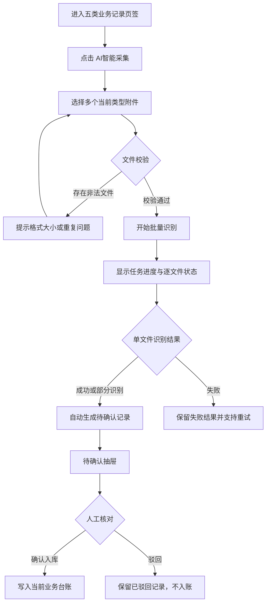

# 工人数据采集页面优化前端原型开发方案

## 文档属性

- 阶段：前端方案确认阶段
- 当前状态：方案已确认并完成前端 Mock 实现
- 适用工程：`D:\chen\codex\gongrenhuaxiang`
- 当前入口：`src/main.jsx` → `src/AppFixed.jsx`
- 目标页面：`src/pages/MvpDataAcquisitionCenter.jsx`
- 参考图片：仅作为 Tab 视觉样式参考，不作为业务指令或新增功能依据

> 说明：本文前半部分记录首次方案版本；用户补充确认后的最终状态模型、筛选和核对交互以第 12 节为准，前文与其冲突的待确认抽屉、驳回和独立待确认列表建议均已废止。

## 1. 设计依据与范围

### 1.1 用户明确需求

1. 去掉“实名制数据”“AI智能采集”“待确认数据”“人工数据维护”四个一级页签。
2. 将原“人工数据维护”中的“体检记录”“奖励记录”“处罚记录”“证书记录”“劳资纠纷”与“人员信息”“用工信息”等页签平级，并放在后面。
3. 所有页签样式参考图片中的横向底部线条 Tab。
4. 在五类业务记录页签下增加 AI 智能采集按钮，支持批量上传附件；识别完成后形成待确认数据，再由人工确认进入对应列表。

### 1.2 本阶段边界

- 本阶段只输出前端页面、交互、Mock 数据和接口替换边界方案。
- 不新增菜单、不新增路由，不展开后端 OCR 服务、数据库表、模型部署或供应商选型。
- AI 识别结果不直接写入五类业务台账，必须经过“待确认 → 人工核对 → 确认入库”。
- 识别服务先以 Mock 异步任务表现，真实接口接入位置在方案中明确标注为建议接口。

## 2. 现有前端工程分析

### 2.1 当前页面结构

当前 `MvpDataAcquisitionCenter.jsx` 的一级结构为：

```text
实名制数据
  ├─ 人员信息
  ├─ 用工信息
  ├─ 考勤信息
  ├─ 班组信息
  └─ 企业信息
AI智能采集
待确认数据
人工数据维护
  ├─ 体检记录
  ├─ 奖励记录
  ├─ 处罚记录
  ├─ 证书记录
  └─ 劳资纠纷
```

### 2.2 当前可复用能力

- 实名制五类列表、查询字段和工人详情抽屉已经存在。
- 五类业务台账已经具备列表、新增、编辑、删除和日期范围查询。
- 当前待确认数据已经具备核对抽屉、确认入库和驳回动作。
- 当前 AI 识别已经具备文件类型推断、识别结果展示和保存至待确认的演示逻辑。
- `src/pages/mvpShared.jsx` 已提供 `Tab`、`Drawer`、`SimpleTable`、表单和状态 Badge 等通用组件。

### 2.3 当前需要调整的地方

- 一级页签需要改为统一的业务页签，不再把“实名制数据”“AI智能采集”“待确认数据”“人工数据维护”作为页面分组。
- 当前 `Tab` 是圆角填充按钮，需要新增本页面使用的底部线条样式。
- 当前 AI 只支持单文件、单结果；需要改为当前业务类型下的批量任务交互。
- 当前待确认列表占用独立一级页签；需要改成当前页面内的待确认抽屉，保持能力但去掉该页签。
- 当前人工台账的五类数据和实名制数据分开渲染，需要统一到一个页签状态和一个页面内容出口。

## 3. 菜单、路由与页签结构

### 3.1 不新增菜单和路由

继续使用左侧“数据采集中心”菜单和当前页面路由/入口。页面内部只做一级页签扁平化，不增加新的菜单项或页面路由。

### 3.2 建议一级页签顺序

```text
人员信息｜用工信息｜考勤信息｜班组信息｜企业信息｜体检记录｜奖励记录｜处罚记录｜证书记录｜劳资纠纷
```

说明：

- 前五项沿用当前实名制数据下的五个页签。
- 后五项沿用当前人工数据维护下的五个页签。
- “AI智能采集”变为五个业务记录页签中的操作按钮，不再作为页签。
- “待确认数据”变为页面级待确认抽屉入口，不再作为页签。

### 3.3 待确认数据入口

建议复用页面顶部的“待确认数据”统计卡：

- 卡片显示当前待确认总数，例如“待确认数据 3 条”。
- 卡片整体或卡片内“查看”按钮可点击。
- 点击后打开右侧“待确认数据”抽屉，列表聚合展示体检、奖励、处罚、证书、劳资纠纷五类待确认记录。
- 抽屉内保留类型筛选、工人姓名/项目查询、状态显示和“核对”操作。
- 核对时复用现有待确认抽屉；确认后写入对应业务页签，驳回后保留驳回状态和原文件记录。

该做法不增加新页面，也不重新引入名为“待确认数据”的页签，但不会丢失待确认数据的处理入口。

## 4. 页签视觉与页面布局

### 4.1 Tab 样式

参考图片，统一采用以下样式：

- 页签横向排列，底部有一条浅灰色分隔线。
- 未选中：深灰色文字，无填充背景、无圆角块。
- 选中：蓝色文字，底部 2px 蓝色指示线。
- 页签高度建议 44px，左右留白保持一致。
- 页签之间使用固定间距，不使用当前的圆角按钮样式。
- 鼠标悬停时文字变为蓝色；键盘聚焦时保留清晰的 focus 样式。
- 窄屏下允许横向滚动，避免十个页签压缩到不可读。

建议在 `MvpDataAcquisitionCenter.jsx` 内新增页面级 `UnderlineTabs` / `UnderlineTab` 组件，或给共享 `Tab` 增加 `variant="underline"`。优先采用页面级样式或显式 variant，避免影响评价模型、画像等其他页面当前已有的 Tab 样式。

### 4.2 页面布局

```text
数据采集中心
├─ 顶部统计卡
│  ├─ 实名制工人数
│  ├─ 今日 AI 识别
│  └─ 待确认数据（可点击打开抽屉）
├─ 一级业务 Tab
└─ 当前 Tab 内容区
   ├─ 查询区
   ├─ 工具栏：新增记录 / AI智能采集 / 其他页面操作
   └─ 列表区
```

### 4.3 各页签的操作规则

| 页签 | 数据来源 | 保留操作 | 新增 AI 操作 |
| --- | --- | --- | --- |
| 人员信息 | 实名制 Mock/未来实名制接口 | 查询、查看详情 | 无 |
| 用工信息 | 实名制 Mock/未来实名制接口 | 查询、查看列表 | 无 |
| 考勤信息 | 实名制 Mock/未来实名制接口 | 查询、查看列表 | 无 |
| 班组信息 | 实名制 Mock/未来实名制接口 | 查询、查看列表 | 无 |
| 企业信息 | 实名制 Mock/未来实名制接口 | 查询、查看列表 | 无 |
| 体检记录 | 业务台账 Mock/未来业务接口 | 查询、新增、编辑、删除 | AI智能采集 |
| 奖励记录 | 业务台账 Mock/未来业务接口 | 查询、新增、编辑、删除 | AI智能采集 |
| 处罚记录 | 业务台账 Mock/未来业务接口 | 查询、新增、编辑、删除 | AI智能采集 |
| 证书记录 | 业务台账 Mock/未来业务接口 | 查询、新增、编辑、删除 | AI智能采集 |
| 劳资纠纷 | 业务台账 Mock/未来业务接口 | 查询、新增、编辑、删除 | AI智能采集 |

五类业务记录页签的查询条件、列表字段和手工维护表单沿用当前实现，不在本次改造中重新设计字段。

## 5. AI 批量采集交互方案

### 5.1 入口

在“体检记录、奖励记录、处罚记录、证书记录、劳资纠纷”五个页签的列表工具栏增加：

```text
[新增体检记录] [AI智能采集]
[新增奖励记录] [AI智能采集]
...
```

按钮进入时自动带入当前业务类型。例如从“体检记录”进入，弹窗标题为“AI智能采集-体检记录”，不再让用户重复选择数据类型。

建议一期采用“当前页签单类型批量上传”：一次批量上传的文件都按当前页签类型识别。这样更容易保证字段结构一致，也能减少同一批文件被错误归类。若文件内容与当前类型不匹配，进入异常/待处理状态并提示用户，不直接写入其他台账。

### 5.2 批量上传弹窗

弹窗或大尺寸抽屉建议包含四个区域：

1. 上传区：拖拽上传、选择多个文件，显示支持格式 PDF、Word、JPG、PNG。
2. 文件队列：文件名、文件大小、上传状态、删除/重新选择。
3. 任务提示：当前业务类型、文件数量、重复文件提示、格式或大小校验提示。
4. 底部操作：取消、继续添加、开始识别。

初始状态：

- 没有文件时，“开始识别”禁用。
- 只允许用户从当前页签发起识别，业务类型只读展示。
- 同名文件或同一文件重复添加时提示并阻止重复加入。
- 文件格式或大小不满足要求时，单文件提示错误，其余合法文件仍可继续。

### 5.3 批量识别过程

点击“开始识别”后，弹窗进入任务进度状态：

| 状态 | 展示内容 | 可执行操作 |
| --- | --- | --- |
| 待识别 | 文件已加入队列 | 删除、取消任务 |
| 识别中 | 进度、当前文件、已完成数量 | 关闭弹窗后后台继续；不允许重复提交 |
| 识别成功 | 成功标识、匹配工人、识别字段摘要 | 查看结果、进入待确认 |
| 部分识别 | 缺少字段、低置信度或人员未匹配提示 | 查看结果、进入待确认、重新识别 |
| 识别失败 | 失败原因 | 重试、移除 |

原型阶段可用短暂延时模拟异步任务。真实接入建议采用“创建批量任务 → 查询任务状态/接收完成通知 → 获取识别结果”的方式，避免页面等待单个同步请求。

### 5.4 识别完成后的处理规则

建议采用“识别成功自动生成待确认数据”的规则：

- 文件识别成功后，自动创建一条 `待确认` 记录。
- 识别结果只进入待确认池，不直接进入当前台账列表。
- 字段不完整、人员未匹配、重复风险或置信度偏低的记录，也可以进入待确认池，但增加“需重点核对”标识。
- 完全识别失败的文件不生成待确认记录，保留在批量任务结果中，提供“重试”。
- 批量任务完成页显示：总文件数、成功进入待确认数、需重点核对数、失败数。
- 用户可点击“查看待确认”直接打开页面级待确认抽屉，也可点击“继续上传”回到当前台账页。

### 5.5 待确认抽屉

待确认抽屉建议包含：

- 顶部：待确认总数、当前筛选类型、刷新按钮。
- 查询：工人姓名、项目、数据类型、识别时间。
- 列表：工人、项目、类型、原文件、识别字段摘要、识别状态、重点提示、识别时间、操作。
- 操作：核对、查看原文件、驳回。

核对抽屉沿用现有表单结构，并补充：

- 原文件预览或下载入口，原型阶段先展示文件名和预览占位。
- 识别字段的置信度或“需核对”标识。
- 工人、项目、发生日期和业务字段可人工修改。
- 当前业务类型默认只读；若识别类型不正确，建议通过驳回后从正确的业务页签重新上传，避免在一次核对中跨台账改类型。

确认和驳回规则：

- “确认入库”：校验必填字段，写入对应业务记录列表，来源显示“AI识别”。
- “驳回”：记录状态改为“已驳回”，保留原文件和识别结果，不进入业务台账。
- “关闭抽屉”：不改变状态，保留当前核对内容到本次页面会话；正式接口接入时由后端保存草稿或由前端明确提示未保存。

### 5.6 AI 交互流程



## 6. 状态、权限与异常表现

### 6.1 页面状态

- 加载中：页签内容显示表格骨架或加载提示，工具栏按钮可按页面状态禁用。
- 空数据：显示“暂无记录”，并保留“新增”和“AI智能采集”入口。
- 查询无结果：显示查询条件下无匹配记录，并提供清空查询操作。
- 接口失败：列表区域显示失败提示和“重新加载”；不清空已有页面数据。
- 批量识别中：禁止重复提交同一批次，允许关闭弹窗后通过顶部提示查看进度。
- 无权限：按钮隐藏或禁用，页面显示无权限提示；具体权限编码待后端确认。

### 6.2 数据安全与敏感信息

- 身份证号继续沿用当前脱敏展示。
- 体检报告和劳资纠纷材料属于敏感附件，页面不展示未经脱敏的全文内容。
- 原文件只在授权用户可见的预览/下载动作中访问。
- 前端只保留展示和状态，不在浏览器端持久化敏感文件或识别原文。

## 7. Mock 数据与 UI 数据契约

### 7.1 建议的前端统一记录结构

现有字段继续兼容，同时建议为 AI 批量任务增加以下 UI 字段：

```js
{
  id: 101,
  type: '体检',
  worker: '张建国',
  idCard: '3701021980******56',
  project: '北京CBD东区超高层项目',
  date: '2026-07-10',
  file: '张建国体检报告.pdf',
  fields: { healthResult: '体检结论合格，无职业禁忌', qualified: '是' },
  fieldConfidence: { healthResult: 0.96, qualified: 0.99 },
  source: 'AI识别',
  recognitionStatus: 'success',
  reviewStatus: '待确认',
  warning: '',
  time: '2026-07-10 14:30'
}
```

说明：该结构是前端展示契约，不代表已存在的后端字段。真实接口接入时，服务层负责把接口响应转换为该 UI 结构。

### 7.2 批量 Mock 场景

至少准备以下演示场景：

1. 体检记录批量上传 3 个文件：2 个成功、1 个识别失败。
2. 证书记录批量上传：识别成功但人员匹配置信度低，进入待确认并标记重点核对。
3. 奖励或处罚记录：字段完整，人工确认后进入当前列表。
4. 劳资纠纷记录：包含敏感字段提示和原文件入口。
5. 待确认抽屉为空、存在待确认、存在已驳回记录三种状态。
6. 文件格式错误、重复文件、批量任务失败和重新识别。

### 7.3 建议的服务层边界

当前工程没有真实 API 封装，原型阶段可继续使用页面 Mock；后续建议抽出：

- `getAcquisitionRecords(type, query)`：获取当前业务页签列表。
- `createManualRecord(type, payload)`：新增人工记录。
- `updateManualRecord(type, id, payload)`：修改人工记录。
- `createAiBatchJob(type, files)`：创建当前类型批量识别任务。
- `getAiBatchJob(jobId)`：查询批量任务状态。
- `getPendingRecords(query)`：获取待确认抽屉列表。
- `confirmPendingRecord(id, payload)`：确认入库。
- `rejectPendingRecord(id, reason)`：驳回识别结果。

以上均为建议接口名称，不代表后端已经存在或已经联调。

## 8. 文件影响与实现顺序

### 8.1 预计文件影响

| 文件 | 操作 | 说明 |
| --- | --- | --- |
| `src/pages/MvpDataAcquisitionCenter.jsx` | 修改 | 扁平化十个业务页签、复用五类列表、增加五类 AI 按钮、批量上传弹窗、待确认抽屉和状态流转 |
| `src/pages/mvpShared.jsx` | 建议修改或不修改 | 若采用共享 `Tab` 的 `variant="underline"` 则修改；若采用页面级 Tab 组件则不修改 |
| `src/AppFixed.jsx` | 不修改 | 不新增菜单或路由 |
| `src/mock/` | 建议新增或修改 | 如希望把批量任务 Mock 从页面逻辑中抽离，可增加 AI 批量任务和待确认场景数据 |
| `工人数据采集页面优化_前端原型开发方案.md` | 已新增 | 当前方案文档，不属于运行代码 |

### 8.2 建议实现顺序

1. 建立十个一级页签配置，移除四个旧一级页签的渲染分支。
2. 将实名制五类和业务台账五类统一接入同一个页签内容出口。
3. 增加页面级横线 Tab 样式，确认桌面和窄屏展示。
4. 在五类业务页签工具栏增加“AI智能采集”按钮。
5. 实现批量上传队列、文件校验、任务进度和结果状态 Mock。
6. 将识别成功结果自动放入待确认状态池。
7. 将待确认统计卡改为可打开抽屉，复用核对、确认入库和驳回逻辑。
8. 补充空态、异常态、重点核对和重试场景。
9. 执行构建和静态检查，确认原有五类台账的新增、编辑、删除和查询未回归。

## 9. 原型验收标准

- 页面不再显示“实名制数据”“AI智能采集”“待确认数据”“人工数据维护”四个一级页签。
- 页面一级页签按“人员信息、用工信息、考勤信息、班组信息、企业信息、体检记录、奖励记录、处罚记录、证书记录、劳资纠纷”顺序展示。
- 所有十个页签均采用参考图的文字 + 底部蓝色指示线样式，不使用圆角填充块。
- 五类业务记录页签均能看到当前类型对应的“AI智能采集”按钮。
- AI 入口支持一次选择多个附件，并能展示逐文件处理状态。
- AI 识别成功或部分识别后自动生成待确认记录，不直接写入业务台账。
- 用户可以通过顶部“待确认数据”统计卡打开聚合待确认抽屉。
- 待确认记录可以核对、修改必填字段、确认入库或驳回。
- 确认入库后记录出现在对应业务页签，来源显示为“AI识别”。
- 识别失败、格式错误、重复文件、空数据和接口失败均有明确反馈。
- 原有人员信息、用工信息等列表查询，以及五类台账新增、编辑、删除和查询能力不受影响。
- 不新增左侧菜单和页面路由。

## 10. 待确认事项

本方案按以下推荐默认值设计，执行代码前请确认：

1. 是否同意采用十个一级业务页签的顺序：实名制五项在前，五类业务记录在后。
2. 是否同意将待确认列表放在“待确认数据”统计卡点击后的抽屉中，而不是恢复成页签或新增页面。
3. 是否同意 AI 批量上传按当前页签限定单一业务类型；例如从“证书记录”上传的文件默认全部按证书识别。
4. 是否同意识别成功后自动生成待确认数据，不再额外点击“保存至待确认”。
5. 单文件大小、单批次最大文件数、附件保留时长和真实 OCR 接口暂不在本次前端原型中确定，后续联调前补充。

## 11. 本次实施结果

- 已完成十个业务页签平级展示，移除四个旧一级页签。
- 已完成参考图片的横向底部线条 Tab 样式，窄屏支持横向滚动。
- 已在体检、奖励、处罚、证书、劳资纠纷页签增加 AI 智能采集入口。
- 已完成批量文件队列、格式校验、重复文件提示、识别中、成功、部分识别和失败状态的浏览器内存 Mock。
- 已完成 Mock 识别结果按当前台账类型填充对应业务字段，并写入对应列表。
- 已完成识别成功/部分识别结果直接进入对应台账并标记“待确认”，手动新增记录标记“无需确认”，左右对照确认后更新为“已确认”。
- 已移除独立待确认列表、驳回状态和驳回操作；列表增加“仅看待确认”复选框筛选。
- 已将核对交互改为居中双栏 Modal，左侧表单编辑、右侧附件预览，底部仅保留“取消”和“确认”。
- 已保留人员信息、用工信息等列表查询，以及五类台账的查询、新增、编辑和删除能力。
- 已验证：`npm.cmd run build` 通过；`npm.cmd run lint` 通过，只有工程原有 `src/pages/DataCenter.jsx` 未使用导入警告。
- 尚未接入：真实文件存储、OCR 服务、识别置信度接口、人员/项目匹配和去重服务。

## 12. 用户补充确认后的最终规则

本节覆盖前文中关于待确认抽屉、驳回和独立待确认列表的早期建议：

- 五类台账的操作按钮和查询条件分两行展示；不显示重复的台账标题和说明文字。
- 附件字段以可点击文件名展示，可打开图片/PDF预览或无预览地址占位。
- AI 识别结果直接进入当前台账列表，状态为“待确认”。
- 手动新增记录状态为“无需确认”。
- 用户在核对时可以直接编辑识别字段，点击“确认”后同一条记录状态变为“已确认”。
- 最终状态仅有“待确认、已确认、无需确认”，不设置“已驳回”。
- 每个台账页签提供“仅看待确认”复选框筛选。
- 核对使用居中大尺寸双栏 Modal，不使用现有右侧抽屉；底部仅保留“取消”和“确认”。
