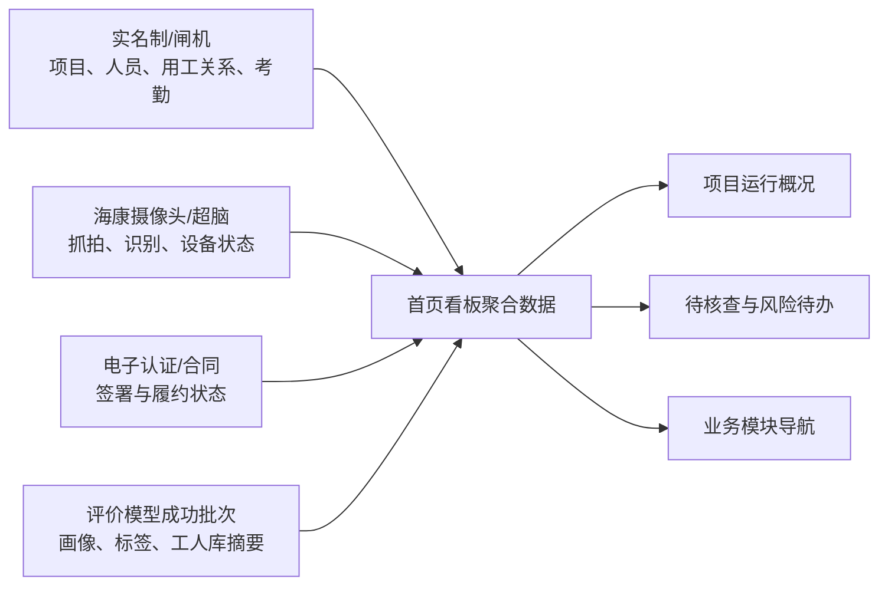

# 建筑产业工人服务平台首页看板前端页面开发设计方案

## 文档属性

| 项目 | 内容 |
| --- | --- |
| 文档目的 | 为“首页看板”前端原型开发提供可直接执行的页面、组件、交互、Mock 数据和联调边界说明 |
| 目标工程 | `D:\chen\codex\gongrenhuaxiang`（React + Vite + Tailwind CSS 前端 MVP） |
| 参考工程 | `D:\chen\codex\wugankaoqin`（Vue2 + Ant Design Vue 考勤与 AI 识别前端） |
| 文档版本 | V1.0 |
| 编制日期 | 2026-08-04 |
| 本期交付 | 首页看板前端原型设计；默认使用 Mock 数据，不改造现有后端、不接入真实设备 |

## 1. 设计依据与原型范围

### 1.1 设计依据

本页服务于课题“进场核验 → 可信履约 → 智能考勤与风险预警 → 智能评价 → 企业工人库”的平台闭环。任务书及既有需求已明确三类核心能力：电子认证与电子合同、基于 AI 识别的考勤辅助与陌生人预警、基于实名制数据的工人评价模型。

已核对的现有前端能力如下：

| 来源 | 已有能力 | 首页复用方式 |
| --- | --- | --- |
| 工人画像 MVP | 数据采集中心、评价模型、工人画像与工人库；五维评价、执行批次、标签和画像摘要 | 复用“最近成功评价批次”的等级、数据完整度、画像/工人库统计口径 |
| 无感考勤前端 | 按“项目 + 工人 + 日期”的考勤台账、进出场记录、AI 识别记录、识别照片预览 | 复用考勤汇总、AI 识别结果和跳转详情的产品口径；不直接复用 Vue 组件 |
| 第 5—7 章功能需求 | 项目人脸库、电子合同、陌生人员人工复核、风险处置、评价批次和工人库反馈闭环 | 用于定义首页展示范围、待办优先级和状态边界 |

### 1.2 页面定位

首页是面向承包企业管理员、项目管理员的“项目运行总览与待处置工作台”，而不是只展示数字的大屏。用户进入页面后，应在一个屏幕内回答五个问题：

1. 当前项目有哪些有效用工人员，今天的到场情况怎样？
2. 实名制考勤和 AI 现场核验是否存在需要核查的差异？
3. 有哪些电子合同尚未签署或临近到期？
4. 最近一次评价是否已完成，工人库的能力与风险分布怎样？
5. 哪些现场风险和待确认记录需要先处理？

### 1.3 本期边界

本期首页仅负责汇总、提示和导航，不在首页完成下列高风险或复杂操作：

- 不在首页发起、签署、变更或解除电子合同；
- 不在首页修正实名制考勤、调整 AI 阈值、修改人脸库或生成跨项目名单；
- 不在首页重算工人评价模型、修改历史评价结果或自动调整工人标签；
- 不因“陌生人”或“待确认”自动写入黑名单、负面评价或用工限制；
- 不展示完整身份证号、人脸特征值、原始设备序列号等敏感信息。

首页的操作入口只跳转到相应业务模块，或在原型阶段以提示反馈代替未接入的模块。

## 2. 现有前端工程分析与落地约束

### 2.1 目标工程

当前工人画像 MVP 的真实入口是 `src/main.jsx → src/AppFixed.jsx`。应用使用左侧菜单状态切换页面，尚未引入路由；已有菜单为“数据采集中心、工人评价模型、工人画像与工人库”。页面使用 React、Tailwind CSS 和 `lucide-react`，现有页面数据均保存在浏览器内存。

因此首页看板采用同一技术栈和交互风格：白色业务卡片、浅灰页面背景、蓝色主操作、Lucide 图标、桌面端优先。首期不引入图表组件库；趋势图使用轻量 SVG/CSS 柱线图，避免为了一个看板新增 ECharts 等依赖。

### 2.2 考勤参考工程

无感考勤工程是独立 Vue2 项目，已经沉淀以下可复用的产品规则：

- 考勤日台账按“项目 + 工人 + 考勤日期”汇总；首次进场取最早有效进场记录，最后出场取最晚有效出场记录。
- 实名制/闸机进出场记录是考勤原始和权威来源；AI 摄像头记录用于现场辅助核验。
- AI 记录展示“已匹配、陌生人、待确认”三种产品结果；匹配成功时才补齐项目工人基础信息。
- “陌生人”仅表示完成当前项目人脸库比对且确认无匹配对象；低置信度、无人脸、人脸质量不足、多人脸、识别服务异常等均为“待确认”。
- AI 结果不直接改变实名制考勤状态，也不直接形成负面评价。

目标工程与参考工程框架不同，开发时应按本方案重新实现 React 组件和 Mock 数据，不复制 `.vue` 文件，也不假定两个工程的页面已经可以跳转。

## 3. 菜单、页面结构与视觉布局

### 3.1 菜单与页面映射

首页看板新增为目标工程的第一个菜单，默认进入该页。由于当前工程没有路由，以下“建议路由”是后续统一平台接入时使用的语义标识，不应在本期伪造 URL。

| 菜单 key | 菜单名称 | 页面组件 | 建议路由 | 状态 |
| --- | --- | --- | --- | --- |
| `dashboard` | 首页看板 | `HomeDashboard` | `/dashboard` | 本次新增，默认菜单 |
| `acquisition` | 数据采集中心 | `MvpDataAcquisitionCenter` | `/data-acquisition` | 已有 |
| `index` | 工人评价模型 | `MvpIndexCenter` | `/evaluation-model` | 已有 |
| `portrait` | 工人画像与工人库 | `MvpPortraitCenter` | `/worker-portraits` | 已有 |

考勤台账、AI 识别记录、电子合同和风险处置页面在当前 React 工程尚不存在。首页中的相关按钮先通过统一的 `onNavigate` 回调传出目标模块和筛选条件；当目标模块未注册时，原型仅提示“该业务模块待接入”，不得跳转到虚构页面。

### 3.2 页面骨架

```text
┌──────────────────────────────────────────────────────────────────────┐
│ 首页看板  项目选择器  日期范围（今日/近7日）  数据更新时间  刷新     │
├──────────────────────────────────────────────────────────────────────┤
│ 项目在场人数 │ 今日到场率 │ 待签电子合同 │ 待处置风险 │ 待确认识别 │
├────────────────────────────┬─────────────────────────────────────────┤
│ 今日考勤与 AI 核验          │ 风险待办（按紧急程度、时间排序）         │
│ - 近 7 日到场趋势           │ - 已确认风险再次出现                     │
│ - 今日正常/缺少记录/待核查  │ - 陌生人员待复核                         │
│ - AI 已匹配/陌生人/待确认   │ - 考勤多源不一致                         │
├──────────────────────┬─────┴─────────────────────────────────────────┤
│ 电子合同进度          │ 工人评价与工人库                          │
│ 待签、已签、生效、临期│ 最近成功批次、等级分布、数据待补充、人才摘要│
├──────────────────────┴───────────────────────────────────────────────┤
│ 最新现场事件：最近 AI 抓拍、考勤异常、合同状态变化、评价批次完成     │
└──────────────────────────────────────────────────────────────────────┘
```

### 3.3 响应式规则

| 宽度 | 布局规则 |
| --- | --- |
| ≥ 1440px | 五张核心指标卡同一行；“考勤与 AI”占 7 列，“风险待办”占 5 列；电子合同和评价各占 6 列 |
| 1024–1439px | 核心指标卡每行 3 张；主要内容区改为上下排列，内部仍保留双列 |
| < 1024px | 作为兼容展示而非手机端专项设计：筛选器换行，所有卡片单列，表格横向滚动；左侧菜单保持现有折叠逻辑 |

## 4. 页面与组件设计

### 4.1 顶部工作区：`DashboardToolbar`

| 区域 | 展示与交互 | 规则 |
| --- | --- | --- |
| 页面标题 | “首页看板”及说明“项目运行总览与待处置事项” | 不展示“数据大屏”等泛化标题 |
| 项目选择 | 单选下拉，显示“项目名称 / 项目状态”；项目管理员仅见授权项目 | 所有卡片、趋势、待办和事件都必须使用同一个当前项目 |
| 时间范围 | 快捷项“今日、近 7 日”，默认“今日”；可选择日期范围 | “今日”用于考勤和实时事件；评价卡仍展示最近成功批次及其数据截止时间 |
| 数据更新时间 | 显示最近一次成功获取数据的时间 | 分项数据无法同时刷新时，卡片内显示各自更新时间和数据状态 |
| 刷新 | 点击重新拉取看板聚合数据；加载时按钮转圈且禁用重复点击 | 刷新失败不清空上一次成功数据，显示局部失败提示 |

### 4.2 核心指标区：`OverviewMetricCards`

五张卡片使用统一结构：图标、标题、主数值、单位/分母、状态说明、可选跳转链接。卡片点击仅进入同一业务模块的列表查询，不执行任何审批动作。

| 卡片 | 主展示 | 次级说明 | 点击动作 | 色彩规则 |
| --- | --- | --- | --- | --- |
| 项目在场人员 | 当前有效在场人数 | 已实名登记人数、班组数 | 打开工人库并带项目和“在场”筛选 | 默认蓝色 |
| 今日到场率 | 实际有权威考勤人数 ÷ 应考勤人数 | 正常、缺少记录、待核查数量 | 打开考勤台账并带项目、日期 | 正常绿；存在待核查黄 |
| 待签电子合同 | 当前有效用工关系中未完成签署人数 | 签署中、签署失败、临期合同数 | 请求跳转合同管理的待办视图 | 待办黄；签署失败红 |
| 待处置风险 | 未关闭的风险事件数 | 高、一般、今日新增数 | 请求跳转风险处置列表 | 有高风险红；仅一般黄 |
| 待确认识别 | AI 待确认记录数 | 陌生人待复核、设备异常数 | 请求跳转 AI 识别记录，筛选待确认/陌生人 | 橙色；不得使用红色将待确认等同高风险 |

卡片使用的“今日到场率”只统计有权威实名制/闸机考勤记录的人员；AI 仅用于形成“待核查”提示。应考勤人数、是否包含请假/非排班人员的计算口径需要后端确认，在 Mock 阶段使用明确示例说明。

### 4.3 今日考勤与 AI 核验：`AttendanceAiOverview`

该卡片用于快速判断“考勤数据是否可信、现场识别是否需要核查”，包含以下四部分。

| 子区域 | 内容 | 交互 |
| --- | --- | --- |
| 近 7 日趋势 | 每日应考勤人数、权威考勤到场人数和到场率；默认突出今日 | 悬停显示日期、应到、实到、到场率；点击某日请求进入对应日期考勤台账 |
| 今日考勤摘要 | 正常、缺少进场/出场记录、有考勤无 AI、有 AI 无考勤四类数量 | 点击某项带状态筛选进入考勤台账；“有 AI 无考勤”仅表示待核查，不写为缺勤 |
| AI 识别分布 | 已匹配、陌生人、待确认数量，采用环形图或比例条 | 点击状态请求进入 AI 识别列表；“陌生人”和“待确认”必须分开 |
| 最新识别事件 | 最近 5 条抓拍：缩略图、时间、设备位置、结果标签、人员摘要/“未关联身份” | 点击缩略图打开只读预览抽屉；点击“查看全部”请求跳转 AI 识别记录 |

AI 事件中：

- `已匹配`：显示姓名、脱敏身份证号、企业和班组；
- `陌生人`：不显示工人姓名、身份证号、企业、班组，只显示“未关联项目工人”和项目/设备信息；
- `待确认`：显示“待确认原因”，如低置信度、多人脸、遮挡、无人脸、识别服务异常；不得使用“陌生人”代替。

### 4.4 风险待办：`RiskTodoPanel`

风险待办是首页的主要操作区域，不仅展示告警数量。每条待办包含风险级别、来源、标题、发生时间、项目区域/设备、当前状态和主操作。

| 待办来源 | 进入首页的条件 | 首页标题示例 | 主操作 |
| --- | --- | --- | --- |
| 已确认风险人员再次出现 | 已经人工复核为风险人员，且本次抓拍命中有效提醒规则 | “已确认风险人员在 1 号门再次出现” | 查看处置详情 |
| 陌生人员待复核 | 完成项目人脸库比对且确认无匹配对象，但尚未完成人工复核 | “材料通道发现未关联项目工人的人员” | 去人工复核 |
| AI 待确认 | 低置信度、无人脸、遮挡、多脸、服务异常等 | “材料通道识别结果待确认：人脸质量不足” | 查看识别详情 |
| 考勤多源不一致 | 规则识别为“有权威考勤无 AI”或“有 AI 无权威考勤” | “张三存在权威考勤与现场核验差异” | 查看考勤与 AI 明细 |
| 合同异常 | 签署失败、超时未签、即将到期等已定义合同状态 | “12 名已入场人员电子合同待签署” | 查看合同待办 |
| 评价数据待补充 | 最近评价批次中，人员因数据不足未形成完整结果 | “8 名工人评价数据待补充” | 打开数据采集中心 |

排序规则为“高风险未关闭 → 一般风险未关闭 → 待确认 → 数据待补充”，同级按发生时间倒序。首页最多显示 8 条；超出时显示“查看全部待办”。

风险待办仅汇总已发生事件或已定义规则产生的待确认事项。只有人工复核确认的风险结论才能显示为“风险”；陌生人员和 AI 待确认不自动升级为高风险。

### 4.5 电子合同进度：`ContractProgressPanel`

| 区域 | 展示内容 | 规则 |
| --- | --- | --- |
| 状态概览 | 待签署、签署中、生效中、临近到期、签署失败数量 | “已入场但待签”是重点提示；数量均限定当前项目和当前数据权限 |
| 待办列表 | 最多 4 条：姓名、所属企业、合同状态、更新时间 | 身份信息仅展示姓名和企业，不展示证件号码 |
| 快捷动作 | “查看合同待办”“查看临期合同” | 仅发送跳转请求，不在首页签署或催签 |

电子合同模块当前没有可复用前端实现，因此本组件在第一阶段必须使用 Mock 数据和状态标签。不得把“有用工关系”直接等同于“电子合同已生效”。

### 4.6 工人评价与工人库：`EvaluationTalentPanel`

| 区域 | 展示内容 | 规则 |
| --- | --- | --- |
| 最近评价批次 | 批次名称/周期、状态、完成时间、覆盖人数、数据截止时间 | 只读取最近一次成功或部分成功的正式批次；禁止在页面打开时重新计算 |
| 等级分布 | A/B/C/D 和数据待补充人数；使用小型比例条 | “数据待补充”独立展示，不计入 D 级 |
| 五维摘要 | 本项目平均职业资质、履约能力、安全行为、工作效率、信用记录 | 仅显示批次计算后的只读摘要，不展开展示单人敏感依据 |
| 工人库摘要 | 在场人才、可复用人才、临期证书提醒、已确认风险提示数 | 评分、标签和风险只作为辅助参考，不展示“禁用/淘汰”等决定性语言 |
| 快捷动作 | “查看评价批次”“进入工人画像与工人库” | 在当前工程可直接切换已有的 `index` 或 `portrait` 菜单 |

### 4.7 最新现场事件：`RecentActivityFeed`

展示最近 10 条跨模块事件，用于了解近况而非处理完整业务。每条包含模块图标、描述、发生时间和状态标签。

推荐覆盖：AI 抓拍、权威考勤异常、合同签署状态变化、评价批次完成、数据采集确认入库、风险处置关闭。没有权限的来源事件不显示；同一来源事件可聚合成“近 10 分钟新增 3 条待确认识别”。

## 5. 数据口径、状态与权限表现

### 5.1 看板数据关系



| 数据类别 | 首页使用方式 | 权威/展示边界 |
| --- | --- | --- |
| 项目、企业、班组、工人、有效用工关系 | 作为项目选择、在场人数、合同与工人库筛选基础 | 以实名制适配后的统一结果为准 |
| 进出场与日考勤 | 计算当日到场、缺少记录和趋势 | 实名制/闸机为权威；AI 不能覆盖或改写考勤状态 |
| 摄像头抓拍与 AI 识别 | 显示匹配、陌生人、待确认、设备相关待办 | 只在当前项目有效人脸库范围内比对；项目间不得混用 |
| 合同状态 | 显示待签、签署中、生效、临期和失败 | 仅展示已同步的签署/履约状态，不在前端推断 |
| 评价和画像 | 显示最近成功批次的汇总、等级和数据待补充 | 只读快照；失败批次不得替换首页正式结果 |
| 风险事件 | 显示已定义规则或人工确认形成的待办 | 未复核的陌生人/待确认记录仅为待核查，不是风险结论 |

### 5.2 前端状态模型

| 场景 | 页面表现 | 禁止表现 |
| --- | --- | --- |
| 整页首次加载 | 骨架屏覆盖卡片和列表；筛选控件可见但禁用 | 空白白屏或展示伪造 0 值 |
| 某分区加载失败 | 保留其他分区；本分区显示失败说明和“重试” | 因一个接口失败清空整页 |
| 项目无数据 | 展示“当前筛选范围暂无数据”，说明可能原因 | 将无数据写为 0 分、0 风险或未到场 |
| AI 待确认 | 橙色标签 + 待确认原因 + 查看详情 | 红色“陌生人”、黑名单或风险人员 |
| 有 AI 无考勤 | 黄色情况提示，进入人工核查 | 直接标记缺勤 |
| 有考勤无 AI | 黄色情况提示，保留正常/缺少记录的权威考勤状态 | 用 AI 缺失直接否定考勤 |
| 评价数据不足 | “数据待补充”标签，显示影响人数和截止时间 | 按 0 分或 D 级展示 |
| 无权限 | 隐藏无权限卡片或以“暂无权限查看”占位 | 仅前端隐藏后仍保留敏感数值在页面数据中 |

### 5.3 权限展示

| 角色 | 默认数据范围 | 首页操作 |
| --- | --- | --- |
| 承包企业管理员 | 授权企业及项目 | 查看总览、风险待办、合同和工人库摘要 |
| 项目管理员 | 当前授权项目 | 查看本项目考勤、AI 识别、合同待办、评价摘要并进入处置详情 |
| 劳务企业管理员 | 本企业参与的项目与本企业工人 | 查看本企业人员、考勤、合同和画像摘要；不看其他企业人员详情 |
| 评价管理员 | 授权项目和评价批次 | 查看评价数据待补充、批次和画像摘要 |
| 系统管理员 | 平台授权范围 | 查看项目维度运营信息和设备/同步异常 |

工人端不使用本管理首页。若后续需要工人个人首页，应另行设计，不能简单复用本页的合同、风险和企业人才信息。

## 6. Mock 数据与 UI 数据契约

### 6.1 建议的页面数据模型

本期在 `src/mock/dashboard.js` 中提供一个统一的 `getDashboardOverview(filters)` 方法；真实接口接入后，保持页面消费的 UI 结构不变。以下是前端展示结构，不是数据库表或外部接口字段定义。

```js
{
  scope: {
    projectId: 'P001',
    projectName: '东区住宅建设项目',
    dateRange: ['2026-08-04', '2026-08-04'],
    updatedAt: '2026-08-04 10:30:00'
  },
  metrics: {
    activeWorkers: { value: 128, registered: 136, teamCount: 12 },
    attendance: { expected: 120, present: 112, rate: 93.3, normal: 106, missingRecord: 4, pendingCheck: 2 },
    contracts: { pendingSignature: 12, signing: 3, active: 116, expiringSoon: 5, failed: 1 },
    risks: { open: 6, high: 1, normal: 5, todayNew: 2 },
    ai: { matched: 364, stranger: 2, pendingConfirmation: 5, deviceException: 1 }
  },
  attendanceTrend: [],
  aiRecentRecords: [],
  riskTodos: [],
  contractSummary: {},
  evaluationSummary: {},
  activities: []
}
```

### 6.2 建议子对象

| 子对象 | 必要展示字段 | Mock 必须覆盖的场景 |
| --- | --- | --- |
| `attendanceTrend` | 日期、应考勤、权威到场、到场率、缺少记录、待核查 | 有数据、无 AI、趋势下降 |
| `aiRecentRecords` | 记录 ID、时间、缩略图、状态、待确认原因、设备名称、人员摘要 | 已匹配、陌生人、低置信度待确认、无人脸待确认 |
| `riskTodos` | ID、来源、级别、标题、描述、发生时间、状态、导航目标 | 高风险、一般风险、待确认、已关闭不展示 |
| `contractSummary` | 各状态计数、待办人员列表、更新时间 | 待签、签署失败、临期、无数据 |
| `evaluationSummary` | 批次状态、周期、截止时间、等级分布、五维均值、待补充人数、工人库摘要 | 成功、部分成功、尚无成功批次、数据待补充 |
| `activities` | 来源、描述、时间、状态、导航目标 | 多类型事件、权限过滤后为空 |

### 6.3 Mock 演示要求

至少提供以下四组可切换数据，保证 Codex 开发出的页面可演示关键业务边界：

1. 正常项目：考勤正常、AI 以已匹配为主、少量合同待签、评价批次成功；
2. 待核查项目：出现“有考勤无 AI”“有 AI 无考勤”、低置信度和多人脸待确认；
3. 风险项目：人工确认的风险人员再次出现、陌生人员待复核、合同签署失败；
4. 数据不足项目：没有成功评价批次或部分工人数据待补充，不能出现伪造的等级与平均分。

## 7. 文件影响与推荐实现顺序

以下是对当前 React MVP 的建议改动清单，路径为计划路径；本设计文档本身不创建或修改代码。

| 文件 | 处理 | 说明 |
| --- | --- | --- |
| `src/AppFixed.jsx` | 修改 | 新增 `dashboard` 菜单并设置为默认；向首页传入统一的菜单切换和通知回调 |
| `src/pages/HomeDashboard.jsx` | 新增 | 组合首页工具栏、指标、考勤 AI、风险、合同、评价和活动流 |
| `src/mock/dashboard.js` | 新增 | 提供统一首页 Mock 数据、项目筛选和四类演示场景 |
| `src/pages/dashboard/DashboardToolbar.jsx` | 新增 | 全局项目、日期范围和刷新控件 |
| `src/pages/dashboard/OverviewMetricCards.jsx` | 新增 | 五张核心指标卡 |
| `src/pages/dashboard/AttendanceAiOverview.jsx` | 新增 | 7 日趋势、考勤摘要、AI 分布和最新识别事件 |
| `src/pages/dashboard/RiskTodoPanel.jsx` | 新增 | 风险和待确认待办 |
| `src/pages/dashboard/ContractProgressPanel.jsx` | 新增 | 合同状态与待签名单摘要 |
| `src/pages/dashboard/EvaluationTalentPanel.jsx` | 新增 | 最近评价批次、等级/五维摘要和工人库摘要 |
| `src/pages/dashboard/RecentActivityFeed.jsx` | 新增 | 跨模块最近事件 |
| `src/pages/dashboard/dashboardShared.jsx` | 新增 | 状态标签、轻量趋势图、空态、加载态和局部错误态等可复用组件 |

推荐开发顺序：

1. 先新增 `dashboard` 菜单和空页面，确保现有三菜单不回归；
2. 落地统一 Mock 数据和 `DashboardToolbar`，实现项目/日期筛选与刷新状态；
3. 开发指标卡、考勤与 AI 核验、风险待办三个核心区域；
4. 开发合同、评价/工人库、活动流三个补充区域；
5. 接入菜单桥接、抽屉预览、空态/错误态和响应式；
6. 再对接真实聚合 API。真实 API 接入必须在前端适配层完成，不让页面直接请求实名制平台、海康设备或电子签章服务。

## 8. 原型验收标准

| 验收项 | 通过标准 |
| --- | --- |
| 信息覆盖 | 首屏同时有项目人员、考勤 AI、合同、风险、评价与工人库五类摘要，且存在待办入口 |
| 范围一致 | 切换项目或日期后，全页数据使用同一筛选范围；评价区域明确显示批次数据截止时间 |
| 考勤权威关系 | 页面明确区分权威考勤与 AI 辅助核验；AI 记录不得改变考勤状态展示 |
| AI 状态准确 | 已匹配、陌生人、待确认分别展示；低置信度等不会显示为陌生人或高风险 |
| 风险闭环边界 | 只有人工确认或明确规则结果显示为风险；陌生人员和待确认存在人工复核入口 |
| 评价快照 | 首页展示最近成功/部分成功批次；数据待补充独立展示，不折算为低分或 D 级 |
| 导航完整 | 每个卡片和待办都有明确的目标模块与筛选条件；目标模块未接入时给出提示而不产生空白跳转 |
| 演示完整 | 四组 Mock 场景均可切换，覆盖正常、待核查、风险、数据不足状态 |
| 视觉一致 | 沿用当前 MVP 的 React、Tailwind、Lucide 图标与左侧菜单视觉，不新增重量级图表依赖 |
| 稳定性 | 首次加载、局部失败、空数据、无权限、刷新中均有明确页面状态，不展示误导性 0 值 |

## 9. 待确认事项

| 事项 | 当前处理方式 | 需要确认的业务口径 |
| --- | --- | --- |
| 应考勤人数 | Mock 中使用项目当日应考勤人数 | 是否扣除请假、休息、未排班、未入场人员 |
| 电子合同临期阈值 | Mock 推荐 30 天 | 合同到期提醒提前天数、是否按合同类型区分 |
| AI 待确认回传 | 页面按待确认展示 | 海康超脑是否能稳定返回低置信度、无人脸、多脸和异常原因 |
| 人脸库同步 | 首页只显示摘要状态 | 人脸库来源、自动同步频率、人工补传及失败重试策略 |
| 风险分级 | 首页使用高/一般两级 | 可升级的来源、频次阈值、通知对象、关闭权限和时限 |
| 多源考勤差异 | 首页仅提示待核查 | 有 AI 无考勤、有考勤无 AI 的时差容忍范围和人工处理规则 |
| 评价刷新频率 | 首页读取最近成功批次 | 批次执行频率、部分成功是否对外展示及画像切换规则 |
| 跨项目风险信息 | 默认不共享 | 是否存在合规授权的企业级风险复用范围；未经确认不做跨项目名单展示 |

## 10. 交付边界说明

本方案可直接作为 Codex 的前端实现输入：先在 `gongrenhuaxiang` 的 React MVP 中完成一个使用 Mock 数据的首页看板，再由后端提供统一的看板聚合结果替换 Mock。电子合同、实名制、海康摄像头/超脑和评价批次均是数据来源与业务跳转目标；前端首页不直接连接这些外部系统，也不把尚未完成的集成表述为已实现能力。
